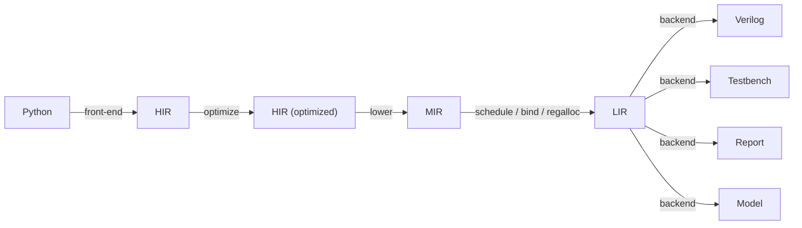

# Holoso design

Holoso lowers a small subset of Python (numerical control/DSP kernels) into vendor-neutral, synthesizable Verilog.
See `README.md` for scope and `PRIOR_ART.md` for why existing tools don't fit.

THIS IS NOT A SPECIFICATION. It records the architecture we are building toward, capturing design intent rather than
implementation detail -- the code is the low-level reference. Many of the trade-offs here won't survive contact with
reality, and we discard and redesign freely. Do not pollute this document with exact code references or
verification-suite mechanics. Read the representative examples under `examples/` to understand the motivation.

## Direction

Build our own compiler. The differentiating work is the front/mid-end: partial evaluation of Python, shape inference,
and operator scheduling for a resource-shared FSM. No external HLS gives us this for Python, and most would force a
pipeline-oriented optimizer we don't want. We delegate only to lightweight Python tools where it clearly pays: SymPy
(fold/CSE/simplify), Cocotb for testbenches, ILP solvers and function minimization (SciPy) for scheduling/regalloc.
Other lightweight dependencies may be introduced as needed.

The target is a specialized program, not a pipeline. We synthesize a sequential FSM (a zero-instruction-set computer,
ZISC) that time-multiplexes a few shared operators over a register file. We do not pursue a constant or near-1
initiation interval like a streaming pipeline: the II is whatever the scheduled program costs -- for a fixed control
path an exact, statically known cycle count from the per-operator latency model, varying across programs and branch
paths. This is a compiler problem more than a circuit-design one.

We encourage departure from IEEE 754 where it makes sense for numerical control/DSP (e.g., drop NaN/subnormals).

Compilation is deterministic and reproducible: identical input produces byte-identical output (except diagnostics and
reports, which may carry timestamps and the like). Name-keyed merge points iterate in sorted order and every stochastic
optimization pass runs with a fixed seed.

## Pipeline



HIR -- "what to compute": SSA dataflow inside a control-flow graph with real branches. Target-independent and semantic;
it does not know how an operation is implemented.

MIR -- "which hardware to use": selected hardware operators, with typed input/constant/operation/output nodes, still
unscheduled. This is the first stage allowed to inspect hardware operator configs or operand numerical limits.

LIR -- "the microprogram": the scheduled, bound, register-allocated op stream for the synthesized machine. Generic
resource/operation base classes plus typed storage: the shared wide data register file (integer+float) and the separate
1-bit boolean bank. LIR owns scheduling, binding, and register allocation, and is RTL-controller-agnostic -- the seam
where a second controller backend can be added later.

Backends -- Verilog, testbench, HTML report, numerical model, and possibly other HDLs later. The numerical-model backend
(see Backend) gives bit-exact, cycle-exact emulation of the emitted HDL, so the synthesis logic can be stabilized down
to LIR before the slow HDL-emission/simulation iteration begins.

## Python API

`synthesize(target, ops, ...) -> SynthesisResult` is the main entry point; it returns an in-memory result and touches
the filesystem only via `result.write(out_dir)`.

Passing the live object (not a file) is more ergonomic and strictly more capable: it carries the runtime environment the
binding-time front-end needs -- `__globals__`, closure cells, default args, and the result of running `__init__` --
which is what evaluates compile-time tables and follows/inlines imported callables. The object is the compile root; the
boundary ("what to ignore") falls out of reachability + binding-time analysis, not manual enumeration.

A plain function synthesizes to a stateless module. A stateful module is requested by passing a bound method of a
constructed instance, e.g. `synthesize(Integrator(k=...).__call__, ops)`: the method's `__self__` is the instance whose
attribute snapshot seeds the reset state, and `__func__` is the analyzed method. The constructor runs in plain Python,
so its arguments are ordinary values frozen into the build -- no separate parameter marshalling.

The root package re-exports only the supported public API. A future second mode -- several methods sharing one state,
selected by passing the class plus a method list and a runtime selector port -- is deferred: it needs a backend selector
and per-method schedules over shared state.

## Types

Runtime values are only:

- `float` -- one ZKF format, `WEXP`/`WMAN` fixed per build. FPGA-friendly formats usually set WMAN to a multiple of the
  native DSP tile width (commonly 18); e.g. WEXP=8 WMAN=36 (44 bit) for precision, WEXP=6 WMAN=18 (24 bit) for simpler
  targets.
- `bool` -- 1 bit.
- A separate fixed-width `int` type may appear eventually. The LIR wide data register file is already neutral storage,
  so future non-boolean scalars can share the bank when their physical width matches the build (the word width is
  expected to be max(float, int) width, near-identical in relevant cases, so minimal waste).

Compile-time ints/shapes/structure are resolved in the front-end and never reach HIR.

## Operators

HIR semantic operations are values of a HIR-local operator hierarchy; an operation is an occurrence of one operator
applied to operand value IDs. Concrete hardware operators are frozen dataclasses whose fields are their parameters; the
float subclass owns its `FloatFormat` and a typed, bit-exact `evaluate` reference matching the RTL. Each hardware
operator owns its timing, signature, instantiation params, and a compact HDL-safe identity stem -- a normalized mnemonic
plus a hex hash of its canonical parameters, e.g. `fadd_326215ea` -- so equal operators time-share one module and the
fully specified operator instance is itself the resource-sharing key. Per-node-parameterized operators are factories
whose `instantiate(k)` returns a concrete operator (e.g. `fmul_ilog2_const` differs by exponent K).

Operators are chosen by a single `OpConfig`, constructed explicitly by the user and passed into `synthesize`; there is
no implicit default. Its float format is verified consistent across the configured operators and drives HIR-to-MIR
lowering; thereafter the format is derived from selected MIR. Latency-tuning knobs are named after the HDL parameters.

## Front-end

Abstract interpretation over the Python AST/CFG with a binding-time lattice (static vs. dynamic). Static values (shapes,
`__init__`-derived constants, compile-time tables) are evaluated concretely -- real Python/NumPy runs at synthesis time.
Dynamic values (input ports, persistent state) become SSA handles that accumulate HIR. A `for` over a static `range` is
unrolled (unless the count exceeds the unroll threshold); a `while` lowers to a real back-edge loop; an `if` on a static
test takes one branch, on a dynamic test emits a real branch.

Persistent state. A synthesized method's `self` is not a port: each instance attribute the method writes becomes a
persistent register (a loop-carried value, the back-edge of the initiation loop), and each attribute it only reads is a
frozen constant folded from the `__init__` snapshot. Within the method `self.attr` is an ordinary SSA variable, so reads
and writes interleave freely; the first read before any write is the register's live-in, the value at method exit its
live-out. Public attributes additionally drive a `state_<attr>` output port (named apart from the `out_<n>` return
ports), so a method need not return anything, and a returned value that is by dataflow a public attribute (however
spelled or aliased) is deduped onto that state port rather than emitting a separate `out_` port; underscore-prefixed
attributes stay internal. A vector-valued attribute
(list, tuple, or 1-D numpy array) decomposes into one scalar register per element (`attr_0`, `attr_1`, ...); a scalar
keeps its bare name. Whether an attribute is state follows reachability -- one assigned only after a return is never
lowered. Reassigning `self` itself is rejected: attributes resolve against the fixed original instance, so a rebinding
would silently miscompile.

Matrices/vectors are statically shaped and unrolled to scalar operations; arrays never exist as hardware aggregates,
only as compile-time bookkeeping over scalar registers. That bookkeeping is a front-end value -- either a scalar wire or
an ordered aggregate -- supporting list/tuple literals, integer indexing, constant slicing, `*`-unpacking,
tuple-unpacking assignment (nested and single-starred), elementwise scalar broadcast, `.flatten()`, and the identity
sequence wrappers (`list`/`tuple`/`np.asarray`/`np.array`/`np.asanyarray`); only scalar leaves reach HIR, so the
supported source is executable numpy.

Inlining. A pure function reachable through `__globals__` is inlined -- its body lowered in a fresh scope, its return
consumed as an aggregate -- so kernels compose. A method call on the synthesized instance (`self.helper(...)`) is
inlined with the instance context kept, so the callee's own `self.<attr>` reads resolve; the method is found through the
class MRO (so a helper on a shared base is inherited), a `@staticmethod` binds all arguments with no receiver, and a
`@property` read inlines its getter (assignment through a setter or any data descriptor is rejected). A called method
may read `self` but not write it -- only the entry method owns the state-slot analysis. Name resolution follows Python:
a local binding shadows a same-named global; a module-level numeric/boolean constant resolves like a literal in value
position; a global shadowing a built-in or intrinsic is honored only when callable (a non-callable shadow like
`abs = 5` is rejected).

Parameters. Positional and keyword-only parameters become input ports: `bool`-annotated ones are 1-bit boolean ports,
unannotated and float-annotated scalars are floating-point ports. Reductions (`max`, `argmax`, `mean`, `@`) lower to
compare/select trees and multiply chains. An aggregate attribute's shape is read from its reset value, optionally
validated against an explicit jaxtyping annotation (concrete dims only); interior shapes are inferred.

## HIR

```
# values
in_port(name, type)               # module input; scalar type assigned at HIR-to-MIR lowering
float_const(value)
state_read(slot)                  # persistent state at block entry
phi([(pred_block, value)])        # SSA merge

# pure semantic operations (selected into concrete hardware by a later pass)
operation(operator, operands)     # float_add, float_mul, float_div, float_neg, float_abs, float_mul_pow2, ...
relational(op, a, b) -> bool      # lt, le, eq, ...  (chained a<b<c desugars to band of the links)
boolean(op, ...)     -> bool      # and/or/xor combinational gates; ==/!= on bools are xnor/xor
cast(a, to_ty)                    # bool(x) / float(cond), combinational float<->bool
select(cond, a, b)                # DATA mux (not control flow), produced by diamond if-conversion

# sinks
state_write(slot, value)
out_port(name, value)
```

Terminators: `jump(target)`, `branch(cond_bool, t, f)`, `ret` (commit state-writes + outputs, raise `done`).

HIR is a real CFG of basic blocks (entry first, a single `Ret` exit) carrying an SSA value DAG. `bool` is implemented
alongside `float` throughout (constants, input ports, state reads, phis), and a state slot's reset is a typed constant,
so a boolean state register carries a boolean snapshot. Node names stay explicit (`FloatConst`, `FloatAdd`, ...) so int
nodes can be added later without overloading float semantics. Negation and absolute value are ordinary semantic float
operations here, not hardware details until selection. Operators expose a HIR-local signature and the builder rejects
type-mismatched operands.

Interning is block-scoped for operations and global for entry-dominating pure values (constants, state reads); inputs
are entry-dominating but never interned (each parameter is a distinct ordered port). An operation is CSE'd only within
its own block, so an identical expression in two sibling `if` arms stays two distinct values -- a globally interned DAG
would illegally share a value across non-dominating arms. Merges emit one phi per diverging scalar leaf.

Boolean values come from boolean inputs, boolean state reads, boolean constants, float comparisons, boolean logic, and
float->bool casts; a bool->float cast crosses back. Operators split structurally into POOLED -- a physical streaming
module the scheduler contends for, the float arithmetic and the comparator -- and INLINE -- a pure expression folded
into a register write, boolean logic and the casts. An operation produces one value: one typed output port of its
operator, with a per-port conditioner (a folded sign control on a float port, a free inversion on a boolean one).
Operations sharing a block, operator, operands, and conditioners while tapping distinct ports fuse into one firing.

- A comparison `a <rel> b` taps one of the comparator's three one-hot order flags with an optional inversion (the ZKF
  ordering is total: lt/gt/eq directly, le/ge/ne by inversion), so one physical comparator serves every relation and
  several relations over one operand pair share a firing. The inversion is a fabric-side XOR folded into the register
  write -- the boolean dual of the wide lanes' hardware sign control.
- Boolean logic `and`/`or` are inline gates; both operands always evaluate (they are pure booleans). A chained
  comparison `a < b < c` desugars to `band(a<b, b<c)` with each operand evaluated once. `not` never materializes
  hardware: NOT chains fold at MIR lowering into the CONSUMER's sideband -- an operand/output/state/phi-arm inversion
  conditioner, or a branch-target swap on a condition -- so one comparator tap and one register serve both polarities.
- `bool(x)` (float->bool) is true iff the ZKF exponent is nonzero (= `x != 0.0`); `float(cond)` (bool->float) is ZKF
  `1.0`/`0.0`. Both are pc-gated inline writebacks invoking functions in the shared `holoso_support.vh` header rather
  than modules or inline logic, which keeps the "one `always @*` block" discipline and confines the ZKF bit layout to
  that one header (cross-checked against the bit-exact model at build time).

Branch vs. select is the core control-flow decision:

- A real `if`/`else` lowers to a `branch` terminator + a `phi` at the merge. Only one side executes; the merge is
  resolved at register allocation -- no runtime mux, the untaken arm never computed, no spurious error recorded.
  Branches are the default.
- `select` (a mux, both inputs live) implements data multiplexing. The if-conversion peephole collapses a small, pure,
  cheap branch diamond into per-phi muxes, making the region straight-line (so it pipelines and reuses registers).
  Because both arms then execute, conversion is gated: every arm operation must be SPECULATABLE (division is not -- a
  speculated div-by-zero would assert the error flag on an untaken path) and each arm must fit the `HOLOSO_IFCONV_MAX_OPS`
  budget (0 disables the pass). A float-phi merge converts to a wide `select`; a boolean-phi merge to a first-class
  `bool_select` (the 1-bit dual), which strength reduction folds to plain `and`/`or`/`not` when an arm is a boolean
  constant. A first-class bool mux keeps a nested diamond's critical-path depth at one mux per level and reuses the float
  select's scheduler/liveness/model/emitter paths. Running both arms can RAISE the static `min_initiation_interval`
  while LOWERING the realized per-transaction latency, which is the goal -- the regression guard is the realized-latency
  test, not the static lower bound. Arm sign chains and inversions fold into the mux's operand conditioners, so
  `x if c else -x` costs one comparison and one mux.

A conditional expression `x if c else y` lowers exactly like an `if` lifted into expression position (branch + typed
phi; a compile-time-known test selects one arm with no branch). A walrus `(name := expr)` binds a function local and
yields the value, supported only where evaluated unconditionally (an `if` test, an assignment/return value, or any
expression not under a short-circuit) and rejected where the binding could be short-circuited: inside `and`/`or`, a
chained comparison, a conditional-expression arm, or a `while` condition.

A nested `if` with no `else` on either level folds to a single combined-`and` branch (`if A: if B: S` becomes
`if A and B: S`), emitting one branch instead of two. This is exact because a boolean test here is a pure combinational
value; the fold is disabled the moment the outer `if` carries an `else` (then the `and` would mis-route the `else`).

Loops. A `for` over a static trip count fully unrolls below the unroll threshold: the counter is a compile-time integer,
so each trip lowers the body once with the counter bound -- a static integer for index/exponent/bound positions, a float
constant for value positions. Reassigning the counter to a runtime value demotes it (a later branch on it becomes a real
runtime branch), matching Python. Rotation-mode CORDIC sin/cos illustrates this -- its per-iteration `2**-i` shift forces
unrolling and its sign test is a per-iteration branch.

A `while` lowers to a real back-edge loop: preheader -> header -> body -> back-edge to the header. The header carries a
phi for each scalar or persistent attribute the body reassigns (a loop-invariant value needs none); since the back-edge
arm is a forward reference, the phi is opened with its preheader arm and closed once the body is lowered, so the HIR/MIR
passes can still visit values in dominance order. Blocks lay out with each body below its header and the single `Ret`
last, so a back-edge is just a jump to a lower address the sequencer already handles; the loop header is
multi-predecessor, so the body fully drains before jumping back and no overlap crosses the back-edge.
`min_initiation_interval` weights the back-edge as not-taken (a true lower bound); the numerical model is the authority
on the realized count. A Newton-Raphson reciprocal iterated to a tolerance illustrates this, on its convergent domain.

### HIR optimization

HIR optimization is hardware-agnostic and ordered so each pass sees final costs: const-fold + algebraic simplify
(SymPy-assisted) -> CSE -> strength reduction (`x*2^k`/`x/2^k` -> semantic `float_mul_pow2`, `x/c` -> `x*(1/c)` for
finite non-power-of-two c, `x**n` -> multiply chain) -> diamond if-conversion (after folding, so arm costs are final;
before DCE, which then sweeps a converted diamond's now-dead condition cone) -> merge threading -> DCE. Constant folding
is typed: an operator receives constant nodes and returns a folded constant, and the builder can re-intern an arbitrary
constant, so bool/int constants need no float-specific rebuilding.

Merge threading eliminates an empty pass-through merge block -- one with phis but no operation, a single jump, and
all-jump predecessors (the shape a non-convertible diamond leaves when its merge feeds a following control structure).
Each predecessor's jump is retargeted onto the merge's successor and the merge's phi arms compose into the successor's
phis. It fires only when every merge phi is consumed solely as the successor-phi arm taken from the merge, so deleting
the merge phis dangles nothing; the result is re-validated (one arm per predecessor) and chained merges collapse to a
fixpoint. A merge phi reached any other way (e.g. a loop-invariant value the header carries on its back-edge arm) keeps
its real branch -- deferred (see LIR DEFERRED).

It is understood that FP math is non-associative, so some of these optimizations may produce non-bit-exact results. This
is accepted, analogous to fast-math in C/C++ compilers.

### DEFERRED

Intrinsics. `sqrt`/`sincos`/`exp` and the like are recognized but always hard-error today -- no intrinsic operator or
node exists yet. Each will map to an operator module.

Variable-trip `for` loops: a `for` above the unroll threshold is rejected, not lowered to a counted back-edge loop (that
needs a runtime integer counter).

Early return from a loop body.

Integer operands: typed int operands/constants/operators sharing the wide register bank when their width matches the
build.

## MIR

HIR-to-MIR lowering selects concrete hardware. The float lowerer maps each semantic float operator to its configured
hardware operator and collapses semantic `float_neg`/`float_abs` chains into MIR sign-control sidebands on operands,
results, or output wires. Semantic `float_mul_pow2(k)` selects `fmul_ilog2_const` when the float format supports that
exponent; an out-of-range exponent is rejected (a fallback ordinary multiply by `2^k` would be degenerate anyway, since
such a constant overflows or underflows the format). Lowering rejects semantic domains that have no selected MIR
representation.

The MIR builder is a single typed-construction graph builder with no global scalar type, so mixed-type expressions share
one value namespace; it carries the configured float format explicitly so float-less modules still elaborate with a
known scalar width. Hardware operators expose a concrete signature and construction validates operands against the
selected operator; typed MIR subclasses additionally validate local invariants (float-domain types/sign-controls,
operand/sign arity), while cross-node operand checks stay in the builder where the referenced values are available.

The CFG is carried through MIR as typed per-resource-family views (a float view and a boolean view sharing the block
skeleton), then scheduled and register-allocated per block.

## LIR

```
resources:
  instances: [inst(operator), ...]          # each binds a fully-specified pooled hardware operator
  float_format: fmt                         # ZKF semantics for float operators and constants
  regfile: width + N wide regs              # FF bank; backend synthesizes a sparse, schedule-specific mux fabric
  bool_regfile: N 1-bit bool regs           # branch conditions and boolean values/state
  float_consts: [fconst(magnitude), ...]    # nonnegative; the sign rides the consumer's sign sideband
  inputs:  [input_load(name, typed_dst_reg), ...]
  outputs: [output_wire(name, typed_source), ...]

pooled firing:  (inst, operands+conditioners, [write(port, dst_reg, conditioner), ...], issue_cycle)
inline firing:  (operator, operands+conditioners, write(port, dst_reg, conditioner), issue_cycle)
makespan: the last commit cycle. The observable in_valid->out_valid latency is makespan + WRITE_LATCH + 1 + FETCH_LAG.
```

LIR is the scheduled, bound, register-allocated microprogram. It exposes a minimal API -- the consumer dataclasses and
port classes backends need, `build()`, and shared analysis helpers (per-cycle grouping, register liveness, read/writer
sets, stable ref labels) so backends do not each re-derive them.

Storage is a sparse register file synthesized per kernel: each operand's read mux spans only the registers it reads,
each register's write select only its actual writers (see Backend for the encoding). A CPU-conventional full-reach
crossbar was tried first and abandoned -- its read/write port multiplexors imposed untenable timing.

### Scheduling

The LIR scheduler runs software-pipelined list scheduling over each block of the selected MIR. Operator latencies are
fully static and data-independent (most throughput-1, zero-bubble), so the whole schedule is computed at compile time:
each op gets an issue cycle and a bound instance, and the backend just replays it with a cycle counter -- no scoreboard.
This makes the latency model load-bearing rather than advisory: the backend commits each result at `issue + latency`
without watching `out_valid`, the generated RTL passes that latency into each operator wrapper's mandatory `LATENCY`
parameter, and any Python/RTL drift fails at elaboration. An inaccurate latency is a correctness bug, not a bad estimate.

Each op issues on the earliest cycle its operands are ready and a free instance exists, with no barrier: a comparison or
cast issues as soon as its own operands have landed, so a cross-domain chain (`float(x>0)*k`) schedules tightly. The
commit-to-issue spacing a dependence requires is not one constant -- it is derived pairwise from the producer's
result-bank landing and the consumer's read mechanism by one shared rule over the cycle-accurate timing model. That
model is built from four named primitives, never per-case constants: a global fetch lag (the microcode fetch leads the
datapath), a per-bank read latch, a writeback latch carried by a POOLED wide operator's result path (an inline op
writes the register array combinationally and carries none, so an inline wide result lands a cycle before a pooled one;
the latch-free boolean bank has neither latch), and a read-first edge (a register read sees the value written one step
earlier). The operator's pipeline depth is orthogonal: a pooled instance has its stage count, an inline combinational
op has latency 0. Every
landing/read/fire/writeback/boundary helper derives from this one set, so the two banks and the pooled/inline classes
are uniform instances rather than hand-coded cases -- which is what lets boolean-logic and cast chains schedule
back-to-back and shortens logic-dense kernels.

Block-resident operands (inputs, state reads, phis, drained-in results) load before the block's first control word, so a
consumer reads them from cycle 0 and an op can issue from that first word. Two constraints raise an op's earliest issue
to cycle 1: a pooled op presents its read address one step early, and an entry-block op producing a persistent live-out
must stay off the accept-handshake word the sequencer re-fires during the `in_valid` wait.

```
for cycle = 0, 1, 2, ...:
    ready = unscheduled ops whose every operand has committed (per-bank dependency edge), and
            cycle >= 1 for a pooled op or an entry-block persistent-live-out producer
    for op in ready by critical_path desc:
        if an instance of op's hardware operator is free this cycle: bind it; issue_cycle[op] = cycle
```

Instances are pooled by the fully specified hardware operator itself (equal-by-value): all `fadd`/`fmul`/`fdiv` of a
config are equal and share instances; `fmul_ilog2_const` of different K are distinct modules. A configurable per-class
budget (default 1) caps instances per distinct operator value, serializing co-issues beyond the budget.

### Register allocation

Register allocation is reach-aware over the whole CFG. Whether two values may share a register is decided on a
hardware-frame interference graph from per-block liveness: a value resides in a block from the first step when carried in
or a phi result, from its landing cycle when defined there, and through the boundary when live out; a phi result
installed by a copy additionally resides at the tail of every such arm predecessor (the copy physically writes the phi
register there, one step before a branch terminator reads its condition, so an unmodeled install could clobber the
condition selecting the successor; a branch on a phi installed in its own branching block is rejected outright, the
value conflicting with itself). Two values interfere when their residences overlap under the read-first rule -- the
older value's last read must precede the newer's landing. Path-awareness is free: the two arms of an `if` are live in no
common block, so their temporaries reuse the same registers, which keeps a heavily-branched kernel (e.g. a 12-iteration
CORDIC) to a handful of wide registers.

The primary objective is to minimize per-port read-set and per-register writer-set fan-in -- the FPGA steering cost that
matters, not flip-flop count. Register count is a bounded secondary objective (it sheds a register only when that widens
a write select modestly). There is no spill. The coloring is a port-affinity greedy seed refined by simulated annealing
over the same objective, and colors both banks.

Phi-arm coalescing eliminates most install copies. Before coloring, each phi and its register-backed,
identity-conditioner arms merge by union-find whenever the two sides do not interfere, so the arm value flows straight
into the merged register with no copy. The merge is judged on an install-free oracle and then re-checked against the
residual (non-coalesced) installs, re-running to a fixpoint whose worst case is the copy-everything baseline. A merge
onto a non-coalesced state-slot register (owned by its copy-back machinery), a loop carry whose live-in overlaps its
back-edge arm, and a sibling read under a non-identity conditioner keep their copies; a diamond's mutually-exclusive
arms coalesce away. A coalesced slot register, by contrast, is seeded by its live-out pin and absorbs its phi (see
persistent state slots). The pass is pure post-schedule register reassignment -- it changes only register and copy
counts, never behavior or PC layout.

Commutative port assignment, after allocation, orients each commutative firing's two operands across its read ports to
minimize total read-set size (a register read in both positions would otherwise sit in both ports' muxes). Commutation
is an input swap with an induced output-port permutation (identity for single-output arithmetic; the comparator's gt/lt
flags transpose while eq is fixed, exact because the ZKF ordering is total), so the value stays bit-identical -- pure
relabelling, no hardware or latency. Minimizing read-set size over orientations is graph bipartisation, which a local
search cannot reliably optimize, so it is solved exactly per instance as a small MILP (HiGHS via `scipy.optimize.milp`)
with the local search as a fallback. On a stateless EKF update this takes read-mux fan-in from 89 to the optimum 78.

Persistent state slots. Both banks commit state in place: a live-out is written directly into its slot register,
read-first, so a same-frame self-update (`self.x = self.x | y`, an accumulator) reads the old value and writes the new
one with no copy. The live-out may be a pooled operator result, an inline result (a cast, or the select an if-converted
conditional update lowers to), or a phi -- a conditional or loop update whose "unchanged" arm is the slot live-in,
coalesced onto the slot register through the same phi-arm union-find. The decision is judged on the install-free oracle,
which over-approximates, so it is validated against the final coloring and retried: if pinning a live-out in place forces
two interfering values onto the slot register (the live-in still needed past the in-place write -- it feeds another phi,
or a sibling arm computed in a dominator clobbers it), that slot is backed out to a copy. When it cannot commit in place
(a genuine overlap, a folded sign, a chained copy `self.a = self.b`, or an entry-block dwell tenant) the live-out keeps
its own register and a pc-gated copy installs it as early as the old live-in is read. A coalesced slot's register is
reusable for unrelated temporaries during its dead mid-frame gap; a non-coalesced slot stays reserved. The cost that
matters is mux fabric, not flip-flops. State registers are the one datapath exception that reset reaches (each loaded
with its snapshot); pure datapath state stays out of the reset cone.

### Control flow

`branch` is the real control transfer: the PC jumps, untaken ops never run, and the II is whatever the executed path
costs (each path's count exact). Blocks lay out in reverse-postorder with the canonical `Ret` forced last as the
out_valid boundary, so a back-edge is a jump to a lower address; each block's terminator redirects the fetch PC via a
small `case(pc)` that, for a branch, reads the condition's 1-bit register.

A block's terminator offset is the latest cycle a value still lands in its frame -- the boundary must cover every
landing the block does not forward to a successor. It is taken per landing event, so it is both bank-aware (a pooled
wide result lands through its writeback latch, a step after a boolean or inline result) and inline-aware (an inline op
writes the array combinationally and lands a cycle before a pooled wide one). Three landings beyond the ops are charged
explicitly: a phi/const tail install; a NON-coalesced state slot's read-first boundary copy, on its own bank (a
coalesced slot writes its register in place and adds nothing); and the entry block's input loads. A block whose
boundary values are all already resident in predecessors pays none (the drain-only `Ret`s of loop/diamond kernels,
whose body produces every output the `Ret` reads combinationally).

A tail install is classified by whether its source is COMPUTED by the block's own work or RESIDENT at block entry. A
computed-source copy (the phi arm is an operator result or phi produced in this block) must sample its source one step
past the work makespan to read it first, so it fires at the copy step and lands at the wide writeback boundary -- the +1
install step. An install whose source is resident at block entry -- a literal constant (a phi-arm const arm, or a const
branch condition; a wide constant is a combinational wire, a boolean one a literal), an input, or a persistent-state
read -- has nothing to read-first: it fires inline-class at the combinational step within the work makespan and lands one
read-first edge later at the latch-free combinational landing -- two cycles earlier than the copy pipeline, paying
neither the +1 step nor the writeback latch, on either bank. So a block whose tail installs are all entry-resident drains
to that inline landing rather than the wider copy boundary; the recovered cycles shrink every downstream block base (a
UART receiver's boolean live-out resets, and its installs of the rx input, land within their block instead of two cycles
past it). The classification is one per-value predicate (is the value computed, or entry-resident) shared by the install
seed, the post-coalescing refinement, the builder, and the residence so they cannot drift; the register-allocator
residence occupies each install's destination from its own fire step -- earlier for an entry-resident source -- so a
tenant cannot be clobbered by the earlier write.

Cross-block software pipelining then shrinks the terminator offset down to the issue-side envelope -- the latest PC at
which the block still drives a control word, raised to the branch condition's read floor (a produced condition's
boolean landing, a spilled-in condition's carried landing, nothing for a condition resident from the block's first
cycle) -- whenever every successor is single-predecessor, so a spill cannot reach a wrong path. A block branching on a
resident live-in condition therefore shrinks fully rather than paying the wide drain. In-flight results land past the
terminator in the uniquely-reached successor frame, carried there by the fetch pipeline with no replicated microcode;
the successor inherits the predecessor's per-instance busy residue and each spilled value's landing cycle, so it
neither double-drives a busy instance nor reads a not-yet-landed operand. A multi-predecessor successor (merge, loop
header, `Ret`) never receives a spill, so the carry converges in one
reverse-postorder pass and no overlap crosses a back-edge (a loop header, though multi-predecessor, still shrinks its
own terminator when its body and exit successors are single-predecessor). Because whether a phi/const install -- or a
state slot's boundary copy -- is real depends on coalescing (decided later), the install set and the per-block
state-copy drain are computed to a monotone fixpoint that sheds spurious drains as coalescing frees registers.

Compile-time-known branch conditions fold to a single arm so the other is never lowered (no spurious state from an
unreachable write): a literal, a read-only boolean attribute, a comparison of compile-time floats, and the
connective/cast/ternary forms over these. The fold is fast-math and the model and RTL follow the same arm, so they
agree; any runtime operand keeps a real branch. This shared reachability predicate is deliberately narrower than the
complete HIR constant folder -- a constant condition buried under a shape it does not inspect stays a runtime branch, at
worst an unused state register, never a miscompile. Unifying the two is tracked future work.

The static diagnostic timelines (liveness, the HTML schedule) stamp a spilled result on every successor arm it can reach
at exactly the PCs the redirect re-keying produces, so the report is path-exact -- landings and residence tint match the
numerical model's per-path behavior. These views feed only the report and the tests, never the emitter or model.

### DEFERRED

Aggressive cross-block overlap: the landed pipelining shrinks a terminator only to its issue-side envelope, so
write-enable words stay in-block and no microcode is replicated. Pushing further -- letting the write-enable words spill
past the terminator -- would shave the remaining per-block tail but needs the commit-side control fields replicated into
every successor arm (each at its own offset) policed by the single-writer microcode validator (already in place).
Overlap also stays off across any multi-predecessor edge.

Empty merge-block elimination (the HIR merge-threading pass above) leaves two cases a real branch: an empty `else`-arm
block (its predecessor is the diamond branch, so threading would create the forbidden branch-block phi arm) and a merge
phi read outside a successor phi arm (a loop-invariant value used in the loop body, which would need rematerialization as
a self-referential loop-header phi -- unproven against the emitter, not worth the niche benefit).

## Backend (VLIW/ZISC)

The Verilog backend is mechanical from LIR: an inline flop bank plus the 1-bit boolean bank, one module per pooled
operator instance, and one continuous assignment per pooled constant (its ZKF bit pattern precomputed in Python). There
is no general multiport register-file module; storage is the sparse, schedule-specific fabric below. The controller is a
microcode ROM -- one pre-decoded VLIW control word per step, stored in a BRAM-inferable ROM read through a 3-stage fetch:
a PC latch (splitting the `pc -> next_pc -> ROM-address` cone), the array read, and a second register that packs into the
BRAM's dedicated output register for a fast clock-to-out. This replaces an old wide combinational `case(cyc)` cone with
short register-to-register paths. The fetch lags the executing step by `FETCH_LAG = FETCH_STAGES - 1` cycles, which
under static scheduling only adds to the makespan/II; the depth is currently fixed but may be made disableable for
faster chips.

The schedule replays step by step: `pc==0` accepts and parallel-loads inputs directly into the low registers of each
bank in one cycle (gated by `in_valid`); `pc` advances every clock; `pc==LASTPC` asserts `out_valid` while outputs drive
combinationally from their registers by fixed index. To line the latched datapath up with the schedule, each operand's
read-address control is presented one step early and the write-enable/address one step late. The PC holds only at the
two I/O boundaries; bubble steps carry an explicit NOP and the ROM is NOP-padded past the present step to cover the
fetch lag.

The control word stores selectors and addresses, never data. A wide lane's result wires through its writeback latch with
enables one step after the commit; a boolean lane is latch-free, its enables on the commit step and its inversion a
fabric XOR at the write -- which is exactly what leaves a branch condition a cycle of slack at the block boundary. An
inline firing (boolean logic, a cast) is a single PC-gated statement rendered by the operator's own expression, not a
microcode lane: it fires once at a statically known step, so a PC compare is the cheapest correct realization. A control
field constant across the whole program (common for sign controls, single-reader read addresses, single-writer
destinations) is driven by a constant net and lifted out of the ROM, so synthesis prunes what it feeds; the Python ROM
packer and the module's bit-slice offsets are produced together so they cannot drift.

A constant phi-arm install rides the microcode like an operator write rather than a PC compare: a per-register
write-enable field, set one fetch lag before the install lands, drives the register from the constant net (a boolean
install carries its 1-bit value in the word; a wide one selects among its register's constant codebook). The enable
field is set at the install's issue step, so the datapath write commits on the very step the former PC compare did --
identical timing, one fewer special case. A register-source phi-arm copy (it samples a register, needing a read port)
and a signed-constant install stay PC-gated for now.

Sparse storage. A multi-reader operand's read mux is a `case` over its dense read-set index selecting `regs[...]`
directly (the last entry as `default`, so the case is full and the unused high codes fall there as don't-cares). This
deliberately avoids an indexed part-select into a packed gather bus (`bus[idx*W +: W]`): a variable part-select offset is
a multiply, and with a non-power-of-two W (e.g. 24) Lattice Diamond's LSE infers a DSP per operand on the read path.
Padding to a power-of-two stride removes the DSP, but a `case` has no offset arithmetic at all and measures smaller and
faster on all flows. Each register's write select is a one-hot over only its writers, kept one register per flop (the
input load is a separate `if (in_ready && in_valid)` block, not an arm) because a per-instance write demux measured ~10%
larger. Both sides carry a set-local index sized to the set (read-set index, write-target index), never the file-wide
register index, so the ROM word stays narrow; a single-reader/single-writer field needs no compare and lifts out as a
constant.

Errors are non-fatal and informative: each error-bearing operator's flag (`div0`, `domain_error`, etc.) rides its
result's writeback latch and ORs into a global `err` gated by that instance's write-enable; an `err_pc` latch records
the executing step of the last error (zero if none, reset at every accept).

Reset covers the control registers (`pc`, `err_pc`) and the persistent state registers (each loaded with its snapshot,
emitted after the writeback so the snapshot wins on the reset edge); the fetch registers and the rest of the datapath
are reset-unconditional (so they pack into the BRAM output register) and settle to the first word under reset. The
control word and datapath skeleton are the only ZISC-specific part -- LIR itself is controller-agnostic.

Why read-first plus the +1 dependency cycle, not write-through forwarding? Write-through would erase the +1 but its
forwarding muxes cost `O(NRD*NWR)`, and we need many ports -- unsustainable. Read-first plus the +1, hidden under
pipelined overlap, is the better trade. Constant operands are kept as immediates on the input mux; folding them into the
register file or emitting constant-load micro-instructions are noted alternatives for when this becomes a constraint.

Each operator instance carries its own parameters and float format, fixed at construction from the `OpConfig`. Every
instantiation lists every hardware parameter explicitly (including defaults), so it is self-describing and turns a
param-name mismatch into a loud elaboration error. The wrapper does not derive latency; it takes `LATENCY` for sideband
alignment and forwards it to the wrapped implementation, whose source is the reference for stage counts.

Support library. The `support_files` map is the authoritative set of auxiliary HDL shipped with a module: a single
self-contained `holoso_support.v` plus the `holoso_support.vh` function header that generated modules `include`. The
`.v` is assembled in memory, invariant to the generated module, from the hand-written operator wrappers
and every third-party module under the vendored RTL set. This enables the end application to introduce all RTL
dependencies by adding a single large `holoso_support.v` to the synthesis input.

### Numerical model

The numerical model gives bit-exact, cycle-exact emulation of the emitted HDL without HDL emission or simulation, so the
synthesis logic can be verified through LIR during heavy refactors. It is bit-exact because it replaces native float
operators with an exact software implementation of the selected float format, and cycle-exact because it mirrors the
RTL's fetch PC, register files, and sequencer.

It splits into a serializable handle and a runtime machine. `generate()` returns a `NumericalModel`: an opaque,
trivially-picklable wrapper carrying only the LIR (kept private, so the LIR never enters the public API) -- the artifact
a generated testbench embeds. Its `elaborate()` builds a `NumericalSimulator`: the runnable per-clock state machine, an
ordinary non-pickled object. The split keeps the serializable artifact pure data and frees the simulator from fighting
pickle. Both expose the kernel's logical signature as read-only metadata -- `inputs`/`outputs` are lists of ports, each a
logical name paired with a `ScalarType` -- so a driver decides a port's encoding by matching its type and the signature
stays honest as scalar types are added.

`tick()` advances exactly one `posedge clk`, driving the next PC with the same sequencer the Verilog emits (reset,
out_valid, in_ready, terminator redirect, back-pressure). Timing is read off the shared cycle helpers in the fetch-PC
frame, so each tick commits the landings due at the current PC and samples the reads due there. The only mutable state
beyond the register files is a small in-flight buffer -- the stand-in for the operator pipeline and writeback latch: a
result is computed when its operands are sampled but written to the register file only at its landing PC, exactly as the
hardware does. It therefore stays correct when blocks overlap and runs an arbitrarily deep loop in bounded memory (the
same PCs re-fire on each revisit, the buffer only ever holds the handful of in-flight results); at a shrunk terminator's
redirect it re-keys the still-in-flight landings onto the taken successor's frame. The persistent state is just the slot
registers, carried across transactions. A `run()` convenience drives `tick()` over one whole transaction for callers
that only want the outputs.

Generated RTL testbenches (Cocotb today) run the RTL simulator in cycle-by-cycle lockstep with the elaborated numerical
simulator: each cycle ticks both with the same handshake and asserts that `out_valid` agrees (the data-dependent latency
check) and that the output bits match when valid, back-pressure included. End-to-end verification of the original Python
against the numerical model is left to the user, since it requires knowledge of the source semantics.

The RTL-versus-model cosimulation is structurally blind to one miscompile class: a scheduling, instance-binding,
register-allocation, or cross-block-overlap fault in the LIR is shared by both the RTL and the numerical model (the RTL
is emitted from the very LIR the model replays), so a wrong-but-consistent LIR passes the cosim. A schedule-independent
oracle closes this gap. The MIR interpreter evaluates the unscheduled MIR dataflow graph directly through the operators'
own bit-exact `evaluate`, owning no registers, no schedule, and no overlap machinery; it deliberately imports nothing
from the LIR. It shares the front/mid-end and the operators with the numerical model but none of the LIR, so the
differential `interpreter == model` -- bit-exact and exception-free on both float-format sides -- isolates exactly the
LIR layer. A blackbox differential fuzzer rides on this: it generates small kernels as real importable Python source,
drives each through both models across operator configurations, and asserts the bit-exact primary check on every
transaction plus a best-effort float64-reference secondary check. A schedule-length freeze independently pins each
representative kernel's minimum II and last microcode PC (the out_valid boundary), so a scheduling-efficiency
regression fails.

The HTML report is an essential tool for humans to understand and debug what the compiler did. It must provide an EXACT
representation of the generated core behavior, not a simplified or approximated view.

## Fabric-area exploration

The synthesized fabric is dominated by the per-operand read multiplexers: on a register-pressure-heavy kernel (an EKF
update) they are roughly 60-65% of the LUTs, and a read mux's cost is approximately linear in `read-set-size * W`. The
read-set sizes sit at the interference floor -- the values a port reads are largely simultaneously live -- so the muxes
encode real liveness rather than allocation slack, which bounds most levers. Results below were measured end-to-end on
Yosys+nextpnr-ECP5, Lattice Diamond, and Vivado, and are recorded so the dead ends are not re-explored.

Adopted (lossless, f_max-neutral):

- Read mux as a `case` over the dense read-set index rather than an indexed part-select into a packed gather bus:
  smallest and fastest of the encodings tried, free of the DSP-inference trap. Nested-ternary muxes are catastrophic.
- Commutative operand port assignment, solved exactly as a MILP: about 4-5% LUT on the EKF across all three tools
  (read-mux fan-in 89 -> 78), at zero hardware or latency cost. Based on Chen & Cong.
- Dense write-target index and a grouped input load: read/write symmetry at neutral area. The per-register write select
  beats a per-instance write demux by about 10% LUTs.

Explored and rejected for register-pressure-bound kernels:

- LUTRAM register file: a multi-write workload needs a live-value table costing as many LUTs as the FF+mux it replaces;
  banking helps only when access sets partition cleanly.
- Register-file size cap via pressure-limited scheduling: `nreg` floors at peak liveness, so it trades large latency and
  f_max for a couple percent.
- Operator replication and FMA fusion: both raise read-operand traffic (more, or wider, read ports), enlarging total mux
  area despite fewer ops or a shorter makespan.
- Operand collectors (copy/move ops off the worst-reach ports): a copy relocates fan-in rather than removing it -- a net
  gain needs a value moved onto a co-reachable but not co-live target, which the interference floor denies (an honest
  greedy moved total read reach only 95 -> 94), and copies on the shared operator also cost cycles.

Latency-for-area trades (set aside -- latency is a real cost and the area gain did not justify it):

- Distributed/banked register file with scheduled inter-bank copies (Cong's RDR): banking narrows each port's mux but
  serializes the schedule. On the EKF, whose muxes are already at the interference floor, not worthwhile.
- Shared read bus / vertical microcode (one operator per cycle, two shared operand buses): about -6% total LUTs for about
  +55% latency on the EKF, f_max-safe -- a real latency cost for a modest area gain, so not pursued.

## References

- L. Chen, J. Cong. Register Binding and Port Assignment for Multiplexer Optimization. ASP-DAC 2004. Basis for the
  commutative operand port-assignment pass.
- J. Cong, Y. Fan, et al. Architecture and Synthesis for Multi-Cycle Communication (the Regular Distributed Register
  microarchitecture). ISPD 2003. Banking plus scheduled inter-bank copies.
- A. Terechko, et al. Inter-cluster Communication Models for Clustered VLIW Processors. HPCA 2003. Producer-side
  placement preferred over after-the-fact copies.
- M. Gebhart, et al. A Compile-Time Managed Multi-Level Register File Hierarchy. MICRO 2011; S. Asghari Esfeden, et al.
  CORF: Coalescing Operand Register File for GPUs. ASPLOS 2019. Compiler-staged operand near-files (target access
  energy).
- A. W. Appel, K. J. Supowit. Generalizations of the Sethi-Ullman algorithm for register allocation, 1987. Why a copy
  relocates steering cost unless it collapses a fan-in cone.
- AMD UG949, Vivado Design Methodology, "When and Where to Use a Reset." Intel Hyperflex Architecture Handbook,
  "Synchronous Resets Summary" and "Reset Strategies."
