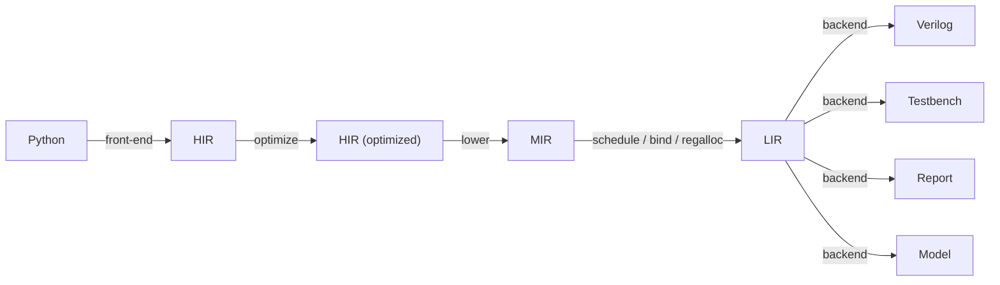

# Holoso design

Holoso lowers a small subset of Python (numerical control/DSP kernels) into vendor-neutral, synthesizable Verilog.
See `README.md` for scope and `PRIOR_ART.md` for why existing tools don't fit.

THIS IS NOT A SPECIFICATION. It records the architecture we are building toward, capturing design intent rather than
implementation detail -- the code is the low-level reference. Many of the trade-offs here won't survive contact with
reality, and we discard and redesign freely. Do not pollute this document with exact code references or
verification-suite mechanics. Read the representative examples under `examples/` to understand the motivation.

## Direction

Build our own compiler. The differentiating work is the front/mid-end: partial evaluation of Python, shape inference,
and operator scheduling for a resource-shared FSM. No external HLS gives us this for Python, and most would force a
pipeline-oriented optimizer we don't want. We delegate only to lightweight Python tools where it clearly pays: SymPy
(fold/CSE/simplify), Cocotb for testbenches, ILP solvers and function minimization (SciPy) for scheduling/regalloc.
Other lightweight dependencies may be introduced as needed.

The target is a specialized program, not a pipeline. We synthesize a sequential FSM (a zero-instruction-set computer,
ZISC) that time-multiplexes a few shared operators over a register file. We do not pursue a constant or near-1
initiation interval like a streaming pipeline: the II is whatever the scheduled program costs -- for a fixed control
path an exact, statically known cycle count from the per-operator latency model, varying across programs and branch
paths. This is a compiler problem more than a circuit-design one.

We encourage departure from IEEE 754 where it makes sense for numerical control/DSP (e.g., drop NaN/subnormals).

Compilation is deterministic and reproducible: identical input produces byte-identical output (except diagnostics and
reports, which may carry timestamps and the like), achieved by sorted iteration over name-keyed merge points and a fixed
seed for every stochastic optimization pass.

## Pipeline

HIR -- "what to compute": SSA dataflow inside a control-flow graph with real branches. Target-independent and semantic;
it does not know how an operation is implemented.

MIR -- "which hardware to use": selected hardware operators over typed nodes, still unscheduled. This is the first stage
allowed to inspect hardware operator configs or operand numerical limits.

LIR -- "the microprogram": the scheduled, bound, register-allocated op stream for the synthesized machine, over typed
storage (a shared wide data register file and a separate 1-bit boolean bank). LIR owns scheduling, binding, and register
allocation, and is RTL-controller-agnostic -- the seam where a second controller backend can be added later.

Backends -- Verilog, testbench, HTML report, numerical model, and possibly other HDLs later. The numerical-model backend
(see Backend) gives bit-exact, cycle-exact emulation of the emitted HDL, so the synthesis logic can be stabilized down
to LIR before the slow HDL-emission/simulation iteration begins.

## Glossary

- Issue / commit / landing -- the three cycles of a result. An op issues when its operands are sampled, commits its
  result `issue + latency` later, and that result lands (first becomes readable) a further fixed latency later.
  A consumer reads at the landing, not the commit.

- Pooled operator -- a latency-bearing arithmetic operator (fadd, fdiv, etc.) time-multiplexed across all its uses.

- Inline operator -- a combinational, simple zero-latency op (boolean logic, select, type cast, etc.)
  emitted as a single HDL expression rather than a pooled operator instance.

- Spill -- NOT a register spill to memory. A value whose landing extends past its block's terminator
  into a single-predecessor successor: the cross-block software-pipelining overlap.

- Install -- a copy that writes a value into a persistent-state slot or a merged-phi register at a block boundary,
  used when coalescing could not make the write free.

- Coalesce -- merging a phi and its identity-arm predecessors onto one register (union-find) so the install becomes a
  no-op.

- Slot (state slot) -- a register holding persistent state across transactions (e.g. `self.x`), committed in place.

- Drain -- the cycles a block's terminator waits past its last commit for in-frame writebacks to land.

- Fetch lag -- the depth by which the control-fetch pipeline leads the executing step;
  every operand is sampled at `issue + fetch lag`.

- Read-first -- within a cycle a register read returns the OLD value, before any same-cycle write; this is the origin of
  the +1 dependency edge between producer and consumer. Aka "read-before-write", "write-after-read" (WAR).

- Dwell -- the PC stalling at one of its hold points: pc 0 (accept, awaiting `in_valid`) or LASTPC (present,
  awaiting the result being taken before restarting).

- Makespan / II -- a block's schedule length in cycles; the initiation interval (II) is the whole executed path's exact
  cycle count.

- ZISC -- zero-instruction-set computer: the VLIW microcode-driven sequential FSM that Holoso synthesizes.

## Python API

`synthesize` is the main entry point; it returns an in-memory result and touches the filesystem only on an explicit
write.

Passing the live object (not a file) is more ergonomic and strictly more capable: it carries the runtime environment the
binding-time front-end needs -- `__globals__`, closure cells, default args, and the result of running `__init__` --
which is what evaluates compile-time tables and follows/inlines imported callables. The object is the compile root; the
boundary ("what to ignore") falls out of reachability + binding-time analysis, not manual enumeration.

A plain function synthesizes to a stateless module. A stateful module is requested by passing a bound method of a
constructed instance, e.g. `synthesize(filt.update, ops)`: the bound instance's attribute snapshot seeds the reset
state, and its method is the analyzed body. The constructor runs in plain Python, so its arguments are ordinary values
frozen into the build -- no separate parameter marshalling.

The root package re-exports only the supported public API. A future second mode -- several methods sharing one state,
selected by passing the class plus a method list and a runtime selector port -- is deferred: it needs a backend selector
and per-method schedules over shared state.

## Types

Runtime values are only:

- `float` -- one ZKF format, `WEXP`/`WMAN` fixed per build. FPGA-friendly formats usually set WMAN to a multiple of the
  native DSP tile width (commonly 18); e.g. WEXP=8 WMAN=36 for precision, WEXP=6 WMAN=18 for simpler targets.
- `bool` -- 1 bit.
- A separate fixed-width `int` type may appear eventually. The LIR wide data register file is already neutral storage,
  so future non-boolean scalars can share the bank when their physical width matches the build, at minimal waste.

Compile-time ints/shapes/structure are resolved in the front-end and never reach HIR.

## Operators

HIR carries pure semantic operations from a HIR-local operator hierarchy; an operation is one operator applied to
operand value IDs. Concrete hardware operators are frozen dataclasses whose fields are their parameters; the float ones
own a `FloatFormat` and a typed, bit-exact `evaluate` reference matching the RTL. Each hardware operator owns its
timing, signature, and a compact HDL-safe identity stem, so the fully specified operator instance is itself the
resource-sharing key and equal operators time-share one module. Per-node-parameterized operators are factories that
instantiate a concrete operator (e.g. multiply-by-constant-power-of-two differs by exponent).

Operators are chosen by a single `OpConfig`, constructed explicitly by the user and passed into `synthesize`; there is
no implicit default. Its float format is verified consistent across the configured operators and drives HIR-to-MIR
lowering; thereafter the format is derived from selected MIR. Latency-tuning knobs are named after the HDL parameters.
Some operators are optional (default `None`).

An operator may declare per-firing small microcode-driven immediate inputs.

Each operator declares a per-instance initiation interval; most operators have II=1, i.e., fully pipelined.

## Front-end

Abstract interpretation over the Python AST/CFG with a binding-time lattice (static vs. dynamic). Static values (shapes,
`__init__`-derived constants, compile-time tables) are evaluated concretely -- real Python/NumPy runs at synthesis time.
Dynamic values (input ports, persistent state) become SSA handles that accumulate HIR. A `for` over a static `range` is
unrolled (unless the count exceeds the unroll threshold); a `while` lowers to a real back-edge loop; an `if` on a static
test takes one branch, on a dynamic test emits a real branch. Static evaluation (used for branch/loop reachability and
compile-time indices) resolves only the operands that both the reachability scan and lowering reconstruct identically:
numeric literals, module-level numeric/array constants, read-only instance attributes, and loop counters -- including
numpy navigation (indexing, slicing, transpose, `.flatten()`) of a module-level array constant or read-only array
attribute.

Persistent state. A synthesized method's `self` is not a port: each instance attribute the method writes becomes a
persistent register (a loop-carried value, the back-edge of the initiation loop), and each attribute it only reads is a
frozen constant folded from the `__init__` snapshot. Within the method `self.attr` is an ordinary SSA variable, so reads
and writes interleave freely. Public attributes additionally drive a `state_<attr>` output port, so a method need not
return anything (and a returned value that is by dataflow a public attribute is deduped onto that state port);
underscore-prefixed attributes stay internal. A vector-valued attribute (list, tuple, or 1-D numpy array) decomposes
into one scalar register per element (`attr_0`, `attr_1`, ...), a matrix-valued one (2-D numpy array) row-major into
`attr_0_0`, `attr_0_1`, ...; a scalar keeps its bare name. Whether an attribute is state follows reachability.
Reassigning `self` itself is rejected: attributes resolve against the fixed original instance, so a rebinding would
silently miscompile.

Matrices/vectors are statically shaped and unrolled to scalar operations; arrays never exist as hardware aggregates,
only as compile-time bookkeeping over scalar registers. That bookkeeping is a front-end value -- either a scalar wire or
an ordered aggregate -- supporting list/tuple literals, numpy-style indexing and constant slicing (`m[i, j]`,
`m[:, j]`, chained `m[i][j]`), unpacking, transpose (`.T`), and the array factories `np.array`/`asarray`/`asanyarray`;
only scalar leaves reach HIR, so the supported source is executable numpy. Module-level numeric and ndarray globals
fold into constants.

List/tuple vs. array. A front-end aggregate carries its Python flavor. The guiding principle is to follow Python
semantics where sensible and otherwise reject a construct rather than silently reinterpret it; in particular a Python
list/tuple is never given numpy semantics. A Python list/tuple (a list/tuple literal, the `list()`/`tuple()` builtins,
or a starred-unpack remainder) has sequence semantics: indexing, constant slicing, unpacking, splatting, building, and
returning all work on it. A numpy array -- a shaped parameter, an ndarray module constant or state attribute,
`np.array`/`asarray`/`asanyarray(...)`, or the result of any array operation -- additionally carries numpy semantics.
The numpy-only operations (elementwise arithmetic, the matrix product, transpose, `.flatten()`, and multi-axis
indexing) apply to arrays and are rejected on a list/tuple: on a Python sequence they mean something else or nothing
(list `+`/`*` are concatenation/repetition, list `-`/`@`/`.T` are undefined), none of which is the array operation
intended.

Array arithmetic. The elementwise arithmetic operators `+ - * /` apply leafwise to same-shape arrays, and a scalar
operand broadcasts over the other side's leaves; this is deliberately narrower than numpy broadcasting -- a mixed-rank
pair (vector + matrix) is rejected rather than silently aligned along a different axis than numpy would pick, and `**`
stays scalar-only (base two with a runtime exponent lowers to exp2; otherwise the exponent must be a compile-time
integer). Augmented assignment to any aggregate (`+=`, `@=`) is rejected: an array would be mutated in place by
numpy while the front-end rebinds (diverging for an alias), and a list `+=` is concatenation, which is unsupported. The
matrix product `@` (equivalently `np.matmul`) follows numpy's shape rules for 1-D and 2-D operands -- inner dimensions
must agree, a 1-D operand is promoted and its axis dropped from the result, vector @ vector is a scalar -- and expands
into scalar multiply/add chains. Each dot product is a left fold, which keeps every product single-use feeding an add of
the running sum: exactly the shape MIR's FMA contraction fuses into one multiply plus an FMA chain when configured. All
shapes are static; there is no batching (ndim > 2) and no runtime sizing.

Inlining. A pure function reachable through `__globals__` is inlined -- its body lowered in a fresh scope, its return
consumed as an aggregate -- so kernels compose. A method call on the synthesized instance (`self.helper(...)`) is
inlined with the instance context kept, so the callee's own `self.<attr>` reads resolve (the method is found through the
class MRO; `@staticmethod` and `@property` getters are supported). A called method may read `self` but not write it --
only the entry method owns the state-slot analysis. Name resolution follows Python.

Parameters. Positional and keyword-only parameters become input ports and require an explicit annotation:
`float`-annotated scalars are floating-point ports, `bool`-annotated ones are 1-bit boolean ports, and a jaxtyping
array annotation with fixed 1-D/2-D dimensions and a floating dtype (e.g. `Float64[np.ndarray, "3 3"]`) decomposes
row-major into one float port per element (a vector's are `name_0, name_1, ...`, a matrix's `name_0_0, name_0_1, ...`).
The jaxtyping types are detected structurally, so jaxtyping stays a dependency of the user's code only.
An aggregate attribute's shape is read from its reset value, optionally validated against an explicit jaxtyping
annotation; interior shapes are inferred.

Return type. The return annotation is likewise mandatory and validated against the inferred output leaves: `float`,
`bool`, a fixed-shape jaxtyping array, an arbitrarily nested `tuple[...]`/`tuple[X, ...]`/`list[X]` of them, or
`None` for a method that returns nothing. A missing annotation or any shape, arity, or scalar-type divergence rejects
the kernel.

## HIR

HIR is a real CFG of basic blocks -- entry first, a single `Ret` exit -- carrying an SSA value DAG. Values are input
ports (one per parameter), float and boolean constants, state reads (persistent state at block entry), phis (SSA
merges), and pure semantic operations; terminators are `jump`, `branch`, and `ret` (which commits state live-outs and
output ports). The pure operations cover float arithmetic (add, mul, div, neg, abs, multiply-by-power-of-two,
base-two exponential and logarithm), relational comparisons and boolean logic yielding `bool`, float<->bool casts, and
`select` (a data mux produced by if-conversion, distinct from control flow).

`bool` is implemented alongside `float` throughout (constants, input ports, state reads, phis), and a state slot's reset
is a typed constant, so a boolean state register carries a boolean snapshot. Node names stay explicit (`FloatConst`,
`FloatAdd`, ...) so int nodes can be added later without overloading float semantics. Negation and absolute value are
ordinary semantic float operations here, not hardware details until selection.

Interning is block-scoped for operations and global for entry-dominating pure values (constants, state reads); inputs
are never interned (each parameter is a distinct ordered port). CSE'ing an operation only within its own block is the
point: an identical expression in two sibling `if` arms must stay two distinct values, because a globally interned DAG
would illegally share a value across non-dominating arms. Merges emit one phi per diverging scalar leaf.

Operators split structurally into POOLED -- a physical streaming module the scheduler contends for --
and INLINE -- a pure expression folded into a register write, like boolean logic.
This split is load-bearing for scheduling and emission.
A comparison taps one of the comparator's order flags with an optional inversion,
so one physical comparator serves every relation (the ZKF ordering is total: lt/gt/eq directly, le/ge/ne by inversion)
and several relations over one operand pair share a firing.
The sorter is the wide-output analogue: it emits the smaller and larger operand on two ports,
so a `min` and a `max` over one pair share a firing.
Boolean `and`/`or` are inline gates that always evaluate both operands (they are pure booleans);
a chained comparison `a < b < c` desugars to `band(a<b,b<c)`.
`not` never materializes hardware: NOT chains fold into the consumer's sideband (an operand/output/state/phi-arm
inversion, or a branch-target swap), so one comparator tap and one register serve both polarities. The casts
(`bool(x)` = `x != 0.0`, `float(cond)` = `1.0`/`0.0`) are inline writebacks that confine the ZKF bit layout to a single
shared header, cross-checked against the bit-exact model at build time.

Branch vs. select is the core control-flow decision:

- A real `if`/`else` lowers to a `branch` terminator + a `phi` at the merge. Only one side executes; the merge is
  resolved at register allocation -- no runtime mux, the untaken arm never computed, no spurious error recorded.
  Branches are the default.
- `select` (a mux, both inputs live) implements data multiplexing. The if-conversion peephole collapses a small, pure,
  cheap branch diamond into per-phi muxes, making the region straight-line (so it pipelines and reuses registers).
  Because both arms then execute, conversion is gated: every arm operation must be SPECULATABLE (division is not -- a
  speculated div-by-zero would assert the error flag on an untaken path) and each arm must fit a configurable op budget.
  A boolean-phi merge converts to a first-class `bool_select` (the 1-bit dual), reusing the float select's
  scheduling and emission paths. Running both arms can RAISE the static lower-bound II while LOWERING the realized
  per-transaction latency, which is the goal -- the regression guard is the realized-latency test, not the static lower
  bound. Arm sign chains fold into the mux's conditioners, so `x if c else -x` costs one comparison and one mux.

A conditional expression `x if c else y` lowers exactly like an `if` lifted into expression position (a compile-time
test selects one arm with no branch). A walrus `(name := expr)` is supported only where evaluated unconditionally and
rejected where the binding could be short-circuited (inside `and`/`or`, a chained comparison, a conditional-expression
arm, or a `while` condition).

An `assert` statement is accepted and ignored wholesale: its test is never lowered, mirroring Python under `-O`, so an
assertion has no hardware effect (each reached assert is logged). Any effect the test would have had when executed is
dropped along with it; as under `-O`, an assert must be side-effect-free.

A nested `if` with no `else` on either level folds to a single combined-`and` branch (`if A: if B: S` becomes
`if A and B: S`), emitting one branch instead of two. This is exact because a boolean test here is a pure combinational
value; the fold is disabled the moment the outer `if` carries an `else` (then the `and` would mis-route the `else`).

Loops. A `for` over a static trip count fully unrolls below the unroll threshold: the counter is a compile-time integer,
so each trip lowers the body once with the counter bound. Reassigning the counter to a runtime value demotes it,
matching Python. Rotation-mode CORDIC sin/cos illustrates this -- its per-iteration `2**-i` shift forces unrolling and
its sign test is a per-iteration branch.

A `while` lowers to a real back-edge loop: preheader -> header -> body -> back-edge to the header. The header carries a
phi for each scalar or persistent attribute the body reassigns. Blocks lay out with each body below its header and the
single `Ret` last, so a back-edge is just a jump to a lower address the sequencer already handles; the loop header is
multi-predecessor, so the body fully drains before jumping back and no overlap crosses the back-edge. The static II
weights the back-edge as not-taken (a true lower bound); the numerical model is the authority on the realized count. A
Newton-Raphson reciprocal iterated to a tolerance illustrates this, on its convergent domain.

### HIR optimization

HIR optimization is hardware-agnostic and ordered so each pass sees final costs: const-fold + algebraic simplify
(SymPy-assisted) -> CSE -> strength reduction (powers of two to shifts, `x/c` to `x*(1/c)`, `x**n` to a multiply chain)
-> diamond if-conversion (after folding, so arm costs are final; before DCE, which then sweeps a converted diamond's
now-dead condition cone) -> merge threading -> DCE. Constant folding is typed, so bool/int constants need no
float-specific rebuilding.

Merge threading eliminates an empty pass-through merge block -- the shape a non-convertible diamond leaves when its
merge feeds a following control structure -- by retargeting each predecessor's jump onto the merge's successor and
composing the phi arms. A merge phi reached any other way (e.g. a loop-invariant value the header carries on its
back-edge arm) keeps its real branch -- deferred (see LIR DEFERRED).

FP math is non-associative, so some of these optimizations may produce non-bit-exact results -- accepted, analogous to
fast-math in C/C++ compilers. The transcendental folds likewise take the ideal (infinite-precision) result,
so a folded constant can differ from the datapath's own value.

### DEFERRED

Composite intrinsics that have no directly matching low-level operator module.

Variable-trip `for` loops: a `for` above the unroll threshold is rejected, not lowered to a counted back-edge loop (that
needs a runtime integer counter).

Early return from a loop body.

Static folding of a constant that reaches a static position (a branch/loop condition or a compile-time index) only
through a local alias or an inline-built value, e.g. `g = CONST; if g[0] > 0:` or `if np.asarray([...])[0] > 0:`. Such
a value still lowers correctly but is treated as dynamic, because folding it would require the reachability scan to
track arbitrary local bindings it does not build. Only module-level constants, read-only instance attributes, and loop
counters fold in static positions.

Integer operands: typed int operands/constants/operators sharing the wide register bank when their width matches the
build.

## MIR

HIR-to-MIR lowering selects concrete hardware. The float lowerer maps each semantic float operator to its configured
hardware operator and collapses semantic negation/absolute-value chains into MIR sign-control sidebands on operands,
results, or output wires. Multiply-by-power-of-two selects the constant-shift operator when the float format supports
that exponent; an out-of-range exponent is rejected, since the equivalent constant would overflow or underflow the
format anyway. The four rounding operators map to one shared `fround` distinguished by its `round_mode` immediate.

Some operator lowerings are context-sensitive, where the final lowering depends on the nearby operations.
Examples include computing min/max in a single pooled comparison operator transaction,
sin/cos being simultaneously computed by the sincos hardware operator, etc.
Another example is the FMA contraction, where a single-use `a*b+c` is lowered into one fused multiply-add.
The matching is done at the MIR level because this is the first layer that is aware of the hardware semantics.

The MIR builder has no global scalar type, so mixed-type expressions share one value namespace, but carries the
configured float format explicitly so float-less modules still elaborate with a known scalar width. The CFG is carried
through MIR as typed per-resource-family views (a float view and a boolean view sharing the block skeleton), then
scheduled and register-allocated per block.

## LIR

LIR is the scheduled, bound, register-allocated microprogram. Its resources are the bound operator instances (each a
fully-specified pooled hardware operator), the float format, the storage banks (a wide data register file and a separate
1-bit boolean bank), a pool of nonnegative float constants (the sign rides the consumer's sideband), and the typed input
loads and output wires. Each scheduled firing -- pooled or inline -- carries its operands and conditioners, its register
writes, and an issue cycle; the makespan is the last commit cycle, and the observable input-to-output latency follows
from it and the fetch timing of the datapath. LIR exposes a minimal API plus shared analysis helpers (per-cycle
grouping, liveness, read/writer sets) so backends do not each re-derive them.

Storage is a sparse register file synthesized per kernel: each operand's read mux spans only the sources it reads,
each register's write mux only the sources it takes (see Backend for the encoding). A CPU-conventional full-reach
crossbar was tried first and abandoned -- its read/write port multiplexors imposed untenable timing.

### Scheduling

The LIR scheduler runs software-pipelined list scheduling over each block of the selected MIR. Operator latencies are
fully static and data-independent (most throughput-1, zero-bubble), so the whole schedule is computed at compile time:
each op gets an issue cycle and a bound instance, and the backend just replays it with a cycle counter -- no scoreboard.
This makes the latency model load-bearing rather than advisory: the backend commits each result at `issue + latency`
without watching `out_valid`, the generated RTL passes that latency into each operator wrapper's mandatory `LATENCY`
parameter, and any Python/RTL drift fails at elaboration. An inaccurate latency is a correctness bug, not a bad
estimate.

Each op issues on the earliest cycle its operands are ready and a free instance exists, with no barrier, so a
cross-domain chain (`float(x>0)*k`) schedules tightly. The commit-to-issue spacing a dependence requires is not one
constant but is derived pairwise from a single cycle-accurate timing model built from a few named primitives (a global
fetch lag and a read-first edge), never per-case constants. Both register banks sample an operand at
issue + fetch lag through a combinational read mux. Every result -- pooled or inline, on
either bank -- writes the register array combinationally and becomes readable a fixed fetch-lag-plus-read-first edge
after its commit. (Earlier designs latched pooled wide results in a writeback latch and presented the wide bank's read
address a step early in a read latch; both were dropped as inconsistent -- the writeback latch caught only float
operators while installs, control flow, and inline writes went direct, and it needlessly delayed short installs --
so every result now writes direct and both banks read alike.) Because the two banks and the pooled/inline classes
are uniform instances of that one model rather than hand-coded cases,
boolean-logic and cast chains schedule back-to-back, which shortens logic-dense kernels. Block-resident operands
(inputs, state reads, phis) are available from the block's first control word, so an op can issue from there.

Each cycle, the ready ops (every operand committed) are issued in critical-path order
onto free instances. Instances are pooled by the fully specified hardware operator itself (equal-by-value): all
`fadd`/`fmul`/`fdiv` of a config share instances; constant-shift operators of different exponent are distinct modules. A
configurable per-class budget (default 1) caps instances per distinct operator value, serializing co-issues beyond the
budget.

### Register allocation

Register allocation is reach-aware over the whole CFG: whether two values may share a register is decided on a
hardware-frame interference graph from per-block liveness, two values interfering when their residences overlap under
the read-first rule (the older value's last read must precede the newer's landing). Path-awareness is free: the two arms
of an `if` are live in no common block, so their temporaries reuse the same registers, which keeps a heavily-branched
kernel (e.g. a 12-iteration CORDIC) to a handful of wide registers.

The primary objective is to minimize per-port read-set and per-register writer-set fan-in -- the FPGA steering cost that
matters, not flip-flop count. Register count is a bounded secondary objective. There is no spill. The coloring is a
port-affinity greedy seed refined by simulated annealing over the same objective, and colors both banks.

Phi-arm coalescing eliminates most install copies: before coloring, each phi and its register-backed, identity-arm
predecessors merge by union-find whenever the two sides do not interfere, so the arm value flows straight into the
merged register with no copy (a diamond's mutually-exclusive arms always coalesce away). The pass is pure post-schedule
register reassignment -- it changes only register and copy counts, never behavior or PC layout.

Commutative port assignment, after allocation, orients each commutative firing's two operands across its read ports to
minimize total read-set size (a register read in both positions would otherwise sit in both ports' muxes). Commutation
is a pure relabelling -- an input swap with an induced output-port permutation -- so the value stays bit-identical at no
hardware or latency cost. Minimizing read-set size over orientations is graph bipartisation, which a local search
cannot reliably optimize, so it is solved exactly per instance as a small MILP, with the local search as a fallback.

Persistent state slots. Both banks commit state in place: a live-out is written directly into its slot register,
read-first, so a same-frame self-update (`self.x = self.x | y`, an accumulator) reads the old value and writes the new
one with no copy. A conditional or loop update whose "unchanged" arm is the slot live-in coalesces onto the slot
register through the same phi-arm union-find. When it cannot commit in place (a genuine overlap, a folded sign, or a
chained copy `self.a = self.b`) the live-out keeps its own register and a microcode-driven copy installs it as early as
the old live-in is read. Two slots that always hold the same value collapse onto one register (a public attribute and
its private alias), dropping the duplicate register and its install copy. State
registers are the one datapath exception that reset reaches (each loaded with its snapshot); pure datapath state stays
out of the reset cone.

### Control flow

`branch` is the real control transfer: the PC jumps, untaken ops never run, and the II is whatever the executed path
costs (each path's count exact). Blocks lay out in reverse-postorder with the canonical `Ret` forced last as the
out_valid boundary, so a back-edge is a jump to a lower address; each block's terminator redirects the fetch PC via a
small `case(pc)` that, for a branch, reads the condition's 1-bit register.

A block's terminator offset is the latest cycle a value still lands in its frame -- it must cover every landing the
block does not forward to a successor. A block whose boundary values are all already resident in predecessors pays none
(the drain-only `Ret`s of loop/diamond kernels, whose body produces every output the `Ret` reads combinationally).
A tail install lands at the block's work makespan, read-first at the boundary, and costs an extra terminator cycle only
when its source is the block's own last-committing work; a source resident at block entry, or computed earlier than that
last work, lands at the makespan and recovers cycles in every downstream block.

Cross-block software pipelining then shrinks the terminator offset down to the issue-side envelope -- the latest PC at
which the block still drives a control word -- whenever every successor is single-predecessor, so a spill cannot reach a
wrong path. In-flight results land past the terminator in the uniquely-reached successor frame, carried there by the
fetch pipeline with no replicated microcode; the successor inherits the predecessor's per-instance busy residue and each
spilled value's landing cycle. A multi-predecessor successor (merge, loop header, `Ret`) never receives a spill, so the
carry converges in one reverse-postorder pass and no overlap crosses a back-edge.

Compile-time-known branch conditions fold to a single arm so the other is never lowered (no spurious state from an
unreachable write). This shared reachability predicate is deliberately narrower than the complete HIR constant folder --
a constant condition buried under a shape it does not inspect stays a runtime branch, at worst an unused state register,
never a miscompile. Unifying the two is tracked future work.

### DEFERRED

Aggressive cross-block overlap: the landed pipelining shrinks a terminator only to its issue-side envelope, so
write-opcode words stay in-block and no microcode is replicated. Pushing further -- letting the write-opcode words spill
past the terminator -- would shave the remaining per-block tail but needs the commit-side control fields replicated into
every successor arm, policed by the single-writer microcode validator (already in place). Overlap also stays off across
any multi-predecessor edge.

Empty merge-block elimination (the HIR merge-threading pass above) leaves two cases a real branch: an empty `else`-arm
block (threading would create a forbidden branch-block phi arm) and a merge phi read outside a successor phi arm (a
loop-invariant value used in the loop body, which would need rematerialization as a self-referential loop-header phi --
unproven against the emitter, not worth the niche benefit).

## Backend (VLIW/ZISC)

The Verilog backend is mechanical from LIR: an inline flop bank plus the 1-bit boolean bank, one module per pooled
operator instance, and one continuous assignment per pooled constant. Either bank is emitted only when used (a
purely-boolean kernel carries no wide register file). There is no general multiport register-file module; storage is
the sparse, schedule-specific fabric below. The controller is a microcode ROM -- one pre-decoded VLIW
control word per step, written as a synchronous `case` over the fetch PC. That `case`-over-address is the inferable-ROM
form every backend recognizes, so each maps it to an appropriate ROM (LUT logic or block RAM), rather than the
array-plus-`initial` form, which some backends do not recognize as a ROM at all (flattening it to logic) and others
force into a slow block RAM even when tiny. It is read through a short multi-stage fetch (a PC
latch, the ROM read register, and a routing register) so the controller is short register-to-register paths rather than
a wide combinational `case(cyc)` cone, for a fast clock-to-out. The ROM `case` occupies its own clocked block -- the
sole sanctioned second `always @(posedge clk)` -- since that dedicated form is what triggers the memory inference. The
fetch leads the executing step, which under static scheduling only adds to the makespan/II; the depth is currently fixed
but may be made disableable for faster chips.

The schedule replays step by step: at PC 0 the machine accepts and parallel-loads inputs into the low registers of each
bank in one cycle (gated by `in_valid`); the PC advances every clock; at the last PC it asserts `out_valid` while
outputs drive combinationally from their registers by fixed index. Both banks read combinationally, so each operand's
read opcode rides its issue step (a combinational read mux samples the operand a fetch lag later) and each register's
write opcode its source's executing step. The PC holds only at the two I/O boundaries; bubble steps carry an explicit
NOP. While the PC dwells it re-fetches that word each cycle, but `transacting` (high only while a transaction is in
flight) forces every operator's `in_valid` and every register's write opcode to the inert NOP code, so the idle
re-fetch commits nothing and the entry word can carry real work.

The control word stores selectors and value routing is uniform across two dual endpoints: a per-operand READ opcode
selects that port's source, and a per-register WRITE opcode selects that register's next value (code 0 == NOP hold).
An operator output, an inline expression (boolean logic, a cast, a select), and a phi-arm/constant/state
move are all just sources one write opcode picks, so PC gates no datapath read or write -- it is left to control flow
alone. A control field constant across the whole program -- a sign control the program never varies, say -- is driven
by a constant net and lifted out of the ROM, so synthesis prunes what it feeds; the Python ROM packer and the module's
bit-slice offsets are produced together so they cannot drift. A gated field (an operator issue strobe or a write
opcode) ANDs `transacting` into its decode -- a width-generic mask to the NOP code -- so a dwelling re-fetch is inert.

Sparse storage. Each operand's read mux is a `case` over its read codebook -- the registers it reads plus each distinct
constant it reads (a constant's magnitude, its sign riding the operand-sign field into the wrapper) -- and each
register's write is a `case` over its write codebook, both indexed by the endpoint's dense opcode. The `case` form
deliberately avoids an indexed part-select into a packed gather bus, whose variable offset is a multiply that, at a
non-power-of-two word width, makes Lattice Diamond's LSE infer a DSP per operand; a `case` has no offset arithmetic and
measures smaller and faster on every flow. A single-source read port drives its lone source directly and needs no
opcode field (a single-source register still carries a 1-bit write opcode -- its folded write-enable/NOP); every opcode
is sized to its own codebook, never the file-wide index, so the ROM word stays narrow.

Errors are non-fatal and informative: each error-bearing operator's flag (`div0`, `domain_error`, etc.) ORs into a
global `err` gated by whether some destination register's write opcode selects that instance's output this step (its
commit window), and an `err_pc` latch records the executing step of the last error (reset at every accept).

Reset covers the control registers and the persistent state registers: the reset arm loads each state register with its
snapshot while the non-reset arm applies that register's opcode-selected update and its boundary install (a
handshake-gated arm at `out_valid && out_ready`), the two segregated as the arms of one `rst` condition. The fetch
registers and the rest of the datapath are reset-unconditional (so they pack into the BRAM output register) and settle
to the first word under reset. The control word and datapath skeleton are the only ZISC-specific part --
LIR itself is controller-agnostic.

Why read-first plus a +1 dependency cycle, not write-through forwarding? Write-through would erase the +1 but its
forwarding muxes cost `O(NRD*NWR)`, and we need many ports -- unsustainable. Read-first plus the +1, hidden under
pipelined overlap, is the better trade. Constant operands are kept as immediate `const_N` nets the read opcode selects,
never stored in the ROM word; folding them into the register file or emitting constant-load micro-instructions are noted
alternatives for when this becomes a constraint.

Each operator instance carries its own parameters and float format, fixed at construction from the `OpConfig`. Every
instantiation lists every hardware parameter explicitly, so it is self-describing and turns a param-name mismatch into a
loud elaboration error. The wrapper does not derive latency; it takes `LATENCY` for sideband alignment and forwards it
to the wrapped implementation, whose source is the reference for stage counts.

Support library. The auxiliary HDL shipped with a module is a single self-contained `holoso_support.v`, assembled in
memory from the hand-written operator wrappers and every module of the vendored ZKF RTL, so the end
application introduces all RTL dependencies by adding one large file to the synthesis input.

### Numerical model

The numerical model gives bit-exact, cycle-exact emulation of the emitted HDL without HDL emission or simulation, so the
synthesis logic can be verified through LIR during heavy refactors. It is bit-exact because it replaces native float
operators with the ZKF model -- a bit-exact software implementation of the selected float format -- and
cycle-exact because it mirrors the RTL's fetch PC, register files, and sequencer.

It splits into a serializable handle and a runtime machine: the handle is a trivially-picklable wrapper carrying only
the LIR (kept private, so the LIR never enters the public API) -- the artifact a generated testbench embeds -- and
elaborating it builds the runnable per-clock state machine. The split keeps the serializable artifact pure data and
frees the simulator from fighting pickle. Both expose the kernel's logical signature as read-only metadata (each port a
logical name paired with a scalar type), so a driver decides a port's encoding by matching its type and the signature
stays honest as scalar types are added.

A tick advances exactly one `posedge clk` with the same sequencer the Verilog emits (reset, out_valid, in_ready,
terminator redirect, back-pressure). The only mutable state beyond the register files is a small in-flight buffer -- the
stand-in for the operator pipeline: a result is computed when its operands are sampled but written to the register file
only at its landing PC, exactly as the hardware does. It therefore stays correct when blocks
overlap and runs an arbitrarily deep loop in bounded memory. The persistent state is just the slot registers, carried
across transactions.

Generated RTL testbenches (Cocotb today) run the RTL simulator in cycle-by-cycle lockstep with the elaborated numerical
simulator: each cycle ticks both with the same handshake and asserts that `out_valid` agrees (the data-dependent latency
check) and that the output bits match when valid, back-pressure included. End-to-end verification of the original Python
against the numerical model is left to the user, since it requires knowledge of the source semantics.

The RTL-versus-model cosimulation is structurally blind to one miscompile class: a scheduling, instance-binding,
register-allocation, or cross-block-overlap fault in the LIR is shared by both the RTL and the numerical model (the RTL
is emitted from the very LIR the model replays), so a wrong-but-consistent LIR passes the cosim. A schedule-independent
oracle closes this gap: a MIR interpreter evaluates the unscheduled MIR dataflow graph directly through the operators'
own bit-exact `evaluate`, owning no registers, no schedule, and no overlap machinery, and deliberately importing nothing
from the LIR. Since it shares the front/mid-end and the operators with the numerical model but none of the LIR, the
differential `interpreter == model` isolates exactly the LIR layer.

The HTML report must give humans an EXACT representation of the generated core behavior -- the tool for understanding
and debugging what the compiler did -- not a simplified or approximated view.

## Fabric-area exploration

The synthesized fabric is dominated by the per-operand read multiplexers: on a register-pressure-heavy kernel (an EKF
update) they are roughly 60-65% of the LUTs. The read-set sizes sit at the interference floor -- the values a port reads
are largely simultaneously live -- so the muxes encode real liveness rather than allocation slack, which bounds most
levers. Results below were measured end-to-end across Yosys+nextpnr-ECP5, Lattice Diamond, and Vivado, and are recorded
so the dead ends are not re-explored.

Adopted (lossless, f_max-neutral):

- Read and write muxes as a `case` over the endpoint's dense opcode (the read codebook folds in the constants a port
  reads; the write codebook, the sources a register takes) rather than an indexed part-select into a packed gather bus,
  or the nested-ternary const-pool selector it replaced: smallest and fastest of the encodings tried. Nested-ternary
  muxes are catastrophic.
- Commutative operand port assignment, solved exactly as a MILP: a few percent LUT on the EKF across all three tools, at
  zero hardware or latency cost. Based on Chen & Cong.
- A per-register write opcode and a grouped input load: read/write symmetry (read selects a source per port, write
  selects a source per register) that folds every write-enable, write-address, const-pool selector, and boolean
  inversion into one tiny opcode, at modest ROM cost. A signed-constant install folds its sign into a compile-time
  constant; a register-source sign stays a runtime `holoso_fsgnop`.

Explored and rejected for register-pressure-bound kernels:

- LUTRAM register file: a multi-write workload needs a live-value table costing as many LUTs as the FF+mux it replaces;
  banking helps only when access sets partition cleanly.
- Register-file size cap via pressure-limited scheduling: `nreg` floors at peak liveness, so it trades large latency and
  f_max for a couple percent.
- Operator replication and FMA fusion: both raise read-operand traffic (more, or wider, read ports), enlarging total mux
  area despite fewer ops or a shorter makespan. This is why the FMA contraction is opt-in (only when `ffma` is
  configured): it is a numerical feature (single- vs double-rounding), not an area lever, so a pressure-bound kernel
  should leave `ffma` unconfigured.
- Operand collectors (copy/move ops off the worst-reach ports): a copy relocates fan-in rather than removing it -- a net
  gain needs a value moved onto a co-reachable but not co-live target, which the interference floor denies, and copies
  on the shared operator also cost cycles.

Latency-for-area trades (set aside -- latency is a real cost and the area gain did not justify it):

- Distributed/banked register file with scheduled inter-bank copies (Cong's RDR): banking narrows each port's mux but
  serializes the schedule. On the EKF, whose muxes are already at the interference floor, not worthwhile.
- Shared read bus / vertical microcode (one operator per cycle, two shared operand buses): a modest total-LUT saving for
  a large latency cost, f_max-safe -- not pursued.

## References

- L. Chen, J. Cong. Register Binding and Port Assignment for Multiplexer Optimization. ASP-DAC 2004. Basis for the
  commutative operand port-assignment pass.
- J. Cong, Y. Fan, et al. Architecture and Synthesis for Multi-Cycle Communication (the Regular Distributed Register
  microarchitecture). ISPD 2003. Banking plus scheduled inter-bank copies.
- A. Terechko, et al. Inter-cluster Communication Models for Clustered VLIW Processors. HPCA 2003. Producer-side
  placement preferred over after-the-fact copies.
- M. Gebhart, et al. A Compile-Time Managed Multi-Level Register File Hierarchy. MICRO 2011; S. Asghari Esfeden, et al.
  CORF: Coalescing Operand Register File for GPUs. ASPLOS 2019. Compiler-staged operand near-files (target access
  energy).
- A. W. Appel, K. J. Supowit. Generalizations of the Sethi-Ullman algorithm for register allocation, 1987. Why a copy
  relocates steering cost unless it collapses a fan-in cone.
- AMD UG949, Vivado Design Methodology, "When and Where to Use a Reset." Intel Hyperflex Architecture Handbook,
  "Synchronous Resets Summary" and "Reset Strategies."
