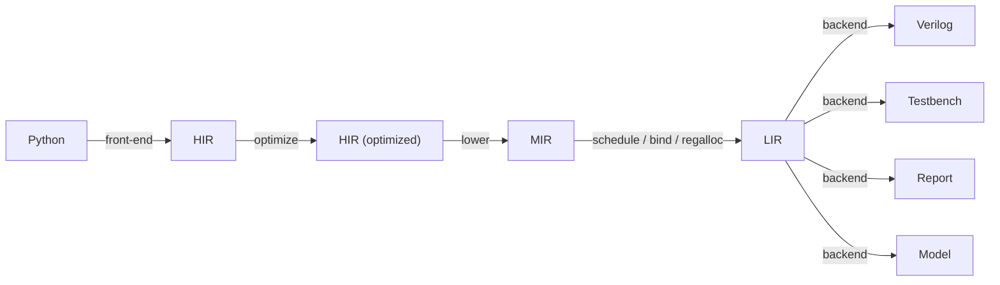

# Holoso design

Holoso lowers a small subset of Python (numerical control/DSP kernels) into vendor-neutral, synthesizable Verilog.
See `README.md` for scope and `PRIOR_ART.md` for why existing tools don't fit. This document records the architecture
we are building toward; it is expected to change frequently, and often may not be up to date.
Initial exploratory notes live in `DESIGN.draft.md` (outdated, superseded by this document).

One must read the representative use-case examples under the `examples/` directory to understand the motivation.

## Direction

- Build our own compiler. The differentiating work is the front/mid-end: partial evaluation of Python, shape
  inference, and operator scheduling for a resource-shared FSM. No external HLS gives us this for Python, and every one
  would force us to drop the Zubax Kulibin float (ZKF) library and adopt a pipeline-oriented optimizer we don't want.

- Delegate only to lightweight Python tools where it clearly pays: SymPy (fold/CSE/simplify), optionally
  Veriloggen's AST for emission, Cocotb for testbenches, optionally an ILP solver for an exact scheduling mode.
  Other lightweight dependencies may be freely introduced as needed.

- Bambu/XLS/CIRCT are not backends. Bambu is kept as a verification oracle and as inspiration only.

- The target is a specialized program, not a pipeline. We synthesize a sequential FSM (a zero-instruction-set
  computer, ZISC) that time-multiplexes a few shared operators over a register file.
  We do not pursue a constant II or II~1 like a streaming pipeline: the initiation interval is whatever the scheduled
  program costs. For a fixed control path it is an exact, statically known cycle count derived from the per-operator
  latency model (data-independent in v0); it varies across programs and, later, across branch paths.
  This is a compiler problem more than a circuit-design one.

## Pipeline



- HIR -- "what to compute": SSA dataflow inside a control-flow graph with real branches. Target-independent and
  semantic; it does not know how an operation is implemented. The `holoso._hir` subpackage owns the IR, semantic
  operators, and hardware-agnostic optimization passes.

- MIR -- "which hardware to use": selected hardware operators, with typed input/constant/operation/output nodes,
  still unscheduled. The current implementation has float-specific subclasses carrying folded sign controls. The
  `holoso._mir` subpackage owns the selected IR and HIR-to-MIR lowerer; this is the first stage allowed to inspect
  `OpConfig` or float-format limits.

- LIR -- "the microprogram": the scheduled, bound, register-allocated op stream for the synthesized machine.
  It has generic resource/operation base classes plus typed resource families such as the current float register file.
  The `holoso._lir` subpackage owns the IR, MIR-to-LIR construction, scheduling, binding, and register allocation.
  Controller-agnostic; this is the seam where a second controller backend can be added later.

- Backends -- Verilog, testbench, HTML report, numerical model

Mental model: HIR is the source-level compiler IR; MIR is selected machine-independent hardware dataflow; LIR is the
instruction stream of a tiny specialized processor; the Verilog backend is its assembler and datapath generator. The
backend stage is a family of independent backends --
the Verilog module, an HTML report, a Cocotb testbench, and a bit-exact numerical model -- each consuming the LIR,
and possibly some additional inputs, such as outputs of another backend.

The numerical backend is helpful during development and heavy refactors: it allows early verification of the synthesis
logic without involving the actual HDL emission and simulation steps, which are slow to iterate on.
Thus, the normal policy during development is to stabilize the synthesis logic down to the LIR using the numerical
model for verification, and once that is proven, move on to the actual HDL generation and testbenches.

## Python API

`synthesize` takes the object -- a function or class, not a source file or path -- and returns an in-memory result;
nothing touches the filesystem unless the caller asks.

```python
def synthesize(target, *, ops: OpConfig, parameters: Mapping[str, object] | None = None,
               entry: str = "__call__", name: str | None = None) -> SynthesisResult: ...

@dataclass(frozen=True)
class SynthesisResult:
    module_name: str

    ports: list[Port]
    input_ports: list[DataInputPort]
    output_ports: list[DataOutputPort]
    control_ports: list[ControlPort]

    verilog_output: VerilogOutput     # generated module text + support_files (the shared holoso_support.v)
    numerical_model: NumericalModel   # bit-exact, picklable pure-Python model (flat FloatValue in -> flat tuple out)
    cocotb_output:  CocotbOutput      # self-contained testbench: embeds the model, checks the DUT bit-for-bit
    html_output:    HtmlOutput        # self-contained single-page report
```

The root package re-exports only the supported public API, keeping the API surface to the minimum.
Private implementation modules may still expose unprefixed package-internal entrypoints at subsystem boundaries;
this is fine because they are shielded by the `__init__.py` selective re-export policy (not visible from outside).
Purely module-local helpers and type aliases inside those private modules are underscore-prefixed.
Same applies to nested subpackages: their internals are private to the subpackage, each has its own API.
Private module-local classes use unprefixed attributes for fields that sibling helpers need to access; the class name
itself provides the module-local privacy boundary. Underscore-prefixed attributes are reserved for state accessed only
by the owning class or its descendants.

The library should not contain entities that are only used in the unit test suite; those belong in the suite.

Passing the object is more ergonomic and strictly more capable than a file: it carries the runtime environment the
binding-time front-end needs -- `__globals__`, closure cells, default args, and the result of running `__init__` --
which is what evaluates compile-time tables and follows/inlines imported callables. The object is the compile root; the
boundary ("what to ignore") falls out of reachability + binding-time analysis, not manual enumeration. Source is read
via `inspect.getsource` + `ast`; when unavailable (REPL/`exec`/notebook-defined, some lambdas) synthesis fails with an
explicit error. For a class, `__init__` runs with `parameters` (overriding the kw-only defaults that otherwise map to
Verilog parameters), attributes written by `entry` become state registers, and `entry` (default `__call__`) is analysed
with the ports dynamic; a plain function is analysed directly. `result.write(out_dir)` is the only operation that
touches the filesystem.

## Front-end

Abstract interpretation over the Python AST/CFG with a binding-time lattice (static vs. dynamic), not tracing:

- Static values (shapes, `__init__`-derived constants, compile-time tables) are evaluated concretely -- real
  Python/NumPy runs at synthesis time.
- Dynamic values (input ports, persistent state) become SSA handles that accumulate HIR.
- `for`/`while` with a static trip count is unrolled; a dynamic trip count is rejected for now (the only case that needs
  a genuine variable-length loop -- a future feature).
- `if` on a static test takes one branch; `if` on a dynamic test emits a real branch (see HIR below).

Matrices/vectors are statically shaped and unrolled to scalar operations at synthesis time (as in the SymPy-CSE'd
`ekf1` example); arrays never exist as hardware aggregates, only as compile-time bookkeeping over scalar registers.
Reductions (`max`, `argmax`, `mean`, `@`) lower to compare/select trees and multiply chains. Input shapes are declared
with jaxtyping (`Float64[np.ndarray, "4 4"]`, concrete dims only); interior shapes are inferred.

## Types

Runtime values are only:

- `float` -- one ZKF format, `WEXP`/`WMAN` fixed per build.
Typical FPGA-friendly formats: WEXP=8 WMAN=36 (44 bits) for precision; WEXP=6 WMAN=18 (24 bits) for simpler targets.
Generated top-level modules are not parameterizable by `WEXP`/`WMAN`: port widths are hardcoded and the selected float
format is recorded by the typed float register-file resource and as internal localparams. Changing the float format
requires re-running synthesis because operator latencies, the static schedule, and register widths are all tied to that
choice.
- `bool` -- 1 bit.

HIR types live in `holoso._hir` as format-free `Type` values; today that family contains `FloatType`. Concrete scalar
types live in `holoso._type`: `ScalarType` is the width-bearing MIR/LIR-port/resource type family, today containing
`FloatType`, whose `FloatFormat` describes the ZKF encoding. A data port carries its scalar type and derives its bit
width from it; control ports carry explicit bit widths. Today all data ports are the same scalar `FloatType`, but this
is an implementation detail.

Compile-time ints/shapes/structure are resolved in the front-end and never reach HIR. A dynamic integer only ever
appears as an index into a static table; it is lowered to a one-hot bool vector + mux, never materialized as an int.

A FloPoCo backend may be introduced later on if makes sense, but it is likely to be mostly shielded behind the
`holoso_support.v` wrapper, so the effect on the codegen is minimal.

## HIR

```
# values
in_port(name, type)               # module input; concrete scalar type is assigned at HIR-to-MIR lowering
float_const(value)
state_read(slot)                  # persistent state at block entry
phi([(pred_block, value)])        # SSA merge

# pure semantic operations (generic; selected into concrete hardware by a later pass)
operation(operator, operands)      # float_add, float_mul, float_div, float_neg, float_abs, float_mul_pow2, ...
relational(op, a, b) -> bool      # lt, le, eq, ...
boolean(op, ...)     -> bool      # and, or, not, xor
select(cond, a, b)                # DATA mux (not control flow)
cast(a, to_ty)                    # bool <-> float
intrinsic(kind, args)             # sqrt, sincos, exp, ...   -> operator module, else hard error

# sinks
state_write(slot, value)
out_port(name, value)
```

Terminators: `jump(target)`, `branch(cond_bool, t, f)`, `ret` (commit state-writes + outputs, raise `done`).

State. Persistent state = class attributes; `__init__` gives initial values (folded, or kw-only params -> Verilog
`parameter`s). An unwritten persistent register holds its value. Reset reaches only state regs that are live-in at reset
before any dominating write (in practice the boolean control flags); pure datapath state stays out of the reset cone.
Registers that hold values assigned in `__init__` are explicitly assigned initial values at module reset.

Branch vs. select (the core control-flow decision):

- A real `if`/`else` lowers to a `branch` terminator + a `phi` at the merge. Only one side executes; the merge is
  resolved at register allocation by coalescing both definitions onto one register -- no runtime mux, the untaken
  arm is never computed, and no spurious error is recorded. Branches are the default.
- `select` (a mux, both inputs live) is reserved for data multiplexing (one-hot lookup, `where`-style picks) and for an
  optional if-conversion peephole that collapses a tiny, pure, cheap diamond. Conservative by default.

The implemented v0 HIR value set is float-only, but the node names are explicit (`FloatConst`, `FloatAdd`, etc.) so
bool/int nodes can be added later without overloading float semantics. Negation and absolute value are ordinary
semantic float operations in HIR. They are not represented as hardware details until selection.
HIR operators expose a HIR-local `Signature`, and the builder rejects operands whose HIR types do not match.

## HIR optimization and lowering

HIR optimization is hardware-agnostic: const-fold + algebraic simplify (SymPy-assisted) - CSE - strength reduction
(`x*2^k`, `x/2^k` -> semantic `float_mul_pow2`; `x/c` -> `x*(1/c)` for finite non-power-of-two constants; `x**n` ->
multiply chain) - optional if-conversion - DCE. Constant folding is typed: an operator receives constant nodes and
returns a folded `Const` node, not an untyped Python value. The HIR builder can re-intern an arbitrary `Const` node
with `const_node()`, so future bool/int constants do not need float-specific rebuilding in shared passes.

HIR-to-MIR lowering lives in `holoso._mir` and is implemented by a lowering context that owns the HIR tree, `OpConfig`,
MIR builder, and value remap. The float lowerer maps each semantic float operator to its configured
`FloatHardwareOperator` from the
single root-level hardware-operator config and collapses semantic `float_neg`/`float_abs` chains into selected-float MIR
`FloatSignControl` values on operator operands/results or output wires. Semantic `float_mul_pow2(k)` selects
`fmul_ilog2_const` when the configured float format supports that exponent; otherwise it falls back to ordinary multiply
by the constant `2^k`.

`MirBuilder` is a single graph builder with typed construction methods; it does not own a global scalar type, so future
mixed-type expressions can share one value namespace and add typed constructors for bool/int values. Hardware operators
expose a concrete `ScalarSignature`, and MIR construction validates operands against the selected operator's signature.
HIR-to-MIR lowering rejects semantic domains that do not yet have a selected MIR representation instead of silently
treating them as floats.

Typed MIR subclasses validate their local invariants at construction time. For example, selected-float MIR nodes verify
that their scalar types/operators/sign controls are float-domain objects and that operation operand/sign sidebands match
the selected operator arity. Cross-node operand type checks still belong in `MirBuilder`, where the referenced values
are available.

Note: it is understood that FP math is non-associative and some of these optimizations may result in non-bit-exact
results, which is accepted.

## LIR

```
resources:
  float_instances: [inst(operator), ...]    # each inst binds a fully-specified FloatHardwareOperator
  float_regfile: fmt + N float regs         # FF bank; the backend synthesizes a sparse, schedule-specific mux fabric
  float_consts: [fconst(value), ...]
  float_inputs: [input_load(name, dst_reg), ...]
  float_outputs: [output_wire(name, source, sign), ...]

scheduled float op:
  (inst, operands+sign_controls, dst_reg, issue_cycle)  # commits at issue_cycle + latency
makespan: the last commit cycle. The observable in_valid->out_valid latency (initiation_interval) is
  makespan + WRITE_LATCH + 1 + FETCH_LAG -- the schedule, the writeback latch landing the final result, and the
  microcode-fetch lag (see Scheduler and Backend).
```

LIR exposes only a minimal API surface, following the design policies.
The top-level `Lir` fields are typed explicitly as `float_instances`, `float_regfile`, `float_inputs`, `float_ops`,
and `float_outputs` because the current machine has only float data resources; future bool/int resources should add
sibling fields instead of overloading these. LIR construction fails explicitly if selected MIR contains a non-float
domain before that domain has a register/constant/output resource family. This check produces a `MirFloatView` once;
scheduling and float register allocation consume that narrowed view.

The `holoso._lir` package exports the LIR consumer contract: the LIR dataclasses and port classes backends need, plus
`build()`. Its private `_build.py` module orchestrates selected MIR narrowing, scheduling, binding, float register
allocation, and constant-pool construction. Its private `_schedule.py` module contains the list-scheduling algorithm and
schedule result type. It contains the reach-aware float-register allocator.
Shared LIR analysis helpers provide per-cycle grouping, register liveness, per-port read-sets / per-register
writer-sets, stable ref labels, and write-timeline reconstruction so backends do not each re-derive them.

- Storage is a sparse register file synthesized per kernel (see Backend): each operand's read mux spans only the
  registers it actually reads, each register's write select only its actual writers. Originally, an attempt to use
  a more CPU-conventional design was made, utilizing a full-reach crossbar register file, which resulted in untenable
  timing penalties due to the expensive read/write port multiplexors, hence the sparse optimized design was preferred.

- Register allocation is reach-aware: it places values to minimize per-port read-set and per-register writer-set
  fan-in (the steering cost that matters on an FPGA), not the register count; widen `N` rather than spill.

- `branch` is the real control transfer: the microprogram counter jumps, untaken ops never run, and the II is whatever
  the executed path costs (each path's count is itself exact).

## Operators

HIR semantic float operations are value instances of the HIR-local `Operator` hierarchy: `FloatAdd`, `FloatMul`,
`FloatDiv`, `FloatNeg`, `FloatAbs`, and strength-reduced `FloatMulPow2`. A HIR `Operation` is an occurrence of one
semantic operator applied to operand value IDs. There are no global semantic-operator singletons; frontend lowering and
HIR passes construct operator values ad hoc and distinguish operation kinds by class-pattern matching.

Concrete hardware operators live at the root in `holoso._operators` and are instances of the `HardwareOperator`
hierarchy. A concrete `HardwareOperator` is a frozen dataclass whose fields are its parameters. Float operators use the
`FloatHardwareOperator` subclass, which owns its `FloatFormat` and typed `evaluate(*FloatValue) -> FloatValue` reference
semantics.
Each hardware operator owns its own timing, notation, concrete `ScalarSignature`, instantiation params, and
`instance_stem`: a lowercase Verilog-safe compact physical identity stem used for HDL names. The visible prefix is the
normalized mnemonic; the suffix is a hex stable hash of the canonical hardware parameters. For float
operators, that hash covers the float format and all sorted HDL params -- always including zero-valued stage params.
Examples look like `fadd_326215ea` or `fmul_ilog2_const_7296114c` rather than spelling every parameter into the name.

Generic, per-node-parameterized hardware operators are factories: a standalone `ParameterizedHardwareOperator`
carrying only its config-time knobs whose `instantiate(k)` returns a concrete `HardwareOperator`. The fully specified
hardware operator instance is itself the resource-sharing key (equal operators time-share one module).

Operators are chosen by a single `OpConfig`, constructed explicitly by the caller and passed into `synthesize`; today
its fields are all floating-point operators, and future bool/int operators should be added to the same config. Its
`float_format` property verifies the configured float operators agree and is used by HIR-to-MIR lowering. After that,
schedule construction derives the format from selected MIR instead of accepting a separate format argument. There is no
implicit default configuration.
Pipeline-stage knobs are named after the HDL parameters in lowercase and default to 0, each adding its value to the
operator's latency. They mirror the ZKF wrappers: `fadd` has `stage_input`/`stage_decode`/`stage_align`/
`stage_normalize` (0..2)/`stage_pack`/`stage_output`; `fmul` has `stage_input`/`stage_product`/`stage_pack`/
`stage_output`; `fdiv` has `stage_input`/`stage_pack`/`stage_output`; and `fmul_ilog2_const` has
`stage_input`/`stage_decode`.

## Scheduler

The private `holoso._lir._schedule` module implements software-pipelined list scheduling over selected
single-block MIR. Operators are fully pipelined (throughput 1) and their latencies are static and data-independent, so
the entire schedule is computed at compile time: each op is assigned an issue cycle and a bound instance, and the backend
just replays it with a cycle counter. The scheduler itself is domain-agnostic; LIR construction partitions the scheduled
result into the typed resource families that exist today. There is no global operator-class registry and no global
operator ordering: physical instance indices are local to one equal-by-value hardware operator, while HDL names use
`instance_stem` to distinguish different operator values of the same class.

The per-operator latency model is therefore exact and load-bearing: the backend commits each result on
`issue + op.latency` without watching `out_valid`, so each operator's `latency` property must match the hardware
cycle-for-cycle. The generated RTL passes this value into each streaming Holoso wrapper's mandatory `LATENCY`
parameter, and the wrapper forwards it into the wrapped ZKF operator so a Python-model/ZKF drift fails during
elaboration or synthesis. An inaccurate latency is a *correctness* bug, not a bad estimate -- the consumer would read a
stale register if the guard were bypassed. The resulting cycle count is exact, never an estimate.

We issue each op on the earliest cycle its operands are ready and a free instance exists -- without waiting for
unrelated ops (no barrier), so a fast `fmul` no longer idles behind a co-scheduled `fdiv`. The register file is
read-first and carries mandatory read- and write-port latches, so a data-dependent consumer is held
`DEPENDENCY_EDGE = 1 + WRITE_LATCH + READ_LATCH` cycles past the producer's commit (the read-first write edge plus the
write and read latches). Inputs are the exception: they load directly into the array at the accept edge (bypassing the
write latch) and the microcode fetch lag hides that load before the first control word reaches the datapath, so an
input-reading op waits only `INPUT_DEPENDENCY_EDGE` -- the read latch alone (= 1 here).

```
for cycle = 1, 2, ...:                          # cycle 0 accepts/loads inputs
    ready = unscheduled ops whose every operator-operand committed (commit + DEPENDENCY_EDGE <= cycle); and,
            if the op reads an input, cycle >= INPUT_DEPENDENCY_EDGE (the load is hidden by the fetch lag)
    for op in ready by critical_path desc:
        if an instance of op's concrete hardware operator is free this cycle:
            bind op to that instance; issue_cycle[op] = cycle
regalloc: reach-aware coloring (greedy port-affinity + a bounded SciPy dual-annealing refinement); share a register
  when last_use <= def (sound under read-first; the latches only widen the margin); no spill
```

- Instances are pooled by the fully specified hardware operator itself (a frozen, equal-by-value `HardwareOperator`):
  ops that elaborate to the same hardware are equal and share instances. E.g., all `fadd`/`fmul`/`fdiv` of a given
  config are equal; `fmul_ilog2_const` differs by its exponent `K`, so same-`K` ops pool while different `K` are
  distinct modules. Each distinct operator value numbers its physical copies from zero, so different `K` values may both
  have instance index `0`; their `instance_stem` keeps emitted names unique.
  The configurable per-class budget (default 1) caps instances of each distinct operator value of that class: equal ops
  time-share, serializing when more than the budget would co-issue.

- Read/write ports are dedicated -- one read port per operator operand (`nrd` = sum of instance arities), one write
  port per operator instance (`nwr` = instance count), independent of I/O width -- but the storage is sparse, not a
  crossbar: the backend emits, per read port, a mux spanning only that operand's read-set (a single-register operand
  is a bare wire) and, per register, a write select spanning only that register's writers (a single-writer register
  needs no address compare). The controller word carries only the addresses/enables those muxes need.

- Inputs preload directly into the low registers `0..nload-1` on the accept step, folded into each such register's
  write select and gated by `in_valid`, rather than through write ports. `nload` spans the input block (the highest
  input register index plus one). Outputs are tapped directly from their register by fixed index.

- Selected-float MIR `FloatSignControl` value objects fold into operand/result sign-control sidebands, and `fconst` is an
  immediate on the input mux; both are free in the schedule. Sign controls are constructed ad hoc rather than
  represented by global sentinel instances.

Why not write-through forwarding? A write-through register file (`RWPASS=1`) would erase the +1 dependency cycle, but
its forwarding muxes cost O(NRD*NWR) and we need many ports -- unsustainable. Read-first plus the +1, hidden under
pipelined overlap, is the better trade.

## Backend (VLIW/ZISC)

Mechanical from LIR: an inline flop bank `regs[0:NREG-1]`, one operator instance per `FloatOperatorInstance`, and one
continuous assignment per pooled constant -- its ZKF bit pattern precomputed in Python by `FloatFormat.encode`. There is
no general-purpose multiport register-file module; storage is emitted as a sparse, schedule-specific fabric (read muxes
spanning each operand's read-set, write selects spanning each register's writers), with mandatory read- and write-port
latches. The controller is a microcode ROM: one pre-decoded VLIW control word per step, stored in a (BRAM-inferable) ROM
read through a 3-stage fetch -- a PC latch (`ucode_addr_q`, splitting the `pc -> next_pc -> ROM-address` cone), the array
read (`ucode_q`), and a second register (`ucode_word`) that packs into the BRAM's dedicated output register (DP16KD
OUTREG / Xilinx DO*_REG) for a fast clock-to-out. This replaces the old wide combinational `case(cyc)` cone with short
register-to-register paths. The fetch lags the executing step by `FETCH_LAG = FETCH_STAGES - 1` cycles: `pc` runs
`0..LASTPC` and `out_valid` is asserted at `LASTPC = makespan + WRITE_LATCH + 1 + FETCH_LAG`. Under fully static
scheduling these stages only add to the makespan/II. The fetch depth and the latches are fixed in v1.

The schedule is replayed step by step: `pc==0` accepts and parallel-loads the inputs directly into registers
`0..nload-1` in one cycle (gated by `in_valid`); `pc` advances every clock through the compute steps; and `pc==LASTPC`
asserts `out_valid` while the outputs are driven combinationally from their registers by fixed index. To line the
latched datapath up with the schedule, each operand's read-address control is presented `READ_LATCH` steps early and the
write-enable/address `WRITE_LATCH` steps late. The PC holds only at the two I/O boundaries; bubble steps carry an
explicit NOP word and the PC keeps advancing, and the ROM is NOP-padded past the present step to cover the fetch lag. No
scoreboard is needed because latencies are static.

The control word stores selectors and addresses, never data: each operand's read mux is driven by its read-address
field (spanning only the read-set), and each register's write select by the per-instance write-enable and destination
(the operator result wires straight into its writeback latch). Constant operands keep using the `const_<i>` immediate
wires through a small per-operand select, latched alongside the register read. A control field that is constant across
the whole program -- very common for sign controls, and now also for single-reader read addresses and single-writer
destinations -- is driven by a constant net and lifted out of the ROM, so synthesis prunes the logic it feeds; the
Python packer that builds the ROM and the bit-slice offsets the module reads are produced together, so they cannot
drift.

Errors are non-fatal and informative: each error-bearing operator's flag rides the same writeback latch as its result,
and `err` ORs it gated by that instance's (latch-aligned) write-enable; the control block latches
`err_pc <= pc - FETCH_LAG` (the executing step) whenever `err`, so `err_pc` is 0 if the run hit no errors (reset at every
accept; `|err_pc` means "any error"), else the last writeback step one occurred.

Reset covers only the control registers (`pc`, `err_pc_q`); the fetch registers are reset-unconditional (so they pack
into the BRAM output register) and settle to `ucode[0]` under reset. The control word and datapath skeleton are the only
ZISC-specific part -- LIR itself is controller-agnostic.

Each operator instance carries its own parameters and float format, fixed at construction from the `OpConfig` threaded
through `synthesize`. The wrappers' configuration params come from `operator.hdl_params()`, while `operator.latency` is
emitted separately as the mandatory `LATENCY` assertion parameter. `hdl_params()` always lists every hardware parameter
explicitly (including zero-valued `STAGE_*`), so the instantiation is self-describing, survives changes to wrapper
defaults, and turns a param-name mismatch into a loud elaboration error. The wrapper does not derive the ZKF latency
internally; it uses `LATENCY` for Holoso sideband alignment and forwards it to the wrapped ZKF operator, whose own
source is the reference for stage-count details. The wrapper instance name is `u_{operator.instance_stem}_{index}`,
where `index` is local to that concrete operator value; the stem uses a short stable hash of the operator's canonical
hardware parameters.

Constant operands are kept as immediates on the input mux. Two alternatives are noted in the backend for when this turns
into a constraint: folding constants into the register file (preloaded like inputs, so every operand is a uniform
register read), or emitting explicit constant-load micro-instructions (uniform operand path with lighter register
pressure, at the cost of scheduling/allocation complexity).

## Decisions

1. Phi merges are resolved by register coalescing, not materialized selects.
2. Split float and bool register banks.
3. If-conversion is conservative -- trivial pure diamonds only; real branches otherwise.
4. SymPy-assisted algebra (fold/CSE/simplify); simple HIR strength reduction in-house.
5. The per-operator latency model is exact and must match the ZKF RTL cycle-for-cycle: the static schedule commits each
   result on `issue + latency` without watching `out_valid`, and generated wrappers pass that value as mandatory
   `LATENCY` so ZKF elaboration catches drift. (Module I/O still uses a valid/ready handshake; `div0` is the only
   data-dependent runtime signal.)
6. Software-pipelined (zero-bubble) static list scheduling over a read-first register file; the controller is a
   microcode ROM replaying the schedule step by step (no runtime scoreboard), since v0 operator latencies are
   data-independent.
7. API takes the function/class object (not source files); synthesis is in-memory, returning `SynthesisResult`; disk
   I/O is an opt-in helper.

## Example (`iir1_lpf`): state + branch + coalescing

```
entry:  f = state_read(first); y_in = state_read(y)
        branch(f, b_init, b_run)
b_init: ya = in_a;                            jump(exit)        # y = x
b_run:  d  = sub(in_a, y_in)                                    # x - y
        m  = fmul_ilog2_const(d, -16)                           # 2^-16 * (x - y)
        yb = add(y_in, m);                    jump(exit)
exit:   y_out = phi[(b_init, ya), (b_run, yb)]
        state_write(y, y_out); state_write(first, const false)
        out_port(out_0, y_out); ret
```

`ya`/`yb` coalesce to the `y` register; the `phi` is free; only one arm runs; `first` resets to True; `y` is unreset.

## First delivery (v0)

Minimal end-to-end slice -- front-end -> HIR -> MIR -> scheduler -> LIR -> Verilog + testbench + report + model --
on a single basic block: combinational, scalar-only, operators `fadd`/`fmul`/`fdiv`/`fmul_ilog2_const` plus semantic
`FloatNeg`/`FloatAbs` folding and `FloatConst`
(`fdiv` and its wrapper already exist in ZKF). No state, control flow, arrays, or bools (`M = 0`); intrinsics
(`sqrt`, `sincos`, ...) raise the "implement this operator" error, pending ZKF support. State, branches, and arrays
follow in later milestones.

## Deferred

Operator-pool auto-sizing, optional ILP mode, dynamic-trip loops, second controller backend, FloPoCo backend,
intrinsics (`sqrt`, `sincos`, `exp`, ... -- pending ZKF support).

Per-target storage/control staging knobs: the read-port and write-port register-file latches and the microcode-fetch
depth are fixed on in v0, proven necessary for timing closure on the harder targets. A flow
that closes timing without one of them should be able to drop it at code-generation time and reclaim the latency.

A fused multiply-add operator wrapping kulibin `zkf_fma` is planned: a `holoso_ffma` wrapper plus an `FFmaOperator`
(with the selection pass fusing `a*b + c` chains). It should cut operator count, register pressure, and latency, and
help timing closure -- to be added later.
