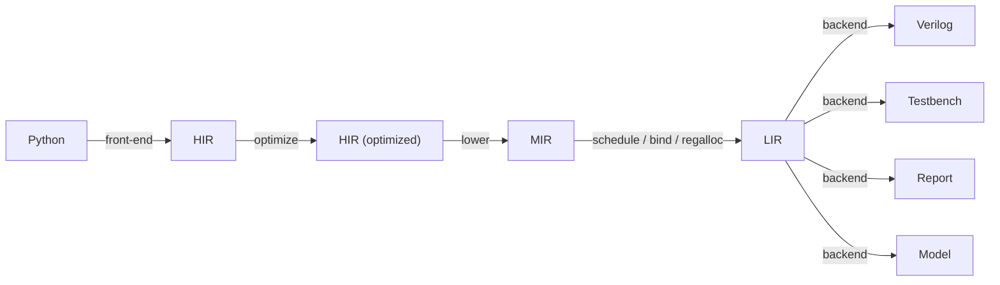

# Holoso design

Holoso lowers a small subset of Python (numerical control/DSP kernels) into vendor-neutral, synthesizable Verilog.
See `README.md` for scope and `PRIOR_ART.md` for why existing tools don't fit. This document records the architecture
we are building toward; it is expected to change frequently, and often may not be up to date.

THIS IS NOT A SPECIFICATION. We don't have to commit to anything outlined here; it is expected that many of the
proposed design decisions and trade-offs won't survive contact with reality, and we should be ready to discard
them and redesign at any moment.

This document is intended to capture the design intent, not the implementation minutae. Do not pollute it with exact
code references or a description of how the verification suite is built -- it's immaterial to the design.

One must read the representative use-case examples under the `examples/` directory to understand the motivation.

## Direction

Build our own compiler. The differentiating work is the front/mid-end: partial evaluation of Python, shape
inference, and operator scheduling for a resource-shared FSM. No external HLS gives us this for Python, and most
would force us to adopt a pipeline-oriented optimizer we don't want.

Delegate only to lightweight Python tools where it clearly pays: SymPy (fold/CSE/simplify), Cocotb for testbenches,
ILP solvers and function minimization (SciPy et al) for scheduling/regalloc.
Other lightweight dependencies may be freely introduced as needed.

The target is a specialized program, not a pipeline. We synthesize a sequential FSM (a zero-instruction-set
computer, ZISC) that time-multiplexes a few shared operators over a register file. We do not pursue a constant II or
II~1 like a streaming pipeline: the initiation interval is whatever the scheduled program costs.
For a fixed control path it is an exact, statically known cycle count derived from the per-operator latency model;
it varies across programs and across branch paths. This is a compiler problem more than a circuit-design one.

Encourage departure from IEEE 754 where it makes sense for a numerical control/DSP system (e.g., drop NaN/subnormals).

Compilation is deterministic and reproducible: identical input produces byte-identical output across invocations
(except for diagnostic outputs and reports, which may include variable data such as timestamps etc.).
Name-keyed merge/materialization points iterate in sorted order and every stochastic
optimization pass runs with a fixed seed.

## Pipeline



HIR -- "what to compute": SSA dataflow inside a control-flow graph with real branches. Target-independent and
semantic; it does not know how an operation is implemented.

MIR -- "which hardware to use": selected hardware operators, with typed input/constant/operation/output nodes,
still unscheduled.This is the first stage allowed to inspect hardware operator configs or operand numerical limits.

LIR -- "the microprogram": the scheduled, bound, register-allocated op stream for the synthesized machine.
It has generic resource/operation base classes plus typed storage: the shared wide data register file (integer+float)
and the separate 1-bit boolean bank.
LIR owns the IR, MIR-to-LIR construction, scheduling, binding, and register allocation.
RTL controller-agnostic; this is the seam where a second controller backend can be added later.

Backends -- Verilog, testbench, HTML report, numerical model, possibly more in the future (including other HDLs).

The numerical model backend is helpful during development and heavy refactors: it allows early verification of the
synthesis logic without involving the actual HDL emission and simulation steps, which are slow to iterate on.
The numerical model implements bit-exact emulation of the emitted HDL; for example, it doesn't use native floating
point operators but instead replaces them with an exact software implementation of the selected float format
implemented in the emitted RTL code.
The normal policy during development is to stabilize the synthesis logic down to the LIR using the numerical
model for verification, and once that is proven, move on to the actual HDL generation and testbenches.

Generated RTL testbenches (Cocotb at the moment, others may appear later) run the RTL simulator in lockstep with the
numerical model, feeding the same inputs and ensuring bit-exact output equivalence. For true end-to-end verification,
the original Python code can be verified against the numerical model itself but it is at the moment up to the user,
mostly because robust verification requires knowledge of the semantics of the original code.

The HTML report is an essential tool for humans to understand what the compiler did and debug it when it goes wrong.

## Python API

`synthesize(target, ops, ...) -> SynthesisResult` is the main entry point that returns an in-memory result;
nothing touches the filesystem unless the caller asks.

Passing the object is more ergonomic and strictly more capable than a file: it carries the runtime environment the
binding-time front-end needs -- `__globals__`, closure cells, default args, and the result of running `__init__` --
which is what evaluates compile-time tables and follows/inlines imported callables. The object is the compile root; the
boundary ("what to ignore") falls out of reachability + binding-time analysis, not manual enumeration.

`result.write(out_dir)` is the only operation that touches the filesystem.

The root package re-exports only the supported public API, keeping the API surface to the minimum.
Private implementation modules may still expose unprefixed package-internal entrypoints at subsystem boundaries;
this is fine because they are shielded by the `__init__.py` selective re-export policy (not visible from outside).
Purely module-local helpers and type aliases inside those private modules are underscore-prefixed.
Same applies to nested subpackages: their internals are private to the subpackage, each has its own API.
Private module-local classes use unprefixed attributes for fields that sibling helpers need to access; the class name
itself provides the module-local privacy boundary. Underscore-prefixed attributes are reserved for state accessed only
by the owning class or its descendants.

A plain function synthesizes to a stateless module. A stateful module is requested by passing a bound method of a
constructed instance, e.g. `synthesize(Integrator(k=...).__call__, ops)`: the method's `__self__` is the instance whose
attribute snapshot seeds the reset state, and `__func__` is the analyzed method (any method except `__init__`). The
constructor runs in plain Python, so constructor arguments are ordinary Python values frozen into the build -- there is
no separate parameter marshalling.

A future second mode for several methods sharing one state -- selected by passing the class together with a list of
its methods plus a runtime method-selector port, which would let `__init__` run at runtime rather than being frozen
-- is deferred: it needs heavier backend work (a selector and per-method schedules over shared state).

The library must not contain entities that are only used in the unit test suite; those belong in the suite.

## Front-end

Abstract interpretation over the Python AST/CFG with a binding-time lattice (static vs. dynamic):

- Static values (shapes, `__init__`-derived constants, compile-time tables) are evaluated concretely -- real
  Python/NumPy runs at synthesis time.
- Dynamic values (input ports, persistent state) become SSA handles that accumulate HIR.
- A `for` over a static `range` is unrolled (unless the count exceeds the unroll threshold); a `while` lowers to a
  real back-edge loop.
- `if` on a static test takes one branch; `if` on a dynamic test emits a real branch.

Persistent state. A synthesized method's `self` is not a port: each instance attribute the method writes becomes a
persistent register (a loop-carried value -- the initiation is the loop body, persistence the back-edge), and each
attribute it only reads is a frozen constant folded from the snapshot. Within the method `self.attr` is an ordinary SSA
variable, so reads and writes interleave freely with computation; the first read before any write is the register's
live-in (carried over from the previous initiation), and the value bound at method exit is the live-out that must reside
in the register at the boundary. Underscore-prefixed attributes stay internal; public attributes additionally drive a
`state_<attr>` output port (named apart from the `out_<n>` return ports), so a method need not return anything, and a
returned value that is, by dataflow, a public attribute (the same SSA value, however it was spelled or aliased) is
deduped onto that one port. An attribute assigned only in unreachable code (after a return) is never lowered, so it
stays a read-only folded constant -- whether an attribute is state follows reachability. A vector-valued attribute --
a list, tuple, or 1-D numpy array -- decomposes into one scalar register per element, slotted (and, if public, ported)
as `attr_0`, `attr_1`, ...; a scalar attribute keeps its bare name `attr` rather than an indexed slot. Reassigning
`self` itself (in any form -- `self = ...`, `self := ...`, `for self in ...`) is rejected: it is the fixed instance the
attributes resolve against, so `self.attr` would keep reading the original instance and the rebinding would silently
miscompile.

Matrices/vectors are statically shaped and unrolled to scalar operations at synthesis time; arrays never exist as
hardware aggregates, only as compile-time bookkeeping over scalar registers. That bookkeeping is a front-end value that
is either a scalar wire or an ordered aggregate of values: list/tuple literals, integer indexing, constant-bound
slicing, `*`-unpacking into call arguments and list/tuple literals, tuple-unpacking assignment (`x, y = b, a`, with
nested and single-starred targets, into locals or `self` attributes), elementwise scalar broadcast (vector `*` scalar),
`.flatten()`, and the sequence wrappers `list`/`tuple`/`np.asarray`/`np.array`/`np.asanyarray` (all identity on an
aggregate) operate on aggregates and leave only scalar leaves in HIR -- the supported source is thus executable numpy.

A pure function reachable through `__globals__` is inlined -- its body lowered in a fresh scope and its return
consumed as an aggregate -- so kernels compose (the `ekf1_stateful` example inlines the stateless `update_x_P`).
Name resolution follows Python: a local binding (parameter or any assignment target, including unpacked ones) shadows a
same-named global, and a global that shadows a built-in or intrinsic is honored only when it is callable -- a
non-callable shadow (e.g. `abs = 5`) is rejected rather than silently lowered to the built-in it spells.

Positional and keyword-only parameters both become input ports. Parameters annotated as `bool` become 1-bit boolean
ports; unannotated and float-annotated scalar parameters become floating-point ports. Reductions (`max`, `argmax`,
`mean`, `@`) lower to
compare/select trees and multiply chains. An aggregate attribute's shape is read from its reset value (list, tuple,
or numpy array); a numpy field may also carry an explicit jaxtyping annotation (`Float64[np.ndarray, "3"]`, concrete
dims only) validated against the value, while a shape-less annotation (`list[float]`, `numpy.typing.NDArray`) leaves
the shape to the value. Parameters are scalar inputs today; a value-less vector input would declare its shape with
jaxtyping. Interior shapes are inferred.

## Types

Runtime values are only:

- `float` -- one ZKF format, `WEXP`/`WMAN` fixed per build.
Typical FPGA-friendly formats have WMAN as a multiple of the native DSP tile argument width, which is commonly 18.
Example good values: WEXP=8 WMAN=36 (44 bits) for precision; WEXP=6 WMAN=18 (24 bits) for simpler targets.
- `bool` -- 1 bit.
- Eventually, a separate fixed-width `int` type may appear. The LIR wide data register file is already neutral
storage so future non-boolean scalar values can use the same bank when their physical width matches the build.
The expectation is that the register word width will be set to max(float width, integer width), which are
expected to be very similar in relevant use cases (hence minimal waste; e.g., e8m36 = 44 bit, plenty for numericals).

Compile-time ints/shapes/structure are resolved in the front-end and never reach HIR.

## HIR

```
# values
in_port(name, type)               # module input; concrete scalar type is assigned at HIR-to-MIR lowering
float_const(value)
state_read(slot)                  # persistent state at block entry
phi([(pred_block, value)])        # SSA merge

# pure semantic operations (generic; selected into concrete hardware by a later pass)
operation(operator, operands)      # float_add, float_mul, float_div, float_neg, float_abs, float_mul_pow2, ...
relational(op, a, b) -> bool      # lt, le, eq, ...  (implemented; chained a<b<c desugars to band of the links)
boolean(op, ...)     -> bool      # and/or are combinational gates; not folds into consumers; xor not yet
cast(a, to_ty)                    # bool(x) / float(cond)  (implemented as combinational float<->bool casts)
select(cond, a, b)                # DATA mux (not control flow), produced by diamond if-conversion; a conditional
                                  # expression first lowers to branch + typed phi and may then convert (see below)
intrinsic(kind, args)             # sqrt, sincos, exp, ...   -> operator module, else hard error

# sinks
state_write(slot, value)
out_port(name, value)
```

Terminators: `jump(target)`, `branch(cond_bool, t, f)`, `ret` (commit state-writes + outputs, raise `done`).

State. Persistent state = the instance attributes the method writes; the instance snapshot at synthesis time (whatever
`__init__` and any later mutation produced) gives each register's reset value, loaded at module reset. A state slot is a
loop-carried dependence resolved at register allocation by coalescing the live-out onto the slot register when its live
range does not overlap the live-in -- the producing operator then writes the slot register directly, no copy. When they
overlap (a one-sample delay line, or a write-then-read), the live-out keeps its own register and the backend copies it
into the slot register at its install cycle -- as early as the old live-in is read and the source is available when the
source is an ordinary register, so that source register frees for reuse, the boundary at the latest. A coalesced slot's
register is itself reusable for unrelated temporaries during its dead mid-frame gap (after the live-in's last read,
before the live-out lands), the tenant folded into the slot's write select -- shedding registers on stateful kernels; a
non-coalesced slot, installed by a standalone copy that cannot fold a tenant, stays reserved. The cost that matters is
mux fabric, not flip-flops. The persistent state registers are the one datapath exception that reset reaches (each
loaded with its snapshot); pure datapath state stays out of the reset cone.

Branch vs. select (the core control-flow decision):

- A real `if`/`else` lowers to a `branch` terminator + a `phi` at the merge. Only one side executes; the merge is
  resolved at register allocation -- no runtime mux, the untaken arm is never computed, and no spurious error is
  recorded. Each arm value is installed into the merged register at the predecessor's tail: directly, when the arm
  operator's result can coalesce onto the merged register, otherwise by a pc-gated copy (see LIR below). Branches are
  the default.
- `select` (a mux, both inputs live) implements data multiplexing: the if-conversion peephole collapses a small,
  pure, cheap branch diamond into per-phi selects, making the region straight-line (so it pipelines and reuses
  registers like any other). Both arms execute, so conversion is gated: every arm operation must be SPECULATABLE
  (an operator property; division is not -- a speculated div-by-zero would assert the module error flag for a path
  never taken), each arm must fit the `HOLOSO_IFCONV_MAX_OPS` budget (0 disables the pass), and v1 converts diamonds
  merging float phis only (a boolean merge stays a real branch). Arm sign chains fold into the select's operand
  conditioners, so `x if c else -x` costs one comparison and one mux. Each select operand is a dedicated direct
  (unlatched) register read; the cost is one mux per merged value, the same order as the per-arm phi-copy installs
  the branch would otherwise need.

HIR is a real CFG of basic blocks (entry first, a single `Ret` exit) carrying an SSA value DAG; `bool` is implemented
alongside float (`BoolConst`, bool `InPort`, bool `StateRead`, bool `Phi`), and a `StateSlot`'s reset is a typed `Const`
(`FloatConst`/`BoolConst`) so a boolean state register (e.g. `iir1_lpf._first`) carries a boolean snapshot. The node
names stay explicit (`FloatConst`, `FloatAdd`, etc.) so int nodes can be added later without overloading float
semantics. Negation and absolute value are ordinary semantic float operations in HIR, not hardware details until
selection. HIR operators expose a HIR-local `Signature`, and the builder rejects operands whose HIR types do not match.

Interning is block-scoped for operations and global for the entry-dominating interned pure values (constants and
state reads); inputs are entry-dominating too but never interned -- each parameter is a distinct, ordered port. An
operation is CSE'd only within its own block, so an identical expression evaluated in two sibling `if` arms stays two
distinct values (only the taken arm runs) -- a globally interned DAG would illegally share a value across
non-dominating sibling arms. Frontend control flow is structured and reducible, so the env it threads only ever
carries values that dominate the current point; merges emit one `Phi` per diverging scalar leaf (an attribute written
on only one arm carries its live-in on the other). This CFG is carried through MIR (typed per-resource-family views: a
float view and a boolean view sharing the block skeleton), scheduled and register-allocated per block, and lowered to
RTL (branch microcode) and to the numerical model.

Boolean values come from boolean input ports, boolean state reads, boolean constants, float comparisons,
boolean logic, and float->bool casts; a bool->float cast crosses back the other way. A `MirOperation` produces ONE
value -- the `output_port`-th result of its operator, with a typed conditioner per port (a folded sign control on a
float port, an optional free inversion on a boolean one) -- and belongs to the resource family of its tapped port's
type, while its operands may reference either bank. Operators split structurally into POOLED (a physical streaming
module the scheduler pools and contends: the float arithmetic and the comparator) and INLINE (a pure expression
folded into a register write: boolean logic and the casts); an operator may have several typed output ports, and
operations sharing one block, operator, operands, and operand conditioners while tapping distinct ports fuse into a
single firing. Boolean leaves may also drive 1-bit output ports directly, including public boolean state attributes
exposed as `state_<attr>`.

  - A comparison `a <relation> b` taps exactly one of the comparator's three one-hot order flags with an optional
    inversion (the ZKF ordering is total: lt/gt/eq directly, le = ~gt, ge = ~lt, ne = ~eq), so one physical
    `holoso_fcmp` serves every relation as an ordinary pooled instance, and several relations over one operand pair
    share a single firing. The inversion is fabric-side (an XOR folded into the register write), the boolean dual of
    the wide lanes' hardware `y_sgnop`.
  - Boolean logic `and`/`or` are inline `& |` gates (each operator owns its `verilog_expr`): `a and b` is
    `band(a, b)`, etc.; both operands always evaluate (the operands here are pure booleans). A chained comparison
    `a < b < c` desugars to `band(a < b, b < c)` with each operand evaluated once; a statically-known connective
    operand folds away. `not` NEVER materializes hardware: NOT chains fold at MIR lowering into the consumer's
    sideband -- an operand/output/state/phi-arm inversion conditioner (the 1-bit dual of the float sign control,
    free in fabric), or a branch-target swap on a condition -- always on the CONSUMER side, so one comparator tap
    and one register serve both polarities of a value (a producer-side flip would split the tap into two
    non-fusible firings).
  - `bool(x)` is the float->bool cast: true iff the ZKF exponent field is nonzero (= `x != 0.0`, sign-agnostic).
    `float(cond)` is the bool->float cast: ZKF `1.0`/`0.0`. Both are pc-gated inline writebacks that invoke the
    two functions in the shared `holoso_support.vh` (`` `include``d by the generated module), not modules and not inline
    logic. Functions keep the "one `always @*` block only" discipline while confining the ZKF bit layout to that one
    header, so the generated module's datapath carries no float-format assumption; the functions and the bit-exact
    model share the same definition (cross-checked at build time).

A conditional (ternary) expression `x if c else y` lowers to a `branch` on `c` plus a typed `phi` merging the two arm
values -- only the taken arm computes -- exactly like an `if` statement lifted into expression position; a
compile-time-known test selects one arm with no branch. A walrus `(name := expr)` binds `name` as a function local (so
the local-name and reachability scans treat it like any assignment) and yields the value. It is supported only where it
is evaluated unconditionally -- an `if` test, an assignment/return value, or any expression not under a short-circuit --
and rejected where its binding could be short-circuited or conditional and so cannot be reconciled between the scans and
lowering: inside an `and`/`or` operand or a chained comparison, a conditional-expression arm, or a `while` condition.

A nested `if` with no `else` on either level is folded to a single combined-`and` branch: `if A: (if B: S)` becomes
`if (A and B): S`, so it emits one branch instead of two (and `if A: if B: if C: S` collapses to one `A and B and C`).
This is exact because a boolean test in this subset is a pure combinational value, so evaluating `B` unconditionally is
equivalent; the fold is disabled the moment the outer `if` carries an `else` (then `if (A and B)` would mis-route the
`else`).

Scheduling is one cross-bank, dependency-aware pass per block over every firing together, with no barrier: a
comparison or cast issues as soon as its own operands have landed, so a cross-domain chain (e.g. `float(x > 0) * k`:
a float comparison feeding a bool->float cast feeding a float multiply) schedules correctly. Pooled firings contend
for physical instances through per-instance busy windows (an instance accepts a new firing every
`initiation_interval` cycles -- 1 for today's fully pipelined operators; the comparator is ordinary in this regard);
inline firings have no contention. The numerical model evaluates the whole block in one commit-sorted pass so a
float op reading a cast result reads it after it is written. Timing is a property of the register bank, never of the
individual operator: the wide bank reads through a read latch and writes through a writeback latch, while the
boolean bank is latch-free -- a boolean result is written directly at its microcode-gated commit step and is
readable the next step, and an inline op reads all its operands on the single step its write fires; a bool->float
result lands in a wide register on the wide bank's ordinary landing. The bank-true dependency edges this yields (see
Scheduler) let boolean-logic and cast chains schedule back-to-back, which directly shortens logic-dense kernels. The
comparison/connective/cast examples (`pid`, `schmitt_trigger`, `signal_window`, `remainder`) synthesize and
cosimulate bit-exactly like `iir1_lpf`.

A `for <name> in range(...)` loop over a static trip count fully unrolls (below an unroll threshold): the counter is a
compile-time integer, not a runtime register, so each trip lowers the body once with the counter bound -- as a static
integer for index/exponent/bound positions (a constant table `table[i]`, a power-of-two shift `2**-i`, a `range`
argument) and as a float constant for value positions. Reassigning the counter name to a runtime value demotes it from
a compile-time integer (a later branch on it is then a real runtime branch, and a static-index use of it is rejected),
matching Python. Unrolling reuses the branch and comparison machinery directly:
the unrolled body's per-iteration branches and comparisons lower exactly as written-out control flow. `cordic_sincos`
(rotation-mode CORDIC, whose per-iteration `2**-i` shift forces unrolling and whose sign test is a per-iteration
branch) synthesizes and cosimulates this way.

A `while` (a variable, convergence-tested count) lowers to a real back-edge loop: preheader -> header -> body ->
back-edge to the header. The header carries a phi for each scalar variable or persistent attribute the body reassigns,
merging its preheader value with the value at the body's end; a loop-invariant value dominates the loop and needs no
phi. A name the body reassigns to a runtime value (including a leaked `for` counter that was a compile-time integer in
the preheader) stays demoted after the loop, exactly as a reassignment outside a loop does, so a later folded
comparison or static-index use of it sees the runtime value rather than the stale compile-time one.
The latch (back-edge) arm is a forward reference -- a body value defined after the header -- so the phi is opened
with its preheader arm and closed once the body is lowered; the same open/close defers the arm through every HIR pass
and the MIR lowering, which otherwise visit values in a dominance order the back edge violates. The block layout puts
each loop body below its header and forces the single `Ret` block last (a loop body, a DFS leaf via its back edge,
would otherwise sort after the exit), so a back-edge is just a jump to a lower address that the next-PC sequencer
already handles. The per-block drain makes the loop-carried values land-stable before the header re-fetches, exactly
as a branch merge reads land-stable phi inputs; `min_initiation_interval` weights the back-edge as not-taken (the loop
exits on its first header test), a true lower bound, with the numerical model the authority on the realized count.
`recip_newton` (Newton-Raphson reciprocal iterated until the update falls below a tolerance) synthesizes and
cosimulates this way, on its convergent domain. A `for` above the unroll threshold is rejected rather than lowered to
a counted back-edge loop (a counted loop would need a runtime integer counter; deferred).

### DEFERRED

Variable-trip `for` loops.

Diamond if-conversion of boolean-phi merges (today only float-phi diamonds convert to select;
a boolean merge needs a (c & t) | (~c & f) logic mux rather than the wide select).

Early return support is missing (from loop body).

Integer operand support is missing; it needs typed int operands/constants/operators that reference the same wide
register bank when their physical width matches the build.

## HIR optimization and lowering to MIR

HIR optimization is hardware-agnostic: const-fold + algebraic simplify (SymPy-assisted) - CSE - strength reduction
(`x*2^k`, `x/2^k` -> semantic `float_mul_pow2`; `x/c` -> `x*(1/c)` for finite non-power-of-two constants; `x**n` ->
multiply chain) - diamond if-conversion (after folding, so arm costs are final -- a constant condition that
escapes the frontend's folding is refused; before DCE, which sweeps a converted diamond's condition cone when
nothing else reads it: conversion turns control dependence into data dependence, so a fully-unused diamond's
condition is dead code like any other; converted diamonds splice into their branching block and block ids
recompact) - DCE. Constant folding is typed: an operator receives constant nodes and
returns a folded `Const` node. The HIR builder can re-intern an arbitrary `Const` node with `const_node()`,
so bool/int constants do not need float-specific rebuilding in shared passes.

HIR-to-MIR lowering is implemented by a lowering context that owns the HIR tree, `OpConfig`, MIR builder,
and value remap. The float lowerer maps each semantic float operator to its configured `FloatHardwareOperator`
from the single root-level hardware-operator config and collapses semantic `float_neg`/`float_abs` chains into
selected-float MIR `FloatSignControl` values on operator operands/results or output wires. Semantic `float_mul_pow2(k)`
selects `fmul_ilog2_const` when the configured float format supports that exponent; an exponent outside the operator's
range is rejected with an explicit error. A fallback to an ordinary multiply by the constant `2^k` would have no
practical utility: such an exponent always lies outside the format's representable range, so the constant itself would
overflow to a (rejected) infinity or underflow to zero, making the multiply degenerate.

`MirBuilder` is a single graph builder with typed construction methods; it does not own a global scalar type, so
mixed-type expressions can share one value namespace. It does carry the configured float format explicitly, so modules
with no float values still elaborate with a known scalar width for constants, localparams, and helper functions.
Hardware operators expose a concrete `ScalarSignature`,
and MIR construction validates operands against the selected operator's signature. HIR-to-MIR lowering rejects
semantic domains that do not yet have a selected MIR representation.

Typed MIR subclasses validate their local invariants at construction time. For example, selected-float MIR nodes verify
that their scalar types/operators/sign controls are float-domain objects and that operation operand/sign sidebands match
the selected operator arity. Cross-node operand type checks still belong in `MirBuilder`, where the referenced values
are available.

It is understood that FP math is non-associative and some of these optimizations may result in non-bit-exact results,
which is accepted. This is analogous to fast-math optimizations in C/C++ compilers.

## LIR

```
resources:
  instances: [inst(operator), ...]          # each inst binds a fully-specified pooled hardware operator
  float_format: fmt                         # ZKF semantics for float operators and constants
  regfile: width + N wide regs              # FF bank; the backend synthesizes a sparse, schedule-specific mux fabric
  bool_regfile: N 1-bit bool regs           # branch conditions and boolean values/state
  float_consts: [fconst(magnitude), ...]    # nonnegative magnitudes; the sign rides the consumer's sign sideband
  inputs: [input_load(name, typed_dst_reg), ...]  # ordered float and boolean input ports
  outputs: [output_wire(name, typed_source), ...]  # ordered float and boolean result/state ports

pooled firing:
  (inst, operands+conditioners, [write(port, dst_reg, conditioner), ...], issue_cycle)  # commits at issue + latency
inline firing:
  (operator, operands+conditioners, write(port, dst_reg, conditioner), issue_cycle)     # one pc-gated statement
makespan: the last commit cycle. The observable in_valid->out_valid latency (initiation_interval) is
  makespan + WRITE_LATCH + 1 + FETCH_LAG -- the schedule, the writeback latch landing the final result, and the
  microcode-fetch lag (see Scheduler and Backend).
```

LIR exposes only a minimal API surface, following the design policies.
It exports the LIR consumer contract: the LIR dataclasses and port classes backends need, plus `build()`.
Shared LIR analysis helpers provide per-cycle grouping, register liveness, per-port read-sets / per-register
writer-sets, stable ref labels, and write-timeline reconstruction so backends do not each re-derive them.

Storage is a sparse register file synthesized per kernel (see Backend): each operand's read mux spans only the
registers it actually reads, each register's write select only its actual writers. Originally, an attempt to use
a more CPU-conventional design was made, utilizing a full-reach crossbar register file, which resulted in untenable
timing penalties due to the expensive read/write port multiplexors, hence the sparse optimized design was preferred.

Register allocation is reach-aware over the whole control-flow graph. Whether two values may share a register is
decided on a hardware-frame interference graph built from per-block liveness: a value resides in a block from the
block's first step when it is carried in from a predecessor or is a phi result, from its operator's landing cycle when
it is defined in the block, and through the block boundary when it is live out; a phi result additionally resides at
the tail of every arm predecessor, because its install copy physically writes the phi register there -- one step
before the boundary where a branch terminator reads its condition, so an unmodeled install could clobber the very
condition selecting the successor. (This conservatively also forbids a phi from sharing its own arm values'
registers, although that same-step read-first self-copy would be harmless; a copy-coalescing pass could reclaim it.
A branch on a phi installed in the branching block itself is rejected outright -- there the conflict is the value
with itself and no assignment can help.) Two values interfere when their residences overlap in some block under the
read-first rule (the older value's last read must precede the newer's landing). Path-awareness is free -- the two arms
of an `if` are live in no common block, so their temporaries reuse the
same registers, which is what keeps a heavily-branched kernel (e.g., a 12-iteration CORDIC) to a handful of wide
registers. The primary objective is to minimize per-port read-set and per-register writer-set fan-in
(the steering cost that matters on an FPGA). Register count is a bounded secondary objective: it colors reach-minimal
and again compacting dead registers up to a write-select cap, keeping whichever minimizes `reach + price * registers`,
so it sheds a register only when that widens a write select modestly. No spill. The coloring is a port-affinity greedy
seed refined by simulated annealing over the same objective.

Commutative port assignment: after allocation, each firing of a commutative operator has its two operands oriented
across its read ports to minimize the total read-set size. A register that an operand reads in one position and
another reads in the other position would otherwise sit in both ports' read muxes; consistent orientation keeps it
in one. Commutation is declared as an input swap with an induced output-port permutation (identity for the
single-output arithmetic; the comparator's gt and lt flags transpose while eq is fixed, exact because the ZKF
ordering is total and compare antisymmetric), so a swapped firing's taps move to the permuted ports and the value is
bit-identical. This is a pure relabelling of which physical port reads which register -- no hardware, no latency --
so it can only shrink the read muxes (the Chen & Cong mux-aware port-assignment lever).
Minimizing total read-set size over orientations is graph bipartisation; a local search stalls well above the
optimum (e.g., ekf1_stateless's multiplier traps at 50 register-arms), so it is solved exactly per instance as a
small MILP (HiGHS via `scipy.optimize.milp`), with the deterministic local search kept as a fallback when the MILP
does not prove optimality in its time budget. On ekf1_stateless this takes read-mux fan-in from 89 to the optimum 78
(the multiplier's two operand muxes from 29+27 to 46 register-arms).

`branch` is the real control transfer: the microprogram counter jumps, untaken ops never run, and the II is whatever
the executed path costs (each path's count is itself exact).

CFG backend (`if`/`else`, comparisons, unrolled `for`, and back-edge `while`).
Blocks are laid out contiguously in reverse-postorder with the single canonical `Ret` forced last as the out_valid
boundary (so a loop body, a DFS leaf via its back edge, stays below it); a back-edge is a jump to a lower address.
Each block spans `boundary_step(block_makespan) + 1` fetch PCs (a per-block drain) and its terminator redirects the
fetch PC at the block's boundary via a small `case(pc)` in `next_pc` that, for a `branch`, reads the condition's 1-bit
register (`bregs`). A phi (and each persistent slot's live-out) is resolved at register allocation as above: coalesced
onto the merged register when its live range does not overlap, else installed by a pc-gated copy at the predecessor's
tail (a parallel copy bundle, read-first, so a swap is correct). `min_initiation_interval` is the shortest-path lower
bound (exact when the kernel has a single forward path); the numerical model reproduces output bits exactly but does
not yet predict the actual per-transaction cycle latency (the testbench checks output bits at the out_valid handshake).

Compile-time-known branch conditions fold to a single arm so the other is never lowered (no spurious state from an
unreachable write): a literal, a read-only boolean attribute, a comparison whose operands are both compile-time floats
(a literal, an unrolled loop counter, a read-only attribute, or `+`/`-`/`*` arithmetic of these), and the connective /
cast / ternary forms over these (`X or True`, `X and False`, equal-arm ternaries, `float(<cond>)` comparisons). The
comparison fold is fast-math (float64), exactly as the constant folder evaluates a relational of constants, accepted
per the fast-math policy above; the model and the RTL follow the same folded arm, so they agree regardless. A condition
with any runtime operand stays a real branch resolved by the hardware comparator. This reachability fold is one shared
predicate across lowering and the attribute/loop scans (so they agree on which arms exist), but it is an AST-level
approximation deliberately narrower than the (complete) HIR constant folder: a constant condition buried under a shape
it does not inspect stays a runtime branch -- at worst leaving an unused state register or rejecting a return under a
contrived tautology, never a miscompile. Unifying it with the complete folder (lower unconditionally, then fold
constant branches in HIR) is tracked future work, unblocked once Phase-2 early returns let the return-placement check
move after constant folding.

There is a hardware-frame interference-graph coloring engine that colors both the wide and boolean register banks,
and one emitter in which every register is driven by a single consolidated write chain (a priority over its input-load,
operator-writeback, pc-gated copy/cast, and state-install drivers).
Persistent-slot live-outs coalesce onto the slot register when their range does not overlap the live-in
(else a pc-gated copy installs them, as early as the live-in is read), a coalesced slot register hosts gap
tenants, and commutative-port assignment orients every commutative firing (the comparator included) across the
whole op stream.

### DEFERRED

Phi-arm coalescing: a phi arm is still installed by a pc-gated copy rather than coalesced onto the merged register
(path-aware coalescing -- mutually exclusive arms do not interfere; a loop-carried phi whose live-in and live-out
overlap still needs copy-installation).

Cross-block software pipelining: the machine uses per-block drain barriers; overlapping a fall-through block's head
with its predecessor's tail (branches and loop back-edges stay hard PC barriers -- the ZISC cannot fetch a successor
before the redirect resolves) is a separate scheduling effort. The complementary half -- if-converting small pure
diamonds to `select` muxes so branchy kernels become branch-free and pipeline fully -- has landed (see HIR).

The numerical model should advance one clk per `.tick()`, replaying PCs and latches like the hardware, so it stays
correct under register reuse and cross-block overlap by construction and enables cycle-accurate lockstep cosimulation
with immediate state-divergence detection (today it reproduces output bits exactly, block by block, but not the
per-transaction cycle latency).

## Operators

HIR semantic float operations are value instances of the HIR-local `Operator` hierarchy.
A HIR `Operation` is an occurrence of one semantic operator applied to operand value IDs.

Concrete hardware operators are instances of the `HardwareOperator` hierarchy.
A concrete `HardwareOperator` is a frozen dataclass whose fields are its parameters.
Float operators use the `FloatHardwareOperator` subclass, which owns its `FloatFormat` and typed
`evaluate(*FloatValue) -> FloatValue` reference semantics (emulated bit-exact following RTL).
Each hardware operator owns its own timing, notation, concrete `ScalarSignature`, instantiation params, and
`instance_stem`: a lowercase HDL-safe compact physical identity stem used for HDL names.
The visible prefix is the normalized mnemonic; the suffix is a hex stable hash of the canonical hardware parameters.
For float operators, that hash covers the float format and all sorted HDL params.
Examples look like `fadd_326215ea` rather than spelling every parameter into the name.

Generic, per-node-parameterized hardware operators are factories: a standalone `ParameterizedHardwareOperator`
carrying only its config-time knobs whose `instantiate(k)` returns a concrete `HardwareOperator`. The fully specified
hardware operator instance is itself the resource-sharing key (equal operators time-share one module).

Operators are chosen by a single `OpConfig`, constructed explicitly by the user and passed into `synthesize`.
Its `float_format` property verifies the configured float operators agree and is used by HIR-to-MIR lowering.
After that, schedule construction derives the format from selected MIR instead of accepting a separate format argument.
There is no implicit default configuration.

Operator latency tuning knobs are named after the HDL parameters (as defined in `holoso_support.v`) in lowercase.

## Scheduler

The LIR scheduler module implements software-pipelined list scheduling over each block of the selected MIR.
Operator latencies are fully static and data-independent (and most of them are throughput-1, zero-bubble),
so the entire schedule is computed at compile time: each op is assigned an issue cycle and a bound instance,
and the backend just replays it with a cycle counter. The scheduler itself is domain-agnostic;
LIR construction partitions the scheduled result into the typed resource families.

The per-operator latency model is therefore exact and load-bearing: the backend commits each result on
`issue + op.latency` without watching `out_valid`, so each operator's `latency` property must match the hardware
cycle-for-cycle. The generated RTL passes this value into each streaming Holoso wrapper's mandatory `LATENCY` parameter,
so a Python-model/RTL operator latency drift fails during elaboration or synthesis. An inaccurate latency is a
*correctness* bug, not a bad estimate -- the consumer would read a stale register if the guard were bypassed.
The resulting cycle count is exact, never an estimate.

We issue each op on the earliest cycle its operands are ready and a free instance exists -- without waiting for
unrelated ops (no barrier). The commit-to-issue spacing a dependence requires is not one constant: it is derived,
pairwise, from the producer's result-bank landing and the consumer's read mechanism by one shared rule
(`dependency_edge`), the same per-bank cycle helpers every other consumer of the timing model uses. The latched wide
bank charges its writeback latch and read-first edge against the consumer's read latch (edge 3 for a float-arithmetic
consumer); the latch-free boolean bank only the read-first edge, against an inline consumer's fire-step read (edge 0
for a logic op reading a comparison -- back-to-back), clamped so an inline consumer always commits strictly after its
producer (the commit-ordered model evaluation relies on that). Inputs are the exception: they load directly into the
array at the accept edge and the microcode fetch lag hides that load before the first control word reaches the
datapath, so an input-reading op waits only `INPUT_DEPENDENCY_EDGE`.

```
for cycle = 1, 2, ...:                          # cycle 0 accepts/loads inputs
    ready = unscheduled ops with every operator-operand committed (commit + dependency_edge(producer, consumer) <=
            cycle, the edge derived per bank pair); and, if the op reads an input, cycle >= INPUT_DEPENDENCY_EDGE
    for op in ready by critical_path desc:
        if an instance of op's concrete hardware operator is free this cycle:
            bind op to that instance; issue_cycle[op] = cycle
regalloc: reach-aware coloring (greedy port-affinity + function minimization) minimizing mux
  fan-in, then register count as a bounded secondary objective (best of a reach-minimal and a cap-compacted coloring);
  share a register when the older value's last read precedes the newer's landing in the hardware frame, R(a) < W(b) --
  the read/write latch separation is reclaimed (what reg_liveness renders), not merely tolerated; no spill
```

Instances are pooled by the fully specified hardware operator itself (a frozen, equal-by-value `HardwareOperator`):
ops that elaborate to the same hardware are equal and share instances. E.g., all `fadd`/`fmul`/`fdiv` of a given
config are equal; `fmul_ilog2_const` differs by its exponent `K`, so same-`K` ops pool while different `K` are
distinct modules. Each distinct operator value numbers its physical copies from zero, so different `K` values may both
have instance index `0`; their `instance_stem` keeps emitted names unique.
The configurable per-class budget (default 1) caps instances of each distinct operator value of that class: equal ops
time-share, serializing when more than the budget would co-issue.

Read/write ports are dedicated -- one read port per operator operand (`nrd` = sum of instance arities), one wide
write port per tapped WIDE output-port lane (`nwr` counts only tapped lanes: the comparator contributes none, a
future sorter one per USED output), independent of I/O width -- but the storage is sparse, not a crossbar. Per
read port the backend emits a mux spanning only that operand's read-set: a single-register operand is
a bare wire, an always-constant operand is the immediate, and a multi-register operand is a `case` over its read-set
index. Per register it emits a write select spanning only that register's writers (a single-writer register needs no
address compare). The two sides are symmetric: the read-address field carries the dense read-set index and the
write-address field the dense write-target index (each `ceil(log2 set)` wide, not the file-wide register index),
so the controller VLIW word carries only those narrow set-local indices plus the per-register write enable.

Inputs preload directly into the low registers of their own bank on the accept step, captured together under a single
`if (in_ready && in_valid)` block rather than through write ports. Wide-bank `nload` currently spans the float input
block (the highest float input register index plus one); boolean inputs are allocated analogously in the boolean bank.
Outputs are tapped directly from their register by fixed index.
Persistent state registers sit directly above the input block in their bank; a coalesced slot is written by
its producing operator like any other result, and a non-coalesced slot is copied into its register on its install
step (`pc == state_copy_step`, which is `LASTPC` for a boundary copy)
by a small reg->reg block beside the input load, capturing its source on that step;
an early install (when the source is an ordinary register read by nothing later) frees that source register for reuse.

Selected-float MIR `FloatSignControl` value objects fold into operand/result sign-control sidebands, and `fconst` is an
immediate on the input mux; both are free in the schedule. Sign controls are constructed ad hoc rather than represented
by global instances.

Why not write-through forwarding? A write-through register file would erase the +1 dependency cycle, but its
forwarding muxes cost `O(NRD*NWR)` and we need many ports -- unsustainable. Read-first plus the +1, hidden under
pipelined overlap, is the better trade.

## Backend (VLIW/ZISC)

Mechanical from LIR: an inline flop bank `regs[0:NREG-1]` plus the 1-bit `bregs`, one module per pooled operator
instance, and one continuous assignment per pooled constant -- its ZKF bit pattern precomputed in Python by
`FloatFormat.encode`. There is no general-purpose multiport register-file module; storage is emitted as a sparse,
schedule-specific fabric (read muxes spanning each operand's read-set, write selects spanning each register's
writers). The wide bank carries read- and write-port latches; the boolean bank is latch-free.
The controller is a microcode ROM: one pre-decoded VLIW control word per step, stored in a (BRAM-inferable) ROM
read through a 3-stage fetch -- a PC latch (`ucode_addr_q`, splitting the `pc -> next_pc -> ROM-address` cone), the
array read (`ucode_q`), and a second register (`ucode_word`) that packs into the BRAM's dedicated output register
(e.g., ECP5 DP16KD OUTREG, Xilinx DO*_REG, etc.) for a fast clock-to-out. This replaces the old wide combinational
`case(cyc)` cone with short register-to-register paths. The fetch lags the executing step by
`FETCH_LAG = FETCH_STAGES - 1` cycles: `pc` runs `0..LASTPC` and `out_valid` is asserted at
`LASTPC = makespan + WRITE_LATCH + 1 + FETCH_LAG`. Under fully static scheduling these stages only add to the
makespan/II. The fetch depth and the latches are currently fixed but may be made disableable for faster chips.

The schedule is replayed step by step: `pc==0` accepts and parallel-loads the inputs directly into registers
`0..nload-1` in one cycle (gated by `in_valid`); `pc` advances every clock through the compute steps; and `pc==LASTPC`
asserts `out_valid` while the outputs are driven combinationally from their registers by fixed index. To line the
latched datapath up with the schedule, each operand's read-address control is presented `READ_LATCH` steps early and the
write-enable/address `WRITE_LATCH` steps late. The PC holds only at the two I/O boundaries; bubble steps carry an
explicit NOP word and the PC keeps advancing, and the ROM is NOP-padded past the present step to cover the fetch lag.
No scoreboard is needed because latencies are static -- this is a fundamental property of this design.

The control word stores selectors and addresses, never data: each operand's read mux is driven by its read-address
field (the dense read-set index), and each register's write select by per-OUTPUT-PORT-LANE write-enable and
write-address fields (the dense write-target index, against which the per-register comparator matches). A wide lane's
result wires through its writeback latch with its enables one step after the commit; a boolean lane is latch-free --
its enables ride the commit step itself and its inversion conditioner is a fabric XOR at the write, which is exactly
what leaves a branch condition one cycle of slack at the block boundary. An inline firing (boolean logic, a cast) is
a single PC-gated statement rendered by the operator's own expression, not a microcode lane: it fires once at a
statically known step, so a PC compare is the cheapest correct realization. Constant operands keep using the
`const_<i>` immediate wires through a small
per-operand select, latched alongside the register read. A control field that is constant across the whole program --
very common for sign controls, and now also for single-reader read addresses and single-writer destinations -- is
driven by a constant net and lifted out of the ROM, so synthesis prunes the logic it feeds;
the Python packer that builds the ROM and the bit-slice offsets the module reads are produced together,
so they cannot drift.

Read mux. A multi-reader operand's mux is a `case` over its dense read-set index (the read-address field) selecting
`regs[...]` directly; the last read-set entry is the `default` arm so the case is full (no inferred latch, and the
unused high codes fall there as don't-cares). It deliberately avoids the obvious-looking alternative -- an indexed
part-select into a packed gather bus, `bus[idx*W +: W]` -- because a variable part-select offset is a multiply: with a
non-power-of-two `W` (e.g. 24) Lattice Diamond's LSE infers it as a DSP `MULT9X9D` per operand on the operand-read path.
Padding each gather element to a power-of-two stride turns the offset back into a shift and removes the DSP, but a
`case` has no offset arithmetic at all, needs no padding, and measures slightly smaller and faster than the
part-select on all three flows -- so the read mux is a plain `case`.

Write select. Each register's writeback is a one-hot select over only its writers, kept one register per flop (the
input load is a separate `if (in_ready && in_valid)` block above, not an arm of the select) so the write logic does
not scatter a register's drivers across per-instance blocks -- a per-writer-instance demux was measured ~10% larger
on yosys/Vivado. For a register written by an instance that writes more than one register, the guard compares its
write-address field against the dense index this register occupies in the instance's sorted write-target set --
the same codebook the microcode packs, so the two cannot drift. This mirrors the read-set index on the read side:
both fields carry a set-local index sized to the set, never the file-wide register index. A single-target instance
needs no compare (its field is lifted out as a constant), and the schedule guarantees at most one writer per register
per step, so the priority chain the emitter writes is logically one-hot. The recode is transparent -- the comparator
simply matches a relabelled constant -- so it costs no decode logic; it only narrows the ROM word and the comparators.

Errors are non-fatal and informative: each error-bearing operator's flag (e.g., `div0`, `domain_error`, etc.) rides
the same writeback latch as its result, and `err` ORs it gated by that instance's (latch-aligned) write-enable;
the control block latches `err_pc <= pc - FETCH_LAG` (the executing step) whenever `err`, so `err_pc` is 0 if the run
hit no errors (reset at every accept; `|err_pc` means "any error"), else the last writeback step one occurred.

Reset covers the control registers (`pc`, `err_pc_q`) and the persistent state registers (each loaded with its reset
snapshot, emitted after the writeback so the snapshot wins on the reset edge); the fetch registers and the rest of the
datapath are reset-unconditional (so they pack into the BRAM output register) and settle to `ucode[0]` under reset.
The control word and datapath skeleton are the only ZISC-specific part -- LIR itself is controller-agnostic.

Each operator instance carries its own parameters and float format, fixed at construction from the `OpConfig`.
Every instantiation lists every hardware parameter explicitly (including default-valued ones),
so the instantiation is self-describing, survives changes to wrapper defaults,
and turns a param-name mismatch into a loud elaboration error. The wrapper does not derive the latency internally;
it uses `LATENCY` for Holoso sideband alignment and forwards it to the wrapped operator implementation, whose own
source is the reference for stage-count details.

Constant operands are kept as immediates on the input mux. Two alternatives are noted in the backend for when this turns
into a constraint: folding constants into the register file (preloaded like inputs, so every operand is a uniform
register read), or emitting explicit constant-load micro-instructions (uniform operand path with lighter register
pressure, at the cost of scheduling/allocation complexity).

The Verilog backend's `support_files` map is the authoritative manifest for auxiliary HDL shipped with a generated
module. File-writing helpers and the out-of-context synthesis harness materialize the whole map verbatim alongside the
generated module, while tool-specific scripts name only the HDL root they read directly.

## Fabric-area exploration

The synthesized fabric is dominated by the per-operand read multiplexers: on a register-pressure-heavy kernel (the
ekf1 EKF update) they are roughly 60-65% of the LUTs, and a read mux's cost is approximately linear in
`read-set-size * W`. The read-set sizes sit at the interference floor -- the values a port reads are largely
simultaneously live, so they must occupy distinct registers -- so the muxes encode real liveness rather than
allocation slack, which is what bounds most levers. The results below were measured end-to-end on Yosys+nextpnr-ECP5,
Lattice Diamond, and Vivado, and are recorded so the dead ends are not re-explored.

Adopted (lossless, f_max-neutral, in the committed design):

- Read mux as a `case` over the dense read-set index rather than an indexed part-select into a packed gather bus:
  smallest and fastest of the encodings tried, and free of the DSP-inference trap (a variable part-select offset is a
  multiply that Diamond's LSE maps to DSP blocks). Nested-ternary muxes are catastrophic.
- Commutative operand port assignment (see LIR portassign solver), solved exactly as a MILP: about 4-5% LUT on ekf1
  across all three tools (read-mux fan-in 89 -> 78), at zero hardware or latency cost.
  Based on Chen & Cong, see references.
- Dense write-target index and a grouped input load: read/write symmetry and cleaner emission at neutral area. The
  per-register write select beats a per-instance write demux -- the scatter costs about 10% more LUTs.

Explored and rejected for register-pressure-bound kernels like `ekf1_stateless`:

- LUTRAM register file: a multi-write workload needs a live-value table that costs as many LUTs as the FF+mux it
  replaces; banking (Cong's RDR) helps only when access sets partition cleanly.
- Register-file size cap via register-pressure-limited scheduling: `nreg` floors at the peak liveness (the
  parallel-loaded inputs plus long-lived state), so it trades large latency and f_max for a couple of percent.
- Operator replication and FMA fusion: both raise read-operand traffic (more, or wider, read ports), enlarging total
  mux area despite fewer ops or a shorter makespan.
- Operand collectors (copy/move ops that relocate values off the worst-reach ports): a copy relocates fan-in rather
  than removing it -- it must itself read what it relocates -- so a net gain needs a value read by several ports moved
  onto a target that is co-reachable but not co-live, which the interference floor denies. An honest greedy moved
  total read reach only 95 -> 94. Copies on the shared operator also cost cycles; producer-side placement is the cited
  alternative (Terechko et al.; the GPU operand-collector line, Gebhart et al. and CORF, stages hot operands but
  targets access energy, not static mux area).

Latency-for-area trades (set aside -- latency is itself a real cost, not a free lever, and the area gain did not
justify it):

- Distributed/banked register file with scheduled inter-bank copies (Cong's RDR): banking narrows each port's mux but
  serializes the schedule, buying area with latency. On ekf1, whose read muxes are already at the interference
  floor, the trade was not worthwhile.
- Shared read bus / vertical microcode (serialize to one operator per cycle, two shared operand buses): measured at
  about -6% total LUTs for about +55% latency on ekf1, f_max-safe -- a real latency cost for a modest area gain, so
  not pursued.

## References

Multiplexer-aware binding and port assignment:

- L. Chen, J. Cong. Register Binding and Port Assignment for Multiplexer Optimization. ASP-DAC 2004. Basis for the
  commutative operand port-assignment pass; frames steering minimization as a binding/port-assignment problem.

Distributed register files and inter-cluster communication (the latency-for-interconnect direction):

- J. Cong, Y. Fan, et al. Architecture and Synthesis for Multi-Cycle Communication (the Regular Distributed Register
  microarchitecture). ISPD 2003. Banking plus explicitly scheduled inter-bank copies.
- A. Terechko, et al. Inter-cluster Communication Models for Clustered VLIW Processors. HPCA 2003. Copies in issue
  slots are expensive; producer-side placement is preferred over after-the-fact copies.

Operand collectors and register-file caches:

- M. Gebhart, et al. A Compile-Time Managed Multi-Level Register File Hierarchy. MICRO 2011. Compiler-staged operand
  near-file (targets access energy).
- S. Asghari Esfeden, et al. CORF: Coalescing Operand Register File for GPUs. ASPLOS 2019. Operand co-location posed
  as graph coloring.

Register pressure and copies:

- A. W. Appel, K. J. Supowit. Generalizations of the Sethi-Ullman algorithm for register allocation, 1987.
  Pressure-minimizing evaluation order and rematerialization. The copy-coalescing-vs-splitting literature is the
  formal statement of why a copy relocates steering cost unless it collapses a fan-in cone.

Reset and timing:

- AMD UG949, Vivado Design Methodology, "When and Where to Use a Reset."
- Intel Hyperflex Architecture High-Performance Design Handbook, "Synchronous Resets Summary" and "Reset Strategies."
