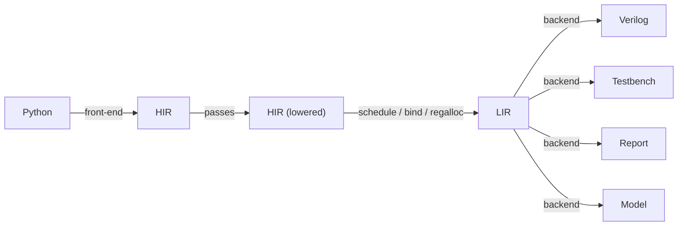

# Holoso design

Holoso lowers a small subset of Python (numerical control/DSP kernels) into vendor-neutral, synthesizable Verilog.
See `README.md` for scope and `PRIOR_ART.md` for why existing tools don't fit. This document records the architecture
we are building toward; it is expected to change frequently, and often may not be up to date.
Initial exploratory notes live in `DESIGN.draft.md` (outdated, superseded by this document).

One must read the representative use-case examples under the `examples/` directory to understand the motivation.

## Direction

- Build our own compiler. The differentiating work is the front/mid-end: partial evaluation of Python, shape
  inference, and operator scheduling for a resource-shared FSM. No external HLS gives us this for Python, and every one
  would force us to drop the Zubax Kulibin float (ZKF) library and adopt a pipeline-oriented optimizer we don't want.

- Delegate only to lightweight Python tools where it clearly pays: SymPy (fold/CSE/simplify), optionally
  Veriloggen's AST for emission, Cocotb for testbenches, optionally an ILP solver for an exact scheduling mode.
  Other lightweight dependencies may be freely introduced as needed.

- Bambu/XLS/CIRCT are not backends. Bambu is kept as a verification oracle and as inspiration only.

- The target is a specialized program, not a pipeline. We synthesize a sequential FSM (a zero-instruction-set
  computer, ZISC) that time-multiplexes a few shared operators over a register file.
  We do not pursue a constant II or II~1 like a streaming pipeline: the initiation interval is whatever the scheduled
  program costs. For a fixed control path it is an exact, statically known cycle count derived from the per-operator
  latency model (data-independent in v0); it varies across programs and, later, across branch paths.
  This is a compiler problem more than a circuit-design one.

## Pipeline



- HIR -- "what to compute": SSA dataflow inside a control-flow graph with real branches. Target-independent.
- LIR -- "the microprogram": the scheduled, bound, register-allocated op stream for the synthesized machine.
  Controller-agnostic; this is the seam where a second controller backend can be added later.
- Backends -- Verilog, testbench, HTML report, numerical model

Mental model: HIR is the compiler IR; LIR is the instruction stream of a tiny specialized processor; the Verilog
backend is its assembler and datapath generator. The backend stage is a family of independent backends --
the Verilog module, an HTML report, a Cocotb testbench, and a bit-exact numerical model -- each consuming the LIR,
and possibly some additional inputs, such as outputs of another backend.

The numerical backend is helpful during development and heavy refactors: it allows early verification of the synthesis
logic without involving the actual HDL emission and simulation steps, which are slow to iterate on.
Thus, the normal policy during development is to stabilize the synthesis logic down to the LIR using the numerical
model for verification, and once that is proven, move on to the actual HDL generation and testbenches.

## Python API

`synthesize` takes the object -- a function or class, not a source file or path -- and returns an in-memory result;
nothing touches the filesystem unless the caller asks.

```python
def synthesize(target, *, ops: OpConfig, parameters: Mapping[str, object] | None = None,
               entry: str = "__call__", name: str | None = None,
               operator_instances: Mapping[type[Op], int] | None = None) -> SynthesisResult: ...

@dataclass(frozen=True)
class SynthesisResult:
    module_name: str
    interface:      ModuleInterface   # typed ports -- the composition contract
    verilog_output: VerilogOutput     # generated module text + support_files (the shared holoso_support .v/.vh)
    numerical_model: NumericalModel   # bit-exact, picklable pure-Python model of the module (flat in -> flat tuple out)
    cocotb_output:  CocotbOutput      # self-contained testbench: embeds the model, checks the DUT bit-for-bit
    html_output:    HtmlOutput        # self-contained single-page report
```

The root package re-exports only the supported public API, keeping the API surface to the minimum.
Private implementation modules may still expose unprefixed package-internal entrypoints at subsystem boundaries;
this is fine because they are shielded by the `__init__.py` selective re-export policy (not visible from outside).
Purely module-local helpers and type aliases inside those private modules are underscore-prefixed.
Same applies to nested subpackages: their internals are private to the subpackage, each has its own API.

The library should not contain entities that are only used in the unit test suite; those belong in the suite.

Passing the object is more ergonomic and strictly more capable than a file: it carries the runtime environment the
binding-time front-end needs -- `__globals__`, closure cells, default args, and the result of running `__init__` --
which is what evaluates compile-time tables and follows/inlines imported callables. The object is the compile root; the
boundary ("what to ignore") falls out of reachability + binding-time analysis, not manual enumeration. Source is read
via `inspect.getsource` + `ast`; when unavailable (REPL/`exec`/notebook-defined, some lambdas) synthesis fails with an
explicit error. For a class, `__init__` runs with `parameters` (overriding the kw-only defaults that otherwise map to
Verilog parameters), attributes written by `entry` become state registers, and `entry` (default `__call__`) is analysed
with the ports dynamic; a plain function is analysed directly. `result.write(out_dir)` is the only operation that
touches the filesystem.

## Front-end

Abstract interpretation over the Python AST/CFG with a binding-time lattice (static vs. dynamic), not tracing:

- Static values (shapes, `__init__`-derived constants, compile-time tables) are evaluated concretely -- real
  Python/NumPy runs at synthesis time.
- Dynamic values (input ports, persistent state) become SSA handles that accumulate HIR.
- `for`/`while` with a static trip count is unrolled; a dynamic trip count is rejected for now (the only case that needs
  a genuine variable-length loop -- a future feature).
- `if` on a static test takes one branch; `if` on a dynamic test emits a real branch (see HIR below).

Matrices/vectors are statically shaped and unrolled to scalar operations at synthesis time (as in the SymPy-CSE'd
`ekf1` example); arrays never exist as hardware aggregates, only as compile-time bookkeeping over scalar registers.
Reductions (`max`, `argmax`, `mean`, `@`) lower to compare/select trees and multiply chains. Input shapes are declared
with jaxtyping (`Float64[np.ndarray, "4 4"]`, concrete dims only); interior shapes are inferred.

## Types

Runtime values are only:

- `float` -- one ZKF format, `WEXP`/`WMAN` fixed per build.
Typical FPGA-friendly formats: WEXP=8 WMAN=36 (44 bits) for precision; WEXP=6 WMAN=18 (24 bits) for simpler targets.
Generated top-level modules are not parameterizable by `WEXP`/`WMAN`: port widths are hardcoded and the selected float
format is recorded by the typed float register-file resource and as internal localparams. Changing the float format
requires re-running synthesis because operator latencies, the static schedule, and register widths are all tied to that
choice.
- `bool` -- 1 bit.

Scalar types live in `holoso._type`: `FloatFormat` describes the ZKF encoding, while `FloatType` is the scalar type
used by data ports and internal typed resources. A data port carries its scalar type and derives its bit width from it;
control ports carry explicit bit widths.
Today all data ports are the same `FloatType`, but this is an implementation detail.

Compile-time ints/shapes/structure are resolved in the front-end and never reach HIR. A dynamic integer only ever
appears as an index into a static table; it is lowered to a one-hot bool vector + mux, never materialized as an int.

A FloPoCo backend may be introduced later on if makes sense, but it is likely to be mostly shielded behind the
`holoso_support.v` wrapper, so the effect on the codegen is minimal.

## HIR

```
# values
in_port(name)                     # module input; scalar type is assigned at LIR/interface construction
const(value)
state_read(slot)                  # persistent state at block entry
phi([(pred_block, value)])        # SSA merge

# pure ops (generic; lowered to concrete operators by a later pass)
arith(op, a, b)                   # add, mul, div        (sub = add + signfix)
signfix(op, a)                    # neg, abs             (combinational, not an operator module)
relational(op, a, b) -> bool      # lt, le, eq, ...
boolean(op, ...)     -> bool      # and, or, not, xor
select(cond, a, b)                # DATA mux (not control flow)
cast(a, to_ty)                    # bool <-> float
intrinsic(kind, args)             # sqrt, sincos, exp, ...   -> operator module, else hard error

# sinks
state_write(slot, value)
out_port(name, value)
```

Terminators: `jump(target)`, `branch(cond_bool, t, f)`, `ret` (commit state-writes + outputs, raise `done`).

State. Persistent state = class attributes; `__init__` gives initial values (folded, or kw-only params -> Verilog
`parameter`s). An unwritten persistent register holds its value. Reset reaches only state regs that are live-in at reset
before any dominating write (in practice the boolean control flags); pure datapath state stays out of the reset cone.
Registers that hold values assigned in `__init__` are explicitly assigned initial values at module reset.

Branch vs. select (the core control-flow decision):

- A real `if`/`else` lowers to a `branch` terminator + a `phi` at the merge. Only one side executes; the merge is
  resolved at register allocation by coalescing both definitions onto one register -- no runtime mux, the untaken
  arm is never computed, and no spurious error is recorded. Branches are the default.
- `select` (a mux, both inputs live) is reserved for data multiplexing (one-hot lookup, `where`-style picks) and for an
  optional if-conversion peephole that collapses a tiny, pure, cheap diamond. Conservative by default.

## Passes (HIR -> HIR)

const-fold + algebraic simplify (SymPy-assisted) - CSE - strength reduction (`x*2^k`, `x/2^k` -> `fmul_ilog2_const`;
`x/c` -> `x*(1/c)` to avoid true dividers; `x**n` -> multiply chain) - operator selection (each program op picks its
configured operator from the `OpConfig`) - optional if-conversion - DCE.

Note: it is understood that FP math is non-associative and some of these optimizations may result in non-bit-exact
results, which is accepted.

## LIR

```
resources:
  operators: [inst(op), ...]                # each inst binds a fully-specified Op (its params + latency baked in)
  float_regfile: fmt + N float regs         # FF bank, multiport -- parallel reads are free
  constants: [fconst(value), ...]

scheduled op:
  (inst, src_regs+sgnops, dst_reg, issue_cycle)   # the op commits its result at issue_cycle + latency
makespan: the last commit cycle (the in_valid->out_valid latency is makespan + 1)
```

- Reads are cheap (multiport FF), so binding is constrained only by operator-instance count and writes.
- Register allocation = liveness + phi-coalescing; widen `N` rather than spill at these sizes.
- `branch` is the real control transfer: the microprogram counter jumps, untaken ops never run, and the II is whatever
  the executed path costs (each path's count is itself exact).

## Operators

Concrete operators are instances of a small class hierarchy under `OperatorDef` (kind-level metadata: `mnemonic`,
`arity`, `error_ports`, `module_name`). A concrete `Op` is a frozen dataclass whose fields are its parameters; the
current `FloatOp` subclass also owns its `FloatFormat`. Each operator owns its own timing, reference semantics,
notation, and instantiation params. Nothing downstream branches on operator identity.

Generic, per-node-parameterized operators are factories: a standalone `ParameterizedOp` (separate from `OperatorDef`,
carrying only its config-time knobs) whose `instantiate(k)` returns a concrete `Op`. The fully-specified `Op`
instance is itself the resource-sharing key (equal ops time-share one module).

The available operators are chosen by an `OpConfig`, constructed explicitly by the caller and passed into
`synthesize`; each field fixes one operator's format and parameters. There is no implicit default configuration.
Pipeline-stage knobs are named after the HDL parameters in lowercase, such as `stage_decode`, `stage_align`,
`stage_product`, and `stage_input`.

## Scheduler

The scheduler is software-pipelined (zero-bubble) list scheduling over the lowered single-block HIR. Operators are
fully pipelined (throughput 1) and their latencies are static and data-independent, so the entire schedule is computed
at compile time: each op is assigned an issue cycle and a bound instance, and the backend just replays it with a
cycle counter.

The per-operator latency model is therefore exact and load-bearing: the backend commits each result on
`issue + op.latency` without watching `out_valid`, so each operator's `latency` property (mirroring its RTL
wrapper) must match the hardware cycle-for-cycle. An inaccurate latency is a *correctness* bug, not a bad estimate --
the consumer would read a stale register. The resulting cycle count is exact, never an estimate.

We issue each op on the earliest cycle its operands are ready and a free instance exists -- without waiting for
unrelated ops (no barrier), so a fast `fmul` no longer idles behind a co-scheduled `fdiv`. The register file is
read-first (`RWPASS=0`): a result written on cycle `c+L` lands in the flop on the next edge and is readable from
`c+L+1`, so a data-dependent consumer is held one cycle past the producer's latency.

```
for cycle = 1, 2, ...:                         # cycle 0 accepts/loads inputs; they read back from cycle 1
    ready = unscheduled ops whose every operator-operand has committed (issue + L + 1 <= cycle)
    for op in ready by critical_path desc:
        if an instance of op's class is free this cycle (and ports permit):
            bind op to that instance; issue_cycle[op] = cycle
regalloc: linear scan over commit cycles; share a register when last_use <= def (sound under read-first); no spill
```

- Instances are pooled by the fully-specified operator instance itself (a frozen, equal-by-value `Op`): ops that
  elaborate to the same hardware are equal and share instances. E.g., all `fadd`/`fmul`/`fdiv` of a given config are
  equal; `fmul_ilog2_const` differs by its exponent `K`, so same-`K` ops pool while different `K` are distinct
  modules. The configurable per-class budget (default 1) caps instances of each operator class: equal ops time-share,
  serializing when more than the budget would co-issue.
- Read/write ports auto-size to the schedule's peak internal parallelism (independent of I/O width).
  Inputs preload through the register file's immediate `load` port on cycle 0 instead of write ports.
  Outputs are tapped from the register file's passive `view` bus by fixed register index instead of read ports.
  An optional NRD/NWR budget (default unbounded) instead gates admission and lengthens the makespan to fit --
  the knob for trading latency against register-file area.
- The `load` port folds into each low register's write-data OR (one masked term, no address comparator), so a
  single-cycle preload of registers `0..nload-1` costs far less than the per-register comparators that one write
  port per input would add. `nload` spans the input block (the highest input register index plus one).
- `signfix` folds into operand sign-mods, `fconst` is an immediate on the input mux; both are free.

Why not write-through forwarding? A write-through register file (`RWPASS=1`) would erase the +1 dependency cycle, but
its forwarding muxes cost O(NRD*NWR) and we need many ports -- unsustainable. Read-first plus the +1, hidden under
pipelined overlap, is the better trade.

## Backend (ZISC)

Mechanical from LIR: a `holoso_regfile` flop bank, one operator instance per `OperatorInstance`, and one continuous
assignment per pooled constant -- its ZKF bit pattern precomputed in Python by `FloatFormat.encode` --
all driven by a control word. The controller is a cycle counter `cyc` driving a `case(cyc)`
microprogram that replays the static schedule: `cyc==0` accepts and parallel-loads the inputs through the register
file's `load` port (registers `0..nload-1` in one cycle), `cyc` advances every clock through the compute cycles
`1..makespan`, and `cyc==makespan+1` asserts `out_valid` while the outputs are driven combinationally from the
register file's `view` bus (wired by fixed register index, so no read ports and no read-address work that cycle).
Each compute cycle asserts `in_valid` to the operators issued that cycle (driving their operand reads) and writes
back the operators that commit that cycle. No scoreboard is needed because latencies are static. Errors are non-fatal and
informative: a combinational `err` flag in the `case(cyc)` block ORs the error signals (today only `fdiv`'s `div0`) of
the operators committing that cycle, and the control block latches `err_cyc <= cyc` whenever `err` -- so `err_cyc` is
0 if the run hit no errors (reset at every accept; `|err_cyc` means "any error"), else the last cycle one occurred.
Reset covers only the control registers (`cyc`, `err_cyc`). Nonblocking assignment only, `case` not functions.
The control word and datapath skeleton are the only ZISC-specific part -- LIR itself is controller-agnostic.

Each operator instance carries its own parameters and float format, fixed at construction from the `OpConfig` threaded
through `synthesize`. The wrappers' instantiation params come from `op.hdl_params()` and the scheduler's timing from
`op.latency` -- both read the same operator instance, so the emitted RTL and the static schedule cannot drift; emitting
only enabled `STAGE_*` keeps a default build's wrappers parameter-free.

**Microcode ROM (deferred, keep on the radar):** the per-cycle `case(cyc)` is a wide mux; for large kernels it could
instead be emitted as a microcode ROM indexed by `cyc` (one packed control word per active cycle), which should
synthesize far better at scale. This is to be confirmed empirically.

## Decisions

1. Phi merges are resolved by register coalescing, not materialized selects.
2. Split float and bool register banks.
3. If-conversion is conservative -- trivial pure diamonds only; real branches otherwise.
4. SymPy-assisted algebra (fold/CSE/simplify); hardware strength reduction in-house.
5. The per-operator latency model is exact and must match the RTL wrappers cycle-for-cycle: the static schedule commits
   each result on `issue + latency` without watching `out_valid`, so an inaccurate latency is a correctness bug, not a
   bad estimate. (Module I/O still uses a valid/ready handshake; `div0` is the only data-dependent runtime signal.)
6. Software-pipelined (zero-bubble) static list scheduling over a read-first register file; the controller is a static
   `case(cycle)` microprogram (no runtime scoreboard), since v0 operator latencies are data-independent.
7. API takes the function/class object (not source files); synthesis is in-memory, returning `SynthesisResult`; disk
   I/O is an opt-in helper.

## Example (`iir1_lpf`): state + branch + coalescing

```
entry:  f = state_read(first); y_in = state_read(y)
        branch(f, b_init, b_run)
b_init: ya = in_a;                            jump(exit)        # y = x
b_run:  d  = sub(in_a, y_in)                                    # x - y
        m  = fmul_ilog2_const(d, -16)                           # 2^-16 * (x - y)
        yb = add(y_in, m);                    jump(exit)
exit:   y_out = phi[(b_init, ya), (b_run, yb)]
        state_write(y, y_out); state_write(first, const false)
        out_port(out_0, y_out); ret
```

`ya`/`yb` coalesce to the `y` register; the `phi` is free; only one arm runs; `first` resets to True; `y` is unreset.

## First delivery (v0)

Minimal end-to-end slice -- front-end -> HIR -> passes -> scheduler -> LIR -> Verilog + testbench + report + model -- on a single basic
block: combinational, scalar-only, operators `fadd`/`fmul`/`fdiv`/`fmul_ilog2_const` plus `signfix` and `fconst`
(`fdiv` and its wrapper already exist in ZKF). No state, control flow, arrays, or bools (`M = 0`); intrinsics
(`sqrt`, `sincos`, ...) raise the "implement this operator" error, pending ZKF support. State, branches, and arrays
follow in later milestones.

## Deferred

Operator-pool auto-sizing, optional ILP mode, dynamic-trip loops, second controller backend, FloPoCo backend,
**microcode-ROM controller** (a packed control word per cycle indexed by `cyc`, replacing the `case(cyc)` mux --
important for large kernels), intrinsics (`sqrt`, `sincos`, `exp`, ... -- pending ZKF support).
