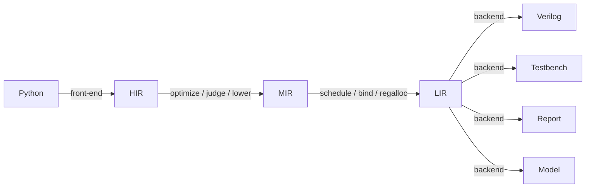

# Holoso design

>*Perfection is achieved not when there is nothing more to add, but when there is nothing left to take away.*

Holoso lowers a small subset of Python (numerical control/DSP kernels) into vendor-neutral, synthesizable Verilog.
See `README.md` for scope and `PRIOR_ART.md` for why existing tools don't fit.

THIS IS NOT A SPECIFICATION. It records the architecture we are building toward, capturing design intent rather than
implementation detail -- the code is the low-level reference. Many of the trade-offs here won't survive contact with
reality, and we discard and redesign freely. Do not pollute this document with exact code references or
verification-suite mechanics. Read the representative examples under `examples/` to understand the motivation.

## Direction

Build our own compiler. The differentiating work is the front/mid-end: partial evaluation of Python, shape inference,
and operator scheduling for a resource-shared FSM. No external HLS gives us this for Python, and most would force a
pipeline-oriented optimizer we don't want. We delegate only to lightweight Python tools where it clearly pays:
Cocotb for testbenches, ILP solvers and function minimization (SciPy) for scheduling/regalloc.

The target is a specialized program, not a pipeline. We synthesize a sequential FSM (a zero-instruction-set computer,
ZISC) that time-multiplexes a few shared operators over a register file. We do not pursue a constant or near-1
initiation interval like a streaming pipeline: the II is whatever the scheduled program costs -- for a fixed control
path an exact, statically known cycle count from the per-operator latency model. This is a compiler problem more than
a circuit-design one.

Compilation is deterministic and reproducible for fixed inputs and dependency versions: identical input produces
byte-identical output (except diagnostics and reports), achieved by sorted iteration over name-keyed merge points and
a fixed seed for every stochastic optimization pass.

### Fast math philosophy

We encourage departure from IEEE 754 where it makes sense for numerical control/DSP (e.g., drop NaN, subnormals,
and the negative zero).

The optimizer does not model the hardware -- the easiest rule here to break, and breaking it looks like diligence.
Constant folding and constant evaluation run in the compiler's own arithmetic (integers of unbounded range, floats at
host precision), never in the target format, so a folded result MAY differ from what the hardware datapath computes
for the same expression; that is designed, not broken. Never add a guard that declines a rewrite because the hardware
would answer differently, and never consult a numeric format to decide whether a rewrite is legal. That binds the
optimizer's own passes, never the layer that knows the machine, which may substitute facts back into the graph and
hand it to the optimizer again (see MIR).

Optimization identities are provided for what the compiler cannot see. Over an operand of unknown value they hold
whatever that value turns out to be; the absence of NaN is a significant enabler: commutativity and associativity;
`x/x == 1` (even for x=0); `x/y == x*(1/y)`; `x*0 == 0` (even for non-finite x); `0/x == 0`; `x+(-x) == 0`;
`int(float(i)) ≈ i`; `float(int(f)) == trunc(f)`; extensible on the same principles. Error-bearing operations are
elided and reordered freely -- what the optimizer deletes signals no error, and what it moves signals its error
elsewhere. Bit-exactness, agreement with host Python, and IEEE 754 conformance are anti-goals; a test that asserts
the datapath's answer for a foldable expression is defective by definition.

Where every operand IS known, no identity applies and ordinary arithmetic decides: constant evaluation is the same
expression in Python and nothing more, each operator answering as its own registered reference does -- the numpy
variant where the math module disagrees, so `log2(0.0)` folds to the `-inf` the hardware computes and a rounding
passes an infinity through where `math.floor` raises. Where the reference raises, or would answer NaN, there is no
value and the build is refused (`math.sqrt(-1.0)`, `inf - inf`, `1 << -1`); where it returns a value the fold takes
it, infinities included -- Python is not consistent about which is which, and neither are we, since chasing a
consistency the language does not have would mean inventing an answer. Nothing else stops a FOLD: not size, not
representability in the target format. A constant the machine must HOLD is another matter: one whose encoding
crosses between finite-nonzero and zero or infinity is refused at selection rather than silently becoming what it
encodes to, integers and floats alike. Only a constant that materializes is asked -- one an operator absorbs, such
as a power-of-two scale, never becomes a word and is never refused.

The two halves diverge, by design: `x/x` rewrites to `1`, so the hardware answers 1 even when `x` is zero at run
time, while `0.0/0.0` written out is refused at compile time.

The error sidebands report INPUT-DEPENDENT failures; an expression that denotes no number is a program defect and is
refused -- but only the kernel's own expressions are. Unrolling and inlining SUBSTITUTE values, so the compiler
manufactures such expressions itself (`for w in [1.0, 0.0]: if w > 0.0: x / w` becomes `x / 0.0`), and convicting one
of those would be the compiler answering for its own transformation. Refusal is therefore SURVIVOR-BASED: `NoNumber`
is an internal signal rather than an error, every speculative fold catches it and leaves the operation as written,
and a single sweep at the HIR-to-MIR boundary refuses whatever is still there -- an expression no identity
erased, no guard excluded, and nothing left dead is the program's own. An operation naming no number is one the
compiler cannot NAME, so every identity treats it as any unknown: `x/x` is 1 even when `x` is `inf - inf`.

This is a LICENSE, not a PROMISE: an expression known to fail on every run MAY be refused, but the compiler does not
undertake to reach everywhere, so two spellings of one kernel can disagree -- one refused, the other built -- at no
cost beyond a missing diagnostic (the arm is dead either way, the emitted hardware identical). A MISSED refusal is
never a defect; a WRONG answer always is.

## Pipeline

```mermaid
flowchart LR
    Python[Python] -->|front-end| HIR[HIR]
    HIR -->|optimize / judge / lower| MIR[MIR]
    MIR -->|schedule / bind / regalloc| LIR[LIR]

    LIR -->|backend| Verilog[Verilog]
    LIR -->|backend| Testbench[Testbench]
    LIR -->|backend| Report[Report]
    LIR -->|backend| Model[Model]
```

HIR -- "what to compute": SSA dataflow inside a control-flow graph with real branches. Target-independent and semantic;
it does not know how an operation is implemented.

MIR -- "which hardware to use": selected hardware operators over typed nodes, still unscheduled. This is the first stage
allowed to inspect hardware operator configs or operand numerical limits.

LIR -- "the microprogram": the scheduled, bound, register-allocated op stream for the synthesized machine, over typed
storage (a shared wide data register file and a separate 1-bit boolean bank). LIR owns scheduling, binding, and register
allocation, and is RTL-controller-agnostic -- the seam where a second controller backend can be added later.

Backends -- Verilog, testbench, HTML report, numerical model, and possibly other HDLs later. The numerical-model backend
gives bit-exact, cycle-exact emulation of the emitted HDL, so the synthesis logic can be stabilized down to LIR before
the slow HDL-emission/simulation iteration begins.

## Glossary

- Issue / commit / landing -- the three cycles of a result: an op issues when the schedule dispatches it (operands
  are sampled a fetch lag later), commits its result at `issue + latency`, and that result lands (first becomes
  readable) a further fixed latency later; a consumer reads at the landing, not the commit.
- Pooled operator -- a latency-bearing arithmetic operator (fadd, fdiv, ...) time-multiplexed across all its uses.
- Inline operator -- a combinational zero-latency op (boolean logic, select, cast) emitted as a single HDL expression.
- Spill -- NOT a register spill to memory: a value whose landing extends past its block's terminator into a
  single-predecessor successor; the cross-block software-pipelining overlap.
- Install -- a copy that writes a value into a persistent-state slot or a merged-phi register at a block boundary,
  used when coalescing could not make the write free.
- Coalesce -- merging a phi and its identity-arm predecessors onto one register so the install becomes a no-op.
- Slot (state slot) -- a register holding persistent state across transactions (e.g. `self.x`), committed in place.
- Drain -- the cycles a block's terminator waits past its last commit for in-frame writebacks to land.
- Fetch lag -- the depth by which the control-fetch pipeline leads the executing step; every operand is sampled at
  `issue + fetch lag`.
- Read-first -- within a cycle a register read returns the OLD value, before any same-cycle write: the origin of the
  +1 dependency edge between producer and consumer.
- Dwell -- the PC stalling at a hold point: pc 0 (accept, awaiting `in_valid`) or LASTPC (present, awaiting the
  result being taken before restarting).
- Makespan / II -- a block's schedule length in cycles; the initiation interval (II) is the whole executed path's
  exact cycle count.
- ZISC -- zero-instruction-set computer: the VLIW microcode-driven sequential FSM that Holoso synthesizes.

## Python API

`synthesize` is the main entry point; it returns an in-memory result and writes nothing to the filesystem unless
explicitly asked. Passing the live object (not a file) is more ergonomic and strictly more capable: it carries the
runtime environment the binding-time front-end needs -- `__globals__`, closure context, and the result of running
`__init__` -- which is what evaluates compile-time tables and follows/inlines imported callables. The object is the
compile root; the boundary ("what to ignore") falls out of reachability + binding-time analysis, not manual
enumeration.

Beside the generated RTL, testbench, numerical model, and report, the result carries the front-end's own
intermediate representation after each of its passes, written as indexed `.fir` documents. Neither Eel program
survives into HIR, so keeping their canonical text is what makes a front-end decision reviewable after the fact --
the compiler explaining itself, next to what it produced.

A plain function synthesizes to a stateless module. A stateful module is requested by passing a bound method of a
constructed instance, e.g. `synthesize(filt.update, options)`: the instance's attribute snapshot seeds the reset state,
and its method is the analyzed body; the constructor runs in plain Python, its arguments frozen into the build. The
root package re-exports only the supported public API. A future second mode -- several methods sharing one state
behind a runtime selector port -- is deferred.

## Types

Runtime values are only:

- `float` -- one ZKF format, `WEXP`/`WMAN` fixed per build. FPGA-friendly formats usually set WMAN to a multiple of the
  native DSP tile width (commonly 18); e.g. WEXP=8 WMAN=36 for precision, WEXP=6 WMAN=18 for simpler targets.
- `bool` -- 1 bit.
- `int` -- a semantic integer, width-less through the front-end and HIR; its hardware width binds at MIR and below.
  Mixed int/float expressions promote to float, C-style.

The two hardware formats are carried side by side through MIR into LIR. Only the float format and a lower bound on
the integer width (`wint_min`) are configured; the word is raised to the float's width where a float must fit the
same register. Because the chosen word is written into the graph (a shift past it folds to zero, and cascades),
selection derives the width at the widest configured word and again at the narrower one the survivors ask for,
keeping the narrower machine only where its own graph agrees; narrowing can erase work rather than reveal it, so it
is tried once, not iterated.

Integers are signed two's complement and saturate at the extremes rather than wrapping. Saturation is defined
behaviour, the dual of a float overflowing to infinity, so it is not an error flag -- were it one, an if-converted
arm that saturated would raise an error the untaken path never earned. The deliberate exception is `<<`: the raw bit
shift truncates at the word, so `5000 << 3` wraps where `5000 * 8` rails, and a rewrite of a power-of-two multiply
must tap the shifter's saturating reading instead. There is no modular or unsigned flavour, so a wrapping
accumulator carries an explicit mask -- which cannot rescue the add it guards, saturation applying first -- and pays
for its carry and sign headroom in the global word width; inferring wrapping/unsigned operations from adjacent
static masks, or checking a mask's modulus against the width its addend needs, are possible future answers.

One wide register holds either family whole: an integer fills it exactly, a float occupies its low bits. Floats pay
in unused flip-flops and slightly wider read muxes, but only where an integer in the same kernel asked for the extra
width; one representation with no edge cases is worth more than the bits it wastes.

Compile-time shapes and aggregate structure are resolved in the front-end and never reach HIR; runtime integers
travel the whole pipeline into every backend. A static integer the kernel wrote folds away before MIR ever sees it;
the integer constants MIR holds are the machine's own -- a shift count, a scaler exponent.

## Operators

HIR carries pure semantic operations from a HIR-local operator hierarchy; an operation is one operator applied to
operand value IDs. Concrete hardware operators are frozen dataclasses whose fields are Holoso-exposed parameters;
float ones delegate their timing and reference arithmetic to the external ZKF library, while integer ones carry a
closed-form latency and their own saturating reference arithmetic. Every hardware operator owns its signature, and a
pooled one also the port names of the module it stands for, so the fully specified operator instance is itself the
resource-sharing key; a machine holds one configuration per pooled class. An operator may declare per-firing
microcode-driven immediate inputs, and declares a per-instance initiation interval (most are II=1, fully pipelined).

Every float operator is optional, so presence is a semantic choice as well as an area one (`ffma` enables FMA
contraction, `fsort` enables min/max, `fsqrt` enables the square root and with it the standalone hypotenuse); what a
kernel cannot reach through the operators it was given is refused at MIR lowering. An integer operator is never
optional, only tuned: the vocabulary is small enough that a kernel using integers needs essentially all of it.

## Front-end

The front-end is three stages over one representation, the Eel: desugaring, partial evaluation, and HIR emission.
Their charters are disjoint so that special-casing cannot accrete: Python's syntactic breadth is absorbed at one
seam, every semantic decision has exactly one owner, and a construct that does not desugar into the Eel vocabulary
amends that vocabulary rather than patching downstream. The Eel has a canonical printed form, so what each stage did
is inspectable.

Desugaring owns syntax alone -- lexical binding, evaluation order, normalization to one spelling per construct --
knowing no types and evaluating nothing. Rejection is the default, acceptance an enumerated whitelist over the
original source shapes; dead code enjoys no exemption, and the body of an `assert` is the one thing accepted and
ignored wholesale, as under `-O`. Name resolution reproduces CPython's static classification of every name, because
the kernel must mean what it means when the host runs it.

Partial evaluation is the sole semantic owner -- binding time, types, shapes, reachability, unrolling, inlining, and
state: a specializing interpreter producing residual Eel, a pure function over an immutable tree re-run from its
inputs rather than patched in place. Static structure folds here while value arithmetic stays the graph's business
per the fastmath charter: every fold runs the very lowering the hardware runs, and the host is never consulted for a
value. The residual program is scalar and typed; early returns and loop exits lower to real control edges rather
than predication, leaving emission mechanical. Three policies bound the evaluation: the compiler never predicts host
failures it is not itself forced to evaluate (inputs are trusted, and hostile-input hardening is rejected as
policy); conservatism may cost a diagnostic, never a wrong value; and every structure-producing expansion draws on
one graph-size budget, so an accidental blow-up is a located rejection rather than a hang.

Scalars are width-less Bool, Int, and Float; hardware formats bind at MIR and below. Four deviations from Python are
deliberate: mixed int/float expressions promote to float C-style, a power yields float unless its base is an int and
its exponent a compile-time nonnegative int (the float-computing spellings `math.pow` and `np.float_power` convert an
integer base as the host does), booleans take no part in arithmetic, and `and`/`or` are eager gates evaluating both
operands as combinational logic does, while other conditional positions still branch.
One join rule governs every meeting point: Int meeting Float promotes to Float, Bool joins only with Bool, and
aggregates only with identical kind and shape -- for a record, identical class.

Aggregates are one container of three kinds fixed by provenance, not shape: a sequence is immutable structure, an
array the numerical kind carrying elementwise arithmetic and all mutation, and a record an immutable typed bundle
fixed by its class -- a plain generated frozen dataclass, so construction is structural and field reads fold.
A `for` target may be a tuple of names, and `enumerate` answers a one-shot iterator exactly as in Python:
consumed by a single iteration, refused everywhere else.
Arrays and records never exist as hardware aggregates: they are compile-time bookkeeping over scalar wires,
decomposed at the module boundary into indexed and field-path ports, and only scalar leaves reach HIR. Structural
transforms (slices, transposes, reshapes) restructure the same storage; a dtype-changing conversion mints a fresh
array exactly where the host copies.

Mutation is admitted only where reference and value semantics cannot be told apart, and rejected with advice
everywhere else, sparing the compiler a heap model and escape analysis. Persistent state is the one mutable
resident; its trees stay disjoint from each other and from everything captured, or a later transaction would write
through an alias the flat state slots cannot represent.

State ownership spans the receiver's whole COMPONENT TREE: every plain instance reachable from the compile root
through attribute chains gets a canonical path, so a kernel object may hold stateful sub-components and any method
may write its own receiver's attributes; a void procedure (`reset()`) is callable as a bare statement, its
None answering only at a use, exactly as in Python. Writes resolve by object identity, never by parameter name, so every
alias of a component reads and writes the same slots; a component with state reachable under two distinct tree
paths is rejected (naming would depend on traversal), while back-reference cycles are simply the same object.
Whether an attribute is state is still decided by running: the assumed set seeds from a syntactic may-write scan
of every desugarable method over every component class, and runs re-trim it to the writes actually reached.
A seeded path whose snapshot cannot be state is POISONED rather than rejected -- it gets no slot,
reads keep folding frozen, and only a reached write convicts -- so host-only utility methods cost a kernel nothing.

Interpretation carries state in the frame environment beside locals and temps, under a key family nothing else
mints, forked and joined at every control meet (branch arms, exit lanes, the inline boundary, residual-frame rows,
loop passes) by the one join rule, so divergent helper-return state joins like any value; a callee inherits the
caller's state entries and its return fold hands them back. Two provenance guards keep stale reads out where calls
can now mutate state mid-statement, both conservative refusals: an augmented store into persistent state rejects
when its right-hand side wrote state (the old-value read would postdate a write CPython reads before), and an
aggregate state handle taken before a call that element-mutates its root rejects at consumption (a pure rebind
keeps old handles valid, exactly as in Python).
A residual loop carries the state roots its region syntactically writes plus whatever reached stores reveal through a
driver-level restart -- lean-first, since carrying an untouched leaf would destroy static folds.

Calls dispatch on the object identity the callee resolves to, not its spelled name, so every spelling of a symbol
(`**` or its function form, `@` or `np.matmul`) resolves one registry entry. A scalar callee carries a group of
typed lowerings, each either a single semantic HIR operator or an inlined composite, declaring a domain per operand
position and optionally a refinement demanding a compile-time value -- of known sign, or of one named value where the
sign does not tell the lowerings apart (a one-half exponent is the square root, an integral one a multiply chain);
selection takes the unique most refined lowering every one of whose positions accepts the operand. An array
composite declares no scalar domain, rank and shape deciding its meaning; whole-array reductions are static left
folds, so FMA contraction stays reachable. A composite may admit a sequence at a declared argument position, and a
scalar entry may be lifted per key to apply elementwise over an array's leaves. Every stub is ordinary Python in
the supported subset, so each is its own numerical reference.

The guiding principle for the subset is to follow Python semantics where the hardware can express them and otherwise
reject rather than silently reinterpret, so kernels stay ordinary executable Python/numpy, each its own
(non-bit-exact) reference on the host. A construct whose faithful meaning the hardware cannot express -- a
data-dependent exception, for instance -- is rejected; one raised unconditionally folds into a compile-time
diagnostic instead, which is how library stubs self-validate with plain `raise`. The module boundary is explicitly
typed: parameters and the return value require annotations, decomposed to scalar ports and checked against the
inferred result.

## HIR

HIR is a real CFG of basic blocks carrying an SSA value DAG: pure semantic operations over floats, booleans, and
integers, phis at merges, and jump/branch/ret terminators. It is target-independent and hardware-unaware, operating
at the level of basic math principles under the fastmath charter. The node vocabulary is explicitly typed per scalar
kind rather than overloading one spelling, which is what let the integer kind arrive alongside the float and boolean
ones without disturbing them. Value sharing respects control flow: an expression is interned only where one value
can legally serve every consumer, so identical expressions in mutually exclusive arms stay distinct.

Operators split structurally into POOLED -- physical streaming modules the scheduler contends for -- and INLINE --
pure expressions folded into a register write; the split is load-bearing for scheduling and emission. Hardware is
never materialized where a shared firing or a sideband suffices: relations over one operand pair share a comparator
firing, min and max over one pair share a sorter firing, and negation/inversion chains fold into consumer sidebands.

A branch the graph itself decides is neither: it is pruned, along with everything only its untaken edge reached, so a
guard the optimizer can settle costs no hardware. The front end decides a condition by evaluating it, never by
algebra over a residual operand, so a condition constant only under a value identity the graph owns (`x*0 == 0`)
survives partial evaluation and is settled here, the branch folding to a single arm and the other never lowered.
Where that leaves the sole exit unreachable the kernel provably never returns, and is refused rather than built into
a module that can never raise `out_valid`.

Branch vs. select is the core control-flow decision for the branches that remain. Real branches are the default: only
the taken side executes, the merge is resolved at register allocation with no runtime mux, and an untaken arm can
neither burn cycles nor record a spurious error. `select` (a mux, both inputs live) is reserved for the small, pure,
cheap diamonds that if-conversion collapses into straight-line code so the region pipelines and reuses registers;
conversion is gated on every arm operation being speculatable, since both arms will execute and an untaken arm must
not fire an error sideband.
Running both arms can RAISE the static lower-bound II while LOWERING the realized per-transaction latency, which is
the goal -- the regression guard is realized latency, not the static bound. The conversion budget counts HIR
operations as they stand, including some a later lowering collapses; overcharging costs an arm its conversion and
never a wrong answer, so the budget stays a count of operations present rather than a prediction of what the machine
holds.

Loops with a static trip count unroll fully, below the unroll threshold (`unroll_max_trips`); above it, or with a
runtime trip count, a `for` over `range` becomes a counted back-edge loop: a hidden counter phi, bounds captured by
value, the static step's sign fixing the exit test. Only `for` consults the threshold; a lazy `range` reaching any
other consumer materializes if static and refuses if runtime. A `while` becomes a genuine back-edge loop that fully
drains before iterating, so no overlap crosses a back-edge; its static II counts the back-edge as not-taken -- a true
lower bound, with the numerical model the authority on realized counts. The `do`-`while` spelling -- a statically
decidable first test -- is peeled, costing microcode and no datapath.

### HIR optimization

Optimization is intentionally very liberal, hardware-agnostic, and bound by the fastmath charter in Direction. The
whole pass sequence runs as one fixpoint rather than as a pipeline, because every pass is another's input, so a
cascade of guards collapses rather than only its first link and no fixed ordering has to be right. What survives is
judged at the HIR-to-MIR boundary, where the graph stops changing: every identity and every guard gets its chance to
erase an expression before it is judged, exactly as the survivor-based charter requires. A conviction reached
through an inlined library composite may name an expression the kernel never spelled; an accepted limitation of the
composites, not of the rule.

Strength reduction speaks all three scalar families with one grammar. Beyond the identity and absorbing elements the
operators declare, it states the rules the shared algebra cannot: the one-sided constant rules of the
non-commutative operators, the value-equality and complement folds (under the same license as `x/x`), negation and
complement tracked as involutions so every spelling of a negation names one node and `-(-x)` costs nothing, and the
constant power-of-two rewrites -- the product into the saturating semantic `imul_pow2`, the quotient into the right
shift (exactly the floor division, negative dividends included), the remainder into the two's-complement mask. No
rule may mint a LEFT shift: the machine-word substitution fixpoint (see MIR) is bounded by the count of left shifts
in the graph. An absorbed scale never becomes a word -- only its exponent materializes -- and constant scalings
compose as exponents rather than as the numbers they multiply to, so `x * 2**40` builds at any width and composing
two scalings of one value cannot itself fail.

## MIR

MIR owns the whole boundary: it optimizes the front end's HIR, judges what survives, and only then selects hardware.
Optimization is not the caller's to run, because the judgement must see the last graph and no earlier one.

It is also where what the machine knows is written back INTO HIR -- the direction the layering permits: nothing in
HIR may ASK a format, but the machine may TELL HIR, since a fact answered only at selection would be stranded past
every fold it could have enabled. The trigonometric cores count angles in turns, so the radian operators are
restated over a turn-native vocabulary with an explicit conversion, ahead of the optimizer, letting a kernel whose
phase is already in turns have its own scaling meet that conversion and cancel. The machine word is told from inside
the fixpoint, since only a fold can reveal a shift count. The float format is told last, once nothing more will
move: a multiplication by a constant the format cannot hold splits into one by its significand and one by its
exponent, so a kernel is not refused over a number the optimizer minted and it never wrote; told any earlier, the
optimizer would compose the pair straight back. A scale past the format's own exponent span is left to be refused.
What may be told is bounded by the same unboundedness that motivates it: a rule qualifies only if its answer is
independent of every operand, since a later round can reveal one as a constant no word holds -- a left shift past
the word is zero whatever it shifts, while the right shift's sign fill holds only for a value the word already
holds, so that clamp stays at lowering.

HIR-to-MIR lowering selects concrete hardware, one lowerer per scalar family, each owning the operations whose
RESULT is its own. The float lowerer maps each semantic float operator to its configured hardware operator and
collapses semantic negation/absolute-value chains into MIR sign-control sidebands on operands, results, or output
wires; multiply-by-power-of-two selects the `fmul_ilog2` scaler, its exponent an ordinary integer operand, and the
four rounding operators map to one shared `fround` distinguished by an immediate mode, which a float-to-integer
conversion reading one of them absorbs as its own. The integer lowerer answers a constant shift count from the count
itself: a right shift past the word is the sign fill, a negative count is refused, and a count no other use reads is
never lowered; `imul_pow2` rides the same shifter through its saturating product tap.

Some lowerings are context-sensitive, depending on the nearby operations -- min/max in one pooled sorter
transaction, sin/cos computed simultaneously by the sincos operator, FMA contraction of a single-use `a*b+c`, a
directional infinity classifier for an infinity predicate adjacent to a sign test -- matched at MIR because this is
the first layer aware of hardware semantics. Some semantic operators lower into combinations of hardware operators
depending on availability and context (e.g. hypotenuse via fatan2); such composite lowerings may use inline muxes to
sanitize operands fed into their internal primitives so that semantically valid edge cases do not raise avoidable
primitive-side errors, while invalid source inputs still reach the error-bearing primitive.

The MIR builder has no global scalar type, so mixed-type expressions share one value namespace, but carries the
configured float and integer formats explicitly. The CFG is carried through as per-bank views sharing the block
skeleton -- the wide data bank and the boolean bank -- then scheduled per block and register-allocated over the
whole CFG. The wide view selects operations and phis structurally, on scalar width, so it is neutral storage rather
than a float family; its leaves are still selected nominally, so a float and an integer share the bank with neither
privileged.

## LIR

LIR is the scheduled, bound, register-allocated microprogram. Its resources are the bound operator instances, the
float format, the storage banks (a wide data register file and a separate 1-bit boolean bank), a wide constant pool
shared by both families, and the typed input loads and output wires. The pool interns constants by their typed
encoded machine value -- a float by its encoded magnitude, the sign riding the consumer's free sideband, an integer
by its whole word -- so encoding-equal float literals share one word and the two families cannot collide. Each wide
carrier names its own scalar family (a state slot's reset snapshot is an encoded value of the slot's family), so the
port metadata the RTL and the numerical model share never assumes one. LIR names its carriers after the bank that
holds them, being the physical binding layer, and types a carrier's folded conditioner by what the bank may hold: a
float port folds a sign into the free `fsgnop` sideband and a boolean port an inversion, but an integer port folds
nothing, since two's-complement negation is not free in fabric. Each scheduled firing carries its operands and
conditioners, its register writes, and an issue cycle; the makespan is the last commit cycle. LIR exposes a minimal
API plus shared analysis helpers (per-cycle grouping, liveness, read/writer sets) so backends do not each re-derive
them.

Storage is a sparse register file synthesized per kernel: each operand's read mux spans only the sources it reads,
each register's write mux only the sources it takes (see Backend for the encoding). A CPU-conventional full-reach
crossbar was tried first and abandoned -- its read/write port multiplexors imposed untenable timing.

### Scheduling

The LIR scheduler runs software-pipelined list scheduling over each block. Operator latencies are fully static and
data-independent, so the whole schedule is computed at compile time and the backend just replays it with a cycle
counter -- no scoreboard. The latency model is load-bearing, not advisory: the backend commits each result at
`issue + latency` without watching `out_valid`, the RTL passes that latency into each operator wrapper's `LATENCY`
parameter, and any Python/RTL drift fails at elaboration. An inaccurate latency is a correctness bug.

Each op issues on the earliest cycle its operands are ready and a free instance exists, with no barrier. The
commit-to-issue spacing a dependence requires is derived pairwise from a single cycle-accurate timing model built
from a few named primitives (a global fetch lag and a read-first edge), never per-case constants: every result --
pooled or inline, on either bank -- writes the register array combinationally and becomes readable a fixed
fetch-lag-plus-read-first edge after its commit, and both banks sample operands alike (per-result writeback and
read-address latches were tried and dropped: inconsistent across result classes and needlessly delaying short
installs). Because the banks and the pooled/inline classes are uniform instances of one model rather than hand-coded
cases, boolean-logic and cast chains schedule back-to-back. Block-resident operands (inputs, state reads, phis) are
available from the block's first control word. Ready ops issue in critical-path order onto free instances, pooled by
the fully specified hardware operator itself (equal-by-value); a per-class budget, currently one, serializes
co-issues beyond it.

Read-first plus the +1 edge, not write-through forwarding, is a deliberate trade: forwarding would erase the +1 but
its muxes cost `O(NRD*NWR)` across many read and write ports -- unsustainable -- while the +1 hides under pipelined
overlap.

### Register allocation

Register allocation is reach-aware over the whole CFG: whether two values may share a register is decided on a
hardware-frame interference graph from per-block liveness, two values interfering when their residences overlap under
the read-first rule. Path-awareness is free: the two arms of an `if` are live in no common block, so their
temporaries reuse the same registers, keeping a heavily-branched kernel to a handful of wide registers. The primary
objective is to minimize per-port read-set and per-register writer-set fan-in -- the FPGA steering cost that matters,
not flip-flop count; register count is a bounded secondary objective, and there is no spilling to memory. The
coloring is a port-affinity greedy seed refined by simulated annealing over the same objective, and colors both
banks.

Phi-arm coalescing eliminates most install copies: before coloring, each phi and its register-backed, identity-arm
predecessors merge by union-find whenever the two sides do not interfere, so the arm value flows straight into the
merged register with no copy (a diamond's mutually-exclusive arms do not interfere, so they usually coalesce away).
The pass is pure post-schedule register reassignment -- values never change, though the surviving copy set decides
which tail installs pay a terminator cycle, so PC layout and cycle counts may shift with it. Commutative port
assignment, after allocation, orients each commutative firing's operands across its read ports to minimize total
read-set size -- a pure relabelling at no hardware or latency cost; the minimization is graph bipartisation, solved
exactly per instance as a small MILP with a local search fallback.

Persistent state slots. Both banks commit state in place: a live-out is written directly into its slot register,
read-first, so a same-frame self-update (an accumulator) reads the old value and writes the new one with no copy; an
update whose "unchanged" arm is the slot live-in coalesces onto the slot through the same union-find. When it cannot
commit in place (a genuine overlap, a folded sign, a chained copy `self.a = self.b`), the live-out keeps its own
register and is installed by a copy -- microcode-driven as early as the old live-in is read where eligible, otherwise
a handshake-gated write at the output boundary; two slots that always hold the
same value may collapse onto one register.

### Control flow

`branch` is the real control transfer: the PC jumps, untaken ops never run, and the II is whatever the executed path
costs. Blocks lay out in reverse-postorder with the canonical `Ret` forced last as the out_valid boundary, so a
back-edge is a jump to a lower address; each block's terminator redirects the fetch PC via a small `case(pc)` that,
for a branch, reads the condition's 1-bit register.

A block's terminator offset is the latest cycle a value still lands in its frame -- it must cover every landing the
block does not forward to a successor, tail installs included. An install's source is classified exactly: a source
scheduled in the block commits locally, and only the block's own last-committing work pushes the install (and the
drain) one step past the work makespan; a source arriving as an in-flight spill read-gates the install at its
landing without a push; and everything else -- constants, inputs, state reads, phis, and foreign results that have
already landed -- is settled at entry, so the install fires at the makespan, read-first at the boundary. A source
register that a sibling install writes is always settled, hence read strictly before any sibling's write lands --
the invariant that keeps cross-referencing loop-carried phis (a swap) correct. Cross-block software
pipelining then shrinks the terminator offset down to the issue-side envelope -- the latest PC at which the block
still drives a control word -- whenever the block carries no installs and every successor is single-predecessor, so
a spill cannot reach a wrong path:
in-flight results land past the terminator in the uniquely-reached successor frame, which inherits the predecessor's
per-instance busy residue and each spilled value's landing cycle. A multi-predecessor successor (merge, loop header,
`Ret`) never receives a spill, so the carry converges in one reverse-postorder pass and no overlap crosses a
back-edge.

### DEFERRED

Aggressive cross-block overlap: letting the write-opcode words spill past the terminator too would shave the
remaining per-block tail, but needs the commit-side control fields replicated into every successor arm (policed by
the single-writer microcode validator already in place); overlap also stays off across any multi-predecessor edge.

The HIR merge-threading pass, which folds an empty pass-through merge block into its predecessors' jumps, leaves two
cases a real branch: an empty `else`-arm block (threading would create a forbidden branch-block phi arm) and a merge
phi read outside a successor phi arm (which would need rematerialization as a self-referential loop-header phi --
unproven against the emitter, not worth the niche benefit).

## Backend (VLIW/ZISC)

The Verilog backend is mechanical from LIR: an inline flop bank plus the 1-bit boolean bank (either emitted only when
used), one module per pooled operator instance, one continuous assignment per pooled constant, and a microcode-ROM
controller -- one pre-decoded VLIW control word per step, written as a synchronous `case` over the fetch PC. That
`case`-over-address is the inferable-ROM form every synthesis tool recognizes and maps to an appropriate ROM (LUT
logic or block RAM), unlike the array-plus-`initial` form, which some tools flatten to logic and others force into a
slow block RAM even when tiny; it occupies its own clocked block, the sole sanctioned second `always @(posedge clk)`,
since that dedicated form is what triggers the inference. The ROM is read through a short multi-stage fetch (PC
latch, ROM read register, routing register) so the controller is short register-to-register paths rather than a wide
combinational cone; the fetch leads the executing step, which under static scheduling only adds to the makespan/II.

The schedule replays step by step: at PC 0 the machine accepts and parallel-loads inputs in one cycle (gated by
`in_valid`); the PC advances every clock; at the last PC it asserts `out_valid` while outputs drive combinationally
from their registers by fixed index. The PC holds only at the two I/O boundaries; bubble steps carry an explicit NOP,
and while the PC dwells, `transacting` (high only while a transaction is in flight) forces every operator's
`in_valid` and every register's write opcode to the inert NOP code, so the idle re-fetch commits nothing and the
entry word can carry real work.

Value routing is uniform across two dual endpoints: a per-operand READ opcode selects that port's source, and a
per-register WRITE opcode selects that register's next value (code 0 == NOP hold). An operator output, an inline
expression, and a phi-arm/constant/state move are all just sources one write opcode picks, so outside the two I/O
boundaries the PC gates no datapath read or write -- that is left to control flow alone. A control field constant
across the whole program is driven by a
constant net and lifted out of the ROM so synthesis prunes what it feeds; the Python ROM packer and the module's
bit-slice offsets are produced together so they cannot drift.

Sparse storage. Each operand's read mux is a `case` over its read codebook (the registers it reads plus each distinct
constant it reads) and each register's write a `case` over its write codebook, both indexed by the endpoint's dense
opcode. The `case` form deliberately avoids an indexed part-select into a packed gather bus, whose variable offset is
a multiply that, at a non-power-of-two word width, makes Lattice Diamond's LSE infer a DSP per operand; a `case` has
no offset arithmetic and measures smaller and faster on every flow. A single-source read port drives its lone source
directly with no opcode field; every opcode is sized to its own codebook, never the file-wide index, so the ROM word
stays narrow. Constant operands are immediate `const_N` nets the read opcode selects, never stored in the ROM word.

Errors are non-fatal and informative: each surviving error-bearing operator's flags (`div0`, `domain_error`, ...) OR
into a global `err` gated by that instance's commit window (a step on which some register's write opcode selects
that instance's output), and an `err_pc` latch records the executing step of the last error (reset at every accept).

Reset covers the control registers and the persistent state registers: the reset arm loads each state register with
its snapshot, the non-reset arm applies its opcode-selected update and boundary install (a handshake-gated arm at
`out_valid && out_ready`, outside the microcode), and the two are segregated as the arms of one `rst` condition. The
fetch registers are reset-unconditional, so they pack into the BRAM output register and settle to the first word
under reset; the rest of the datapath likewise stays out of the reset cone.

Each operator instance carries its own options and float format, fixed at construction from the user's `Options`;
every instantiation lists every hardware parameter explicitly, turning a param-name mismatch into a loud
elaboration error. The auxiliary HDL ships as one self-contained `holoso_support.v`, assembled in memory from
hand-written operator catalogues plus included external RTL, so the end application adds a single file to the
synthesis input. The control word and datapath skeleton are the only ZISC-specific part -- LIR itself is
controller-agnostic.

### Numerical model

The numerical model gives bit-exact, cycle-exact emulation of the emitted HDL without HDL emission or simulation, so
the synthesis logic can be verified through LIR during heavy refactors: bit-exact because it replaces native float
operators with bit-exact software implementations (the ZKF package for floats, the integer operators' own saturating
arithmetic), cycle-exact because it mirrors the RTL's fetch
PC, register files, and sequencer. It splits into a serializable handle carrying only the LIR (kept private, so the
LIR never enters the public API) -- the artifact a generated testbench embeds -- and a runtime machine elaborated
from it. Both expose the kernel's logical signature as read-only metadata (each port a logical name paired with a
scalar type), so a driver decides a port's encoding by matching its type.

A tick advances exactly one `posedge clk` with the same sequencer the Verilog emits (out_valid, in_ready, terminator
redirect, back-pressure); the error sidebands are outside its scope. The only mutable state beyond the register files
is a small in-flight buffer
standing in for the operator pipeline: a result is computed when its operands are sampled but written only at its
landing PC, exactly as the hardware does, so it stays correct when blocks overlap and runs an arbitrarily deep loop
in bounded memory.

Saturation is invisible in the numerical model, which is where the wrong answers appear first: an accumulator that
clamps instead of wrapping surfaces only as wrong numbers, with nothing naming the operation that clamped. A
model-level saturation flag, or an opt-in assertion, would name that defect immediately -- worthwhile for a datapath
whose headline property is saturation.

Generated RTL testbenches (Cocotb today) run the RTL simulator in cycle-by-cycle lockstep with the elaborated model,
asserting each cycle that `out_valid` agrees (the data-dependent latency check) and that the output bits match when
valid, back-pressure included; end-to-end verification of the original Python against the model is left to the user.
The cosimulation is structurally blind to one miscompile class: a scheduling, binding, regalloc, or overlap fault in
the LIR is shared by both sides, so a wrong-but-consistent LIR passes. A schedule-independent oracle closes the gap:
a MIR interpreter evaluates the unscheduled MIR dataflow directly through the operators' own bit-exact `evaluate`,
deliberately importing nothing from the LIR, so the differential `interpreter == model` isolates exactly the LIR
layer. The front-end is bracketed the same way from above: a differential oracle runs the original kernel under
CPython against a host-precision evaluator of the unoptimized HIR, before optimization so fastmath rewrites cannot
muddy the verdict; because the eager gates evaluate operands CPython may skip, a value that names no number is
carried as poison and convicts only when it reaches an observable sink -- an output, a state live-out, a branch
condition.

The generated bench asserts `err_pc == 0` on every vector, so a transaction whose defined answer includes an
asserted error sideband -- an input-fed `x // 0`, a float division by zero -- cannot be cosimulated end to end;
that behavior is covered at the operator-bench and model levels instead. Letting an explicit vector declare its
expected `err_pc` would close this for both families. The bench also caps a transaction at 2^20 cycles, so a valid
loop that legitimately runs longer -- an input-fed counter, a counted loop over a huge static range -- is reported
as a runaway; the numerical model carries its own, far higher ceiling.

The HTML report must give humans an EXACT representation of the generated core behavior -- the tool for understanding
and debugging what the compiler did -- not a simplified or approximated view.

## Fabric-area exploration

The synthesized fabric is dominated by the per-operand read multiplexers: on a register-pressure-heavy kernel (an EKF
update) they are roughly 60-65% of the LUTs. The read-set sizes sit at the interference floor -- the values a port
reads are largely simultaneously live -- so the muxes encode real liveness rather than allocation slack, which bounds
most levers. Results below were measured end-to-end across Yosys+nextpnr-ECP5, Lattice Diamond, and Vivado, and are
recorded so the dead ends are not re-explored.

Adopted (lossless, f_max-neutral):

- Read and write muxes as a `case` over the endpoint's dense opcode rather than an indexed part-select into a packed
  gather bus, or the nested-ternary const-pool selector it replaced: smallest and fastest of the encodings tried.
  Nested-ternary muxes are catastrophic.
- Commutative operand port assignment, solved exactly as a MILP: a few percent LUT on the EKF across all three tools,
  at zero hardware or latency cost. Based on Chen & Cong.
- A per-register write opcode and a grouped input load: read/write symmetry that folds every write-enable,
  write-address, const-pool selector, and boolean inversion into one tiny opcode, at modest ROM cost.
- Explicit don't-care fill of a float write's WREG-WFLT high bits (`{{(WREG-WFLT){1'bx}}, value}`, float views
  narrowed to WFLT), keyed on the write arm's scalar family and engaged only when the integer format widens the
  register file past the float. Only Diamond LSE rewards it, but decisively (about -3% LUT flow-total and f_max up
  on every gapped row, growing with the gap); Vivado and Yosys sweep the dead bits under either spelling. X-filling
  the constant pool was measured null (a constant's high bits are dead at every use) and skipped.

Explored and rejected for register-pressure-bound kernels:

- LUTRAM register file: a multi-write workload needs a live-value table costing as many LUTs as the FF+mux it
  replaces; banking helps only when access sets partition cleanly.
- Register-file size cap via pressure-limited scheduling: `nreg` floors at peak liveness, so it trades large latency
  and f_max for a couple percent.
- Operator replication and FMA fusion: both raise read-operand traffic (more, or wider, read ports), enlarging total
  mux area despite fewer ops or a shorter makespan. This is why the FMA contraction is opt-in (only when `ffma` is
  configured): it is a numerical feature (single- vs double-rounding), not an area lever, so a pressure-bound kernel
  should leave `ffma` unconfigured.
- Operand collectors (copy/move ops off the worst-reach ports): a copy relocates fan-in rather than removing it -- a
  net gain needs a value moved onto a co-reachable but not co-live target, which the interference floor denies, and
  copies on the shared operator also cost cycles.

Latency-for-area trades (set aside -- latency is a real cost and the area gain did not justify it):

- Distributed/banked register file with scheduled inter-bank copies (Cong's RDR): banking narrows each port's mux but
  serializes the schedule. On the EKF, whose muxes are already at the interference floor, not worthwhile.
- Shared read bus / vertical microcode (one operator per cycle, two shared operand buses): a modest total-LUT saving
  for a large latency cost, f_max-safe -- not pursued.

## References

- L. Chen, J. Cong. Register Binding and Port Assignment for Multiplexer Optimization. ASP-DAC 2004. Basis for the
  commutative operand port-assignment pass.
- J. Cong, Y. Fan, et al. Architecture and Synthesis for Multi-Cycle Communication (the Regular Distributed Register
  microarchitecture). ISPD 2003. Banking plus scheduled inter-bank copies.
- A. Terechko, et al. Inter-cluster Communication Models for Clustered VLIW Processors. HPCA 2003. Producer-side
  placement preferred over after-the-fact copies.
- M. Gebhart, et al. A Compile-Time Managed Multi-Level Register File Hierarchy. MICRO 2011; S. Asghari Esfeden, et al.
  CORF: Coalescing Operand Register File for GPUs. ASPLOS 2019. Compiler-staged operand near-files (target access
  energy).
- A. W. Appel, K. J. Supowit. Generalizations of the Sethi-Ullman algorithm for register allocation, 1987. Why a copy
  relocates steering cost unless it collapses a fan-in cone.
- AMD UG949, Vivado Design Methodology, "When and Where to Use a Reset." Intel Hyperflex Architecture Handbook,
  "Synchronous Resets Summary" and "Reset Strategies."
