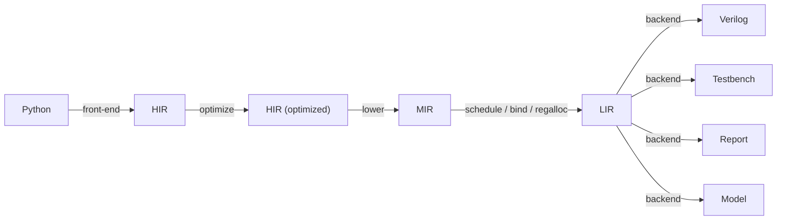

# Holoso design

>*Perfection is achieved not when there is nothing more to add, but when there is nothing left to take away.*

Holoso lowers a small subset of Python (numerical control/DSP kernels) into vendor-neutral, synthesizable Verilog.
See `README.md` for scope and `PRIOR_ART.md` for why existing tools don't fit.

THIS IS NOT A SPECIFICATION. It records the architecture we are building toward, capturing design intent rather than
implementation detail -- the code is the low-level reference. Many of the trade-offs here won't survive contact with
reality, and we discard and redesign freely. Do not pollute this document with exact code references or
verification-suite mechanics. Read the representative examples under `examples/` to understand the motivation.

## Direction

Build our own compiler. The differentiating work is the front/mid-end: partial evaluation of Python, shape inference,
and operator scheduling for a resource-shared FSM. No external HLS gives us this for Python, and most would force a
pipeline-oriented optimizer we don't want. We delegate only to lightweight Python tools where it clearly pays:
Cocotb for testbenches, ILP solvers and function minimization (SciPy) for scheduling/regalloc.

The target is a specialized program, not a pipeline. We synthesize a sequential FSM (a zero-instruction-set computer,
ZISC) that time-multiplexes a few shared operators over a register file. We do not pursue a constant or near-1
initiation interval like a streaming pipeline: the II is whatever the scheduled program costs -- for a fixed control
path an exact, statically known cycle count from the per-operator latency model. This is a compiler problem more than
a circuit-design one.

Compilation is deterministic and reproducible for fixed inputs and dependency versions: identical input produces
byte-identical output (except diagnostics and reports), achieved by sorted iteration over name-keyed merge points and
a fixed seed for every stochastic optimization pass.

### Fast math philosophy

We encourage departure from IEEE 754 where it makes sense for numerical control/DSP (e.g., drop NaN, subnormals,
and the negative zero).

The optimizer does not model the hardware -- the easiest rule here to break, and breaking it looks like diligence.
Constant folding and constant evaluation run in the compiler's own arithmetic (integers of unbounded range, floats at
host precision), never in the target format, so a folded result MAY differ from what the hardware datapath computes
for the same expression; that is designed, not broken. Never add a guard that declines a rewrite because the hardware
would answer differently, and never consult a numeric format to decide whether a rewrite is legal.

Optimization identities are provided for what the compiler cannot see. Over an operand of unknown value they hold
whatever that value turns out to be; the absence of NaN is a significant enabler: commutativity and associativity;
`x/x == 1` (even for x=0); `x/y == x*(1/y)`; `x*0 == 0` (even for non-finite x); `0/x == 0`; `x+(-x) == 0`;
`int(float(i)) ≈ i`; `float(int(f)) == trunc(f)`; extensible on the same principles. Error-bearing operations are
elided and reordered freely -- what the optimizer deletes signals no error, and what it moves signals its error
elsewhere. Bit-exactness, agreement with host Python, and IEEE 754 conformance are anti-goals; a test that asserts
the datapath's answer for a foldable expression is defective by definition.

Where every operand IS known, no identity applies and ordinary arithmetic decides: constant evaluation is the same
expression in Python and nothing more, each operator answering as its own registered reference does -- the numpy
variant where the math module disagrees, so `log2(0.0)` folds to the `-inf` the hardware computes and a rounding
passes an infinity through where `math.floor` raises. Where the reference raises, or would answer NaN, there is no
value and the build is refused (`math.sqrt(-1.0)`, `inf - inf`, `1 << -1`); where it returns a value the fold takes
it, infinities included -- Python is not consistent about which is which, and neither are we, since chasing a
consistency the language does not have would mean inventing an answer. Nothing else stops a fold: not size, not
representability in the target format. The two halves diverge, by design: `x/x` rewrites to `1`, so the hardware
answers 1 even when `x` is zero at run time, while `0.0/0.0` written out is refused at compile time.

The error sidebands report INPUT-DEPENDENT failures; an expression that denotes no number is a program defect and is
refused -- but only the kernel's own expressions are. Unrolling and inlining SUBSTITUTE values, so the compiler
manufactures such expressions itself (`for w in [1.0, 0.0]: if w > 0.0: x / w` becomes `x / 0.0`), and convicting one
of those would be the compiler answering for its own transformation. Refusal is therefore SURVIVOR-BASED: `NoNumber`
is an internal signal rather than an error, every speculative fold catches it and leaves the operation as written,
and a single sweep at the end of HIR optimization refuses whatever is still there -- an expression no identity
erased, no guard excluded, and nothing left dead is the program's own. An operation naming no number is one the
compiler cannot NAME, so every identity treats it as any unknown: `x/x` is 1 even when `x` is `inf - inf`.

This is a LICENSE, not a PROMISE: an expression known to fail on every run MAY be refused, but the compiler does not
undertake to reach everywhere, so two spellings of one kernel can disagree -- one refused, the other built -- at no
cost beyond a missing diagnostic (the arm is dead either way, the emitted hardware identical). A MISSED refusal is
never a defect; a WRONG answer always is.

## Pipeline

```mermaid
flowchart LR
    Python[Python] -->|front-end| HIR[HIR]
    HIR -->|optimize| HIRO["HIR (optimized)"]
    HIRO -->|lower| MIR[MIR]
    MIR -->|schedule / bind / regalloc| LIR[LIR]

    LIR -->|backend| Verilog[Verilog]
    LIR -->|backend| Testbench[Testbench]
    LIR -->|backend| Report[Report]
    LIR -->|backend| Model[Model]
```

HIR -- "what to compute": SSA dataflow inside a control-flow graph with real branches. Target-independent and semantic;
it does not know how an operation is implemented.

MIR -- "which hardware to use": selected hardware operators over typed nodes, still unscheduled. This is the first stage
allowed to inspect hardware operator configs or operand numerical limits.

LIR -- "the microprogram": the scheduled, bound, register-allocated op stream for the synthesized machine, over typed
storage (a shared wide data register file and a separate 1-bit boolean bank). LIR owns scheduling, binding, and register
allocation, and is RTL-controller-agnostic -- the seam where a second controller backend can be added later.

Backends -- Verilog, testbench, HTML report, numerical model, and possibly other HDLs later. The numerical-model backend
gives bit-exact, cycle-exact emulation of the emitted HDL, so the synthesis logic can be stabilized down to LIR before
the slow HDL-emission/simulation iteration begins.

## Glossary

- Issue / commit / landing -- the three cycles of a result: an op issues when the schedule dispatches it (operands
  are sampled a fetch lag later), commits its result at `issue + latency`, and that result lands (first becomes
  readable) a further fixed latency later; a consumer reads at the landing, not the commit.
- Pooled operator -- a latency-bearing arithmetic operator (fadd, fdiv, ...) time-multiplexed across all its uses.
- Inline operator -- a combinational zero-latency op (boolean logic, select, cast) emitted as a single HDL expression.
- Spill -- NOT a register spill to memory: a value whose landing extends past its block's terminator into a
  single-predecessor successor; the cross-block software-pipelining overlap.
- Install -- a copy that writes a value into a persistent-state slot or a merged-phi register at a block boundary,
  used when coalescing could not make the write free.
- Coalesce -- merging a phi and its identity-arm predecessors onto one register so the install becomes a no-op.
- Slot (state slot) -- a register holding persistent state across transactions (e.g. `self.x`), committed in place.
- Drain -- the cycles a block's terminator waits past its last commit for in-frame writebacks to land.
- Fetch lag -- the depth by which the control-fetch pipeline leads the executing step; every operand is sampled at
  `issue + fetch lag`.
- Read-first -- within a cycle a register read returns the OLD value, before any same-cycle write: the origin of the
  +1 dependency edge between producer and consumer.
- Dwell -- the PC stalling at a hold point: pc 0 (accept, awaiting `in_valid`) or LASTPC (present, awaiting the
  result being taken before restarting).
- Makespan / II -- a block's schedule length in cycles; the initiation interval (II) is the whole executed path's
  exact cycle count.
- ZISC -- zero-instruction-set computer: the VLIW microcode-driven sequential FSM that Holoso synthesizes.

## Python API

`synthesize` is the main entry point; it returns an in-memory result and writes nothing to the filesystem unless
explicitly asked. Passing the live object (not a file) is more ergonomic and strictly more capable: it carries the
runtime environment the binding-time front-end needs -- `__globals__`, closure context, and the result of running
`__init__` -- which is what evaluates compile-time tables and follows/inlines imported callables. The object is the
compile root; the boundary ("what to ignore") falls out of reachability + binding-time analysis, not manual
enumeration.

A plain function synthesizes to a stateless module. A stateful module is requested by passing a bound method of a
constructed instance, e.g. `synthesize(filt.update, ops)`: the instance's attribute snapshot seeds the reset state,
and its method is the analyzed body; the constructor runs in plain Python, its arguments frozen into the build. The
root package re-exports only the supported public API. A future second mode -- several methods sharing one state
behind a runtime selector port -- is deferred.

## Types

Runtime values are only:

- `float` -- one ZKF format, `WEXP`/`WMAN` fixed per build. FPGA-friendly formats usually set WMAN to a multiple of the
  native DSP tile width (commonly 18); e.g. WEXP=8 WMAN=36 for precision, WEXP=6 WMAN=18 for simpler targets.
- `bool` -- 1 bit.
- `int` -- a semantic integer, width-less through the front-end and HIR; its hardware width binds at MIR and below
  (the LIR wide data register file is already neutral storage). Mixed int/float expressions promote to float, C-style.

Compile-time shapes and aggregate structure are resolved in the front-end and never reach HIR; runtime integers do
reach HIR, and remain unlowerable past MIR until the integer backend lands (see DEFERRED).

## Operators

HIR carries pure semantic operations from a HIR-local operator hierarchy; an operation is one operator applied to
operand value IDs. Concrete hardware operators are frozen dataclasses whose fields are Holoso-exposed parameters;
float ones delegate to the external ZKF library. Each hardware operator owns its signature and a compact HDL-safe
identity stem, so the fully specified operator instance is itself the resource-sharing key and equal operators
time-share one module. Per-node-parameterized operators are factories that instantiate a concrete operator.

Operators are chosen by a single `OpConfig`, constructed explicitly by the user and passed into `synthesize`; there is
no implicit default. Its float format is verified consistent across the configured operators and drives HIR-to-MIR
lowering; thereafter the format is derived from selected MIR. Latency-tuning knobs are named after the HDL parameters;
some operators are optional. An operator may declare per-firing microcode-driven immediate inputs, and declares a
per-instance initiation interval (most are II=1, fully pipelined).

## Front-end

The front-end is three stages sharing one internal representation, the Eel: desugaring, partial evaluation, and HIR
emission. The stages have disjoint charters, and the division exists to make the previous front-end's failure mode --
special-casing accreting until the design drowns -- structurally impossible: Python's syntactic breadth is absorbed at
exactly one seam, every semantic decision has exactly one owner, and a construct that does not desugar into the
existing Eel vocabulary is a design amendment to be ruled on, never a patch downstream. The Eel has a canonical
printed text form, logged after every stage, so what each transform did is always inspectable.

Desugaring turns the Python AST into Eel and owns syntax alone: lexical binding, source evaluation order, and
lossless normalization to one spelling per construct. It is syntax-directed over an explicitly ruled whitelist of
accepted shapes, judged against the original source shape, and everything outside the whitelist draws a located
rejection -- rejection is the default, acceptance is enumerated. Dead code enjoys no exemption: an unsupported
construct rejects even in a statically untaken arm (the one exception is the body of an `assert`, accepted and
ignored wholesale as under `-O`). Name resolution reproduces CPython's own static classification of every name (an
assignment anywhere makes a name local throughout; comprehensions are their own scopes), because the kernel must mean
exactly what it means when the host runs it; free names resolve through closure cells, then module globals, then
builtins, and are captured as data. Where Python's evaluation order is observable -- the walrus is the subset's one
side effect -- the desugarer materializes that order with single-evaluation temporaries rather than assuming it,
callee before arguments, in CPython's argument order. The desugarer knows no types, no shapes, and evaluates nothing.

Partial evaluation is the sole semantic owner within the front-end (value arithmetic stays the graph's, below). It is
a specializing interpreter from Eel to residual Eel -- a pure function over an immutable tree, re-run from its inputs
rather than patched in place, which is the central lesson of the abandoned rewrite: accumulated marks and mutable
side tables are how fixpoint analyses go quietly wrong. It owns
binding time, scalar types, shapes, aggregate semantics, reachability, unrolling, inlining, argument binding,
mutation legality, and persistent-state determination. Static structure folds here -- shapes, indices, trip counts,
frozen configuration, reachability -- while value arithmetic remains the graph's business as the fastmath charter
demands, so one expression cannot answer two ways according to which layer evaluated it. Two folds run in host
arithmetic instead: the static-exponent power chain the pow rule below grants, and a call whose every argument is a
static integer, which answers as the Python call does so an integer stays an integer. The latter only ever ANSWERS --
where the host declines, the operator's own reference decides, so it cannot turn a legal build into a refusal. Every structure-producing
expansion (unrolling, comprehensions, inlining, repetition, power chains) draws from a single graph-size budget, so
an accidental blow-up is a located rejection rather than a hang; the budget deliberately does not cap exact
arbitrary-precision constant arithmetic. When a fold executed with host arithmetic raises, the failure is certain
wherever the expression is evaluated -- evaluation judged under the subset's own semantics, eager gates included --
so the compiler surfaces a compile-time diagnostic instead of masking the error into a runtime value, escalating it
early and staying simple; folds through HIR operators keep the survivor-based refusal policy. That license extends
no further: the compiler never PREDICTS host failures it is not itself forced to evaluate. Whether a kernel would
raise at run time on the host -- a read-only buffer, an exhausted resource, any state of the host environment
beyond the captured values -- is the user's responsibility, part of the standing contract that inputs are trusted
and the kernel program is well-defined; the compiler synthesizes the datapath the code asks for, and if the
program is not runnable as Python, all bets are off. Guards against such conditions are hostile-input hardening
and are rejected as a matter of policy. A read the evaluator
cannot prove bound on every residual path is a located
rejection -- never a fall-through to a same-named global, where CPython would raise only at run time. The residual
program is scalar and typed, its static control decided and only genuinely dynamic branches and loops remaining; HIR
emission from it is mechanical. An early return is a residual terminator: each return site commits its own outputs
and state live-outs, conformed against the one annotation-fixed table, and emission joins the sites in a single
exit block -- extra control edges, never predication -- and a return site may sit inside a dynamic loop's body,
where its edge simply leaves for the exit block before the latch. Every other exit is a pending lane rather than a
terminator: a break, continue, or inlined-callee return holds its branch open while the surviving path's
continuation nests into the other arm, and the exit's one consumer -- the enclosing loop for break and continue,
the frame boundary for a callee return -- joins the lanes under the one join rule and seals the region. In an
unrolled loop the consumed exits print as ordinary nested branches; a dynamic loop instead consumes its break and
continue lanes into bare residual terminators, the values leaving on those edges riding ordinary join temps so
emission's loop-exit and back-edge joins stay mechanical. A callee return crossing the callee's own dynamic loop
cannot rejoin its siblings as branch arms, so the inlined callee region becomes a residual frame: each return site
ends in a terminator carrying the residual result leaves, all sites converge at the frame's exit, and a result
leaf statically identical across every site never leaves the value model. A loop body whose every path leaves the
loop has no back edge and is rejected -- such a loop cannot iterate and is an `if` in disguise.

Scalars are width-less Bool, Int, and Float; hardware formats bind at MIR and below, never here. Mixed int/float
expressions promote to float C-style, true division always yields float as in Python, a power yields float unless it
is fully folded with a nonnegative integer base (the one place exact integer powers survive), and floor division,
modulo, shifts, and bitwise operators are integer-only -- except that the gates over two booleans remain boolean
operations -- while booleans take no part in arithmetic, a small deliberate deviation from Python bought for clean
typing.
The gates `and`/`or` are eager rather than short-circuiting -- both operands always evaluate, as combinational
logic does -- a second small deliberate deviation; every other conditionally-evaluated position (conditional
expressions, comparison-chain suffixes) keeps Python's semantics through real branches.
One join rule governs every meeting point -- branch merges, loop phis, early returns, state reset against live-out,
and return validation: Int meeting Float promotes to Float with conversions on the integer arms, Bool joins only with
Bool, and aggregates join only with identical kind and shape.

Aggregates are one structural container of two kinds derived from provenance, never inferred from shape: a
sequence (spelled as a tuple or a list) is immutable structure -- construction, indexing, slicing, unpacking, and
returns, with no arithmetic and no element stores -- while an array is the numerical kind, carrying a float or
integer element family, elementwise arithmetic, and all mutation. A rectangular homogeneous list is still a
sequence, never silently an array. Everything else about aggregates -- decomposition to scalar leaves, indexing,
iteration, ports -- is uniform, and element dtype widths are not modeled: array leaves live in the same width-less
int / binary64 float value model as scalars. Arrays never exist as hardware aggregates: matrices and vectors are
compile-time bookkeeping over scalar wires, no aggregate survives partial evaluation, and only scalar leaves reach
HIR.

Mutation follows one principle: it is admitted only where reference semantics and value semantics cannot be told
apart, and rejected with advice everywhere else -- a license, not a promise, so some value-safe spellings are
rejected too. Mutation is array-only. A store or in-place update is legal only when every allocation along the
store path, root through the written array, is still unique and unborrowed at the store step itself, judged after
the stored value and indices are evaluated: reached by no other handle -- freshly built, never aliased, extracted,
embedded, passed, returned, or installed, nor under live iteration -- so the compiler needs no heap model, no
copy-versus-view knowledge, and no escape analysis; aggregates arriving from outside the kernel's own construction
(globals, closures, defaults, parameters) are never mutable, since CPython would let the outside observe the change
and hardware cannot. Persistent state is the one mutable resident: an element store through an unaliased state path is a
state update, observably identical in both worlds. State trees must stay disjoint from each other, from everything
captured, and internally -- otherwise a mutation in a later transaction would write through an alias that the flat
state slots cannot represent -- and the invariant is established by the construction snapshot itself and preserved
by every subsequent install, each policed at its own boundary.

Whether an attribute is state is decided by running, not scanning: the partial evaluator assumes the entry method's
syntactically written attributes are state, evaluates, and re-runs with the assumption shrunk when a write turned out
dead -- monotone, bounded, and exact whenever the conservative run completes, which retires the old
scan-versus-lowering duality outright. A rejection raised under a conservative assumption is final and names the
write that pinned the attribute; conservatism may cost a diagnostic, never a wrong value. Persistent state otherwise
falls out of the instance snapshot as before: written attributes become persistent registers, read-only attributes
freeze into constants, public state is observable through output ports, and state identity is an attribute path, so
composed stateful components remain expressible later without redesign. Only the entry method owns the state
analysis -- an inlined method may read `self` but not write it.

Calls are first-class in Eel and dispatch on the object identity the callee resolves to, not its spelled name.
Inlining everything is the current lowering policy, not a representational fact, so separately compiled subroutines
later change the policy and the emitter, never the desugarer. The math library keeps its one boundary: an intrinsic
maps to a single semantic HIR operator, while a composite (linear algebra included) is ordinary Python in the
supported subset, inlined like user code, so each composite is its own numerical reference; kernels compose by the
same inlining, and a diagnostic arising inside a stub is re-attributed to the user's call site. The registry also
binds array methods and attributes declaratively through the same identity keys — a numpy descriptor names its own
owner and attribute, so ``m.T`` or ``m.flatten()`` resolves to the registered stub with no per-name compiler
surface, and a registration may declare itself a non-copying derivation whose result keeps the source's storage
identity.

The guiding principle for the language subset is unchanged: follow Python semantics where the hardware can express
them, otherwise reject rather than silently reinterpret. The supported source remains ordinary executable
Python/numpy, so the same kernel runs unmodified on the host as its own (non-bit-exact) reference. A construct whose
faithful meaning the hardware cannot express -- a data-dependent exception, for instance -- is rejected; an exception
raised unconditionally (judged within the function that writes it, not at its call sites) folds into a compile-time
diagnostic instead, which is how library stubs self-validate with plain `raise` statements. The module boundary is
explicitly typed: parameters and the return value require annotations, decomposed row-major to scalar ports and
validated against the inferred result; any divergence rejects the kernel. Annotations are detected structurally, so
their libraries remain dependencies of the user's code only.

## HIR

HIR is a real CFG of basic blocks carrying an SSA value DAG: pure semantic operations over floats, booleans, and
integers, phis at merges, and jump/branch/ret terminators. It is target-independent and hardware-unaware, operating
at the level of basic math principles under the fastmath charter. The node vocabulary is explicitly typed per scalar
kind rather than overloading one spelling, which is what let the integer kind arrive alongside the float and boolean
ones without disturbing them (only its backend is still deferred, see DEFERRED); the same discipline extends to the
next kind. Value sharing respects control flow: an expression is interned only where one value can
legally serve every consumer, so identical expressions in mutually exclusive arms stay distinct.

Operators split structurally into POOLED -- physical streaming modules the scheduler contends for -- and INLINE --
pure expressions folded into a register write; the split is load-bearing for scheduling and emission. Hardware is
never materialized where a shared firing or a sideband suffices: every relation taps one shared comparator (several
relations over one operand pair share a firing), min and max over one pair share one sorter firing, and
negation/inversion chains fold into consumer sidebands instead of gates.

Branch vs. select is the core control-flow decision. Real branches are the default: only the taken side executes, the
merge is resolved at register allocation with no runtime mux, and an untaken arm can neither burn cycles nor record a
spurious error. `select` (a mux, both inputs live) is reserved for the small, pure, cheap diamonds that if-conversion
collapses into straight-line code so the region pipelines and reuses registers; conversion is gated on every arm
operation being speculatable, since both arms will execute and an untaken arm must not fire an error sideband.
Running both arms can RAISE the static lower-bound II while LOWERING the realized per-transaction latency, which is
the goal -- the regression guard is realized latency, not the static bound.

Loops with a static trip count unroll fully, below the unroll threshold; a `while` becomes a genuine back-edge loop
that fully drains before iterating, so no overlap ever crosses a back-edge. Its static II deliberately counts the
back-edge as not-taken -- a true lower bound; the numerical model is the authority on realized cycle counts. A
`while` whose first test is decidable at compile time -- the sentinel spelling of a `do`-`while`, which Python has no
syntax for -- has that trip peeled by the front end and only the remaining trips residualized. The peel costs
microcode and no datapath, and removes a runtime test from every transaction along with an entry path no input could
ever take.

### HIR optimization

Optimization is intentionally very liberal, hardware-agnostic, and bound by the fastmath charter in Direction. Each
pass runs where its inputs are final, and the survivor refusal sweep runs strictly last, after everything erasable
has been erased -- reordering it ahead of any reduction would convict expressions a rewrite would have absolved. The
sweep is the sole point of refusal: it re-asks the same fold on the fully reduced graph and follows only provable
control paths, so every identity and every guard gets its chance to erase an expression before it is judged, exactly
as the survivor-based charter requires. A conviction reached through an inlined library composite may name an
expression the kernel never spelled; an accepted limitation of the composites, not of the rule.

### DEFERRED

A `for` that cannot unroll -- a dynamic trip count, or a static one above the unroll threshold -- is rejected rather
than lowered to a counted back-edge loop, which needs a runtime integer counter; once runtime integers lower past
MIR, the counted back-edge loop becomes the natural follow-on.

Integers. HIR carries a complete typed integer vocabulary and folds it exactly, and the front-end emits it; any
integer node reaching MIR is rejected as not-yet-lowerable until the remaining milestone, the integer backend sharing
the wide register bank. A kernel whose integers stay compile-time is unaffected by the gap: a static integer has
already folded away before MIR ever sees it.

## MIR

HIR-to-MIR lowering selects concrete hardware. The float lowerer maps each semantic float operator to its configured
hardware operator and collapses semantic negation/absolute-value chains into MIR sign-control sidebands on operands,
results, or output wires. Multiply-by-power-of-two selects the constant-shift operator when the float format supports
that exponent (an out-of-range exponent is rejected -- the equivalent constant would overflow or underflow the format
anyway); the four rounding operators map to one shared `fround` distinguished by its `round_mode` immediate.

Some lowerings are context-sensitive, depending on the nearby operations -- min/max in one pooled sorter
transaction, sin/cos computed simultaneously by the sincos operator, FMA contraction of a single-use `a*b+c`, a
directional infinity classifier for an infinity predicate adjacent to a sign test -- matched at MIR because this is
the first layer aware of hardware semantics. Some semantic operators lower into combinations of hardware operators
depending on availability and context (e.g. hypotenuse via fatan2, sensible only when arctan is also computed); such
composite lowerings may use inline muxes to sanitize operands fed into their internal primitives so that semantically
valid edge cases do not raise avoidable primitive-side errors, while invalid source inputs still reach the
error-bearing primitive.

The MIR builder has no global scalar type, so mixed-type expressions share one value namespace, but carries the
configured float format explicitly so float-less modules still elaborate with a known scalar width. The CFG is
carried through as typed per-resource-family views (float and boolean sharing the block skeleton), then scheduled per
block and register-allocated over the whole CFG.

## LIR

LIR is the scheduled, bound, register-allocated microprogram. Its resources are the bound operator instances, the
float format, the storage banks (a wide data register file and a separate 1-bit boolean bank), a pool of nonnegative
float constants (the sign rides the consumer's sideband), and the typed input loads and output wires. Each scheduled
firing carries its operands and conditioners, its register writes, and an issue cycle; the makespan is the last
commit cycle. LIR exposes a minimal API plus shared analysis helpers (per-cycle grouping, liveness, read/writer sets)
so backends do not each re-derive them.

Storage is a sparse register file synthesized per kernel: each operand's read mux spans only the sources it reads,
each register's write mux only the sources it takes (see Backend for the encoding). A CPU-conventional full-reach
crossbar was tried first and abandoned -- its read/write port multiplexors imposed untenable timing.

### Scheduling

The LIR scheduler runs software-pipelined list scheduling over each block. Operator latencies are fully static and
data-independent, so the whole schedule is computed at compile time and the backend just replays it with a cycle
counter -- no scoreboard. The latency model is load-bearing, not advisory: the backend commits each result at
`issue + latency` without watching `out_valid`, the RTL passes that latency into each operator wrapper's `LATENCY`
parameter, and any Python/RTL drift fails at elaboration. An inaccurate latency is a correctness bug.

Each op issues on the earliest cycle its operands are ready and a free instance exists, with no barrier. The
commit-to-issue spacing a dependence requires is derived pairwise from a single cycle-accurate timing model built
from a few named primitives (a global fetch lag and a read-first edge), never per-case constants: every result --
pooled or inline, on either bank -- writes the register array combinationally and becomes readable a fixed
fetch-lag-plus-read-first edge after its commit, and both banks sample operands alike (per-result writeback and
read-address latches were tried and dropped: inconsistent across result classes and needlessly delaying short
installs). Because the banks and the pooled/inline classes are uniform instances of one model rather than hand-coded
cases, boolean-logic and cast chains schedule back-to-back. Block-resident operands (inputs, state reads, phis) are
available from the block's first control word. Ready ops issue in critical-path order onto free instances, pooled by
the fully specified hardware operator itself (equal-by-value); a per-class budget, currently fixed at one instance
per distinct operator value, serializes co-issues beyond it.

### Register allocation

Register allocation is reach-aware over the whole CFG: whether two values may share a register is decided on a
hardware-frame interference graph from per-block liveness, two values interfering when their residences overlap under
the read-first rule. Path-awareness is free: the two arms of an `if` are live in no common block, so their
temporaries reuse the same registers, keeping a heavily-branched kernel to a handful of wide registers. The primary
objective is to minimize per-port read-set and per-register writer-set fan-in -- the FPGA steering cost that matters,
not flip-flop count; register count is a bounded secondary objective, and there is no spilling to memory. The
coloring is a port-affinity greedy seed refined by simulated annealing over the same objective, and colors both
banks.

Phi-arm coalescing eliminates most install copies: before coloring, each phi and its register-backed, identity-arm
predecessors merge by union-find whenever the two sides do not interfere, so the arm value flows straight into the
merged register with no copy (a diamond's mutually-exclusive arms do not interfere, so they usually coalesce away).
The pass is pure post-schedule register reassignment -- values never change, though the surviving copy set decides
which tail installs pay a terminator cycle, so PC layout and cycle counts may shift with it. Commutative port
assignment, after allocation, orients each commutative firing's operands across its read ports to minimize total
read-set size -- a pure relabelling at no hardware or latency cost; the minimization is graph bipartisation, solved
exactly per instance as a small MILP with a local search fallback.

Persistent state slots. Both banks commit state in place: a live-out is written directly into its slot register,
read-first, so a same-frame self-update (an accumulator) reads the old value and writes the new one with no copy; an
update whose "unchanged" arm is the slot live-in coalesces onto the slot through the same union-find. When it cannot
commit in place (a genuine overlap, a folded sign, a chained copy `self.a = self.b`), the live-out keeps its own
register and is installed by a copy -- microcode-driven as early as the old live-in is read where eligible, otherwise
a handshake-gated write at the output boundary; two slots that always hold the
same value may collapse onto one register. State registers are the one datapath exception that reset reaches (each
loaded with its snapshot); pure datapath state stays out of the reset cone.

### Control flow

`branch` is the real control transfer: the PC jumps, untaken ops never run, and the II is whatever the executed path
costs. Blocks lay out in reverse-postorder with the canonical `Ret` forced last as the out_valid boundary, so a
back-edge is a jump to a lower address; each block's terminator redirects the fetch PC via a small `case(pc)` that,
for a branch, reads the condition's 1-bit register.

A block's terminator offset is the latest cycle a value still lands in its frame -- it must cover every landing the
block does not forward to a successor. A tail install costs an extra terminator cycle only when its source is an
operator result committing at the block's makespan (its own last work, or conservatively any operator result from
outside the block); a
resident source (constant, input, state read, phi result) fires at the makespan, read-first at the boundary. A source
register that a sibling install writes is always a phi's, hence resident, hence read strictly before any sibling's
write lands -- the invariant that keeps cross-referencing loop-carried phis (a swap) correct. Cross-block software
pipelining then shrinks the terminator offset down to the issue-side envelope -- the latest PC at which the block
still drives a control word -- whenever the block carries no installs and every successor is single-predecessor, so
a spill cannot reach a wrong path:
in-flight results land past the terminator in the uniquely-reached successor frame, which inherits the predecessor's
per-instance busy residue and each spilled value's landing cycle. A multi-predecessor successor (merge, loop header,
`Ret`) never receives a spill, so the carry converges in one reverse-postorder pass and no overlap crosses a
back-edge.

Compile-time-known branch conditions fold to a single arm so the other is never lowered. The front end decides a
condition by evaluating it, never by algebra over a residual operand, so a condition that is constant only under a
value identity the graph owns (`x*0 == 0`) survives partial evaluation and reaches the graph as a branch on a
constant. If-conversion refuses such a branch rather than pinning the untaken arm live through a select, so it
survives as a block that installs a constant and branches on it: at worst unreachable microcode, never a miscompile.

### DEFERRED

Aggressive cross-block overlap: letting the write-opcode words spill past the terminator too would shave the
remaining per-block tail, but needs the commit-side control fields replicated into every successor arm (policed by
the single-writer microcode validator already in place); overlap also stays off across any multi-predecessor edge.

The HIR merge-threading pass, which folds an empty pass-through merge block into its predecessors' jumps, leaves two
cases a real branch: an empty `else`-arm block (threading would create a forbidden branch-block phi arm) and a merge
phi read outside a successor phi arm (which would need rematerialization as a self-referential loop-header phi --
unproven against the emitter, not worth the niche benefit).

## Backend (VLIW/ZISC)

The Verilog backend is mechanical from LIR: an inline flop bank plus the 1-bit boolean bank (either emitted only when
used), one module per pooled operator instance, one continuous assignment per pooled constant, and a microcode-ROM
controller -- one pre-decoded VLIW control word per step, written as a synchronous `case` over the fetch PC. That
`case`-over-address is the inferable-ROM form every synthesis tool recognizes and maps to an appropriate ROM (LUT
logic or block RAM), unlike the array-plus-`initial` form, which some tools flatten to logic and others force into a
slow block RAM even when tiny; it occupies its own clocked block, the sole sanctioned second `always @(posedge clk)`,
since that dedicated form is what triggers the inference. The ROM is read through a short multi-stage fetch (PC
latch, ROM read register, routing register) so the controller is short register-to-register paths rather than a wide
combinational cone; the fetch leads the executing step, which under static scheduling only adds to the makespan/II.

The schedule replays step by step: at PC 0 the machine accepts and parallel-loads inputs in one cycle (gated by
`in_valid`); the PC advances every clock; at the last PC it asserts `out_valid` while outputs drive combinationally
from their registers by fixed index. The PC holds only at the two I/O boundaries; bubble steps carry an explicit NOP,
and while the PC dwells, `transacting` (high only while a transaction is in flight) forces every operator's
`in_valid` and every register's write opcode to the inert NOP code, so the idle re-fetch commits nothing and the
entry word can carry real work.

Value routing is uniform across two dual endpoints: a per-operand READ opcode selects that port's source, and a
per-register WRITE opcode selects that register's next value (code 0 == NOP hold). An operator output, an inline
expression, and a phi-arm/constant/state move are all just sources one write opcode picks, so outside the two I/O
boundaries the PC gates no datapath read or write -- that is left to control flow alone. A control field constant
across the whole program is driven by a
constant net and lifted out of the ROM so synthesis prunes what it feeds; the Python ROM packer and the module's
bit-slice offsets are produced together so they cannot drift.

Sparse storage. Each operand's read mux is a `case` over its read codebook (the registers it reads plus each distinct
constant it reads) and each register's write a `case` over its write codebook, both indexed by the endpoint's dense
opcode. The `case` form deliberately avoids an indexed part-select into a packed gather bus, whose variable offset is
a multiply that, at a non-power-of-two word width, makes Lattice Diamond's LSE infer a DSP per operand; a `case` has
no offset arithmetic and measures smaller and faster on every flow. A single-source read port drives its lone source
directly with no opcode field; every opcode is sized to its own codebook, never the file-wide index, so the ROM word
stays narrow. Constant operands are immediate `const_N` nets the read opcode selects, never stored in the ROM word.

Errors are non-fatal and informative: each surviving error-bearing operator's flags (`div0`, `domain_error`, ...) OR
into a global `err` gated by that instance's commit window (a step on which some register's write opcode selects
that instance's output), and an `err_pc` latch records the executing step of the last error (reset at every accept).

Reset covers the control registers and the persistent state registers: the reset arm loads each state register with
its snapshot, the non-reset arm applies its opcode-selected update and boundary install (a handshake-gated arm at
`out_valid && out_ready`, outside the microcode), and the two are segregated as the arms of one `rst` condition. The
fetch registers are reset-unconditional, so they pack into the BRAM output register and settle to the first word
under reset; the rest of the datapath likewise stays out of the reset cone.

Why read-first plus a +1 dependency cycle, not write-through forwarding? Write-through would erase the +1 but its
forwarding muxes cost `O(NRD*NWR)` across many ports -- unsustainable; read-first plus the +1, hidden under pipelined
overlap, is the better trade.

Each operator instance carries its own Holoso-exposed parameters and float format, fixed at construction from the
`OpConfig`; every instantiation lists every hardware parameter explicitly, turning a param-name mismatch into a loud
elaboration error. The auxiliary HDL ships as one self-contained `holoso_support.v`, assembled in memory from
hand-written operator catalogues plus included external RTL, so the end application adds a single file to the
synthesis input. The control word and datapath skeleton are the only ZISC-specific part -- LIR itself is
controller-agnostic.

### Numerical model

The numerical model gives bit-exact, cycle-exact emulation of the emitted HDL without HDL emission or simulation, so
the synthesis logic can be verified through LIR during heavy refactors: bit-exact because it replaces native float
operators with the ZKF package's bit-exact software implementation, cycle-exact because it mirrors the RTL's fetch
PC, register files, and sequencer. It splits into a serializable handle carrying only the LIR (kept private, so the
LIR never enters the public API) -- the artifact a generated testbench embeds -- and a runtime machine elaborated
from it. Both expose the kernel's logical signature as read-only metadata (each port a logical name paired with a
scalar type), so a driver decides a port's encoding by matching its type.

A tick advances exactly one `posedge clk` with the same sequencer the Verilog emits (out_valid, in_ready, terminator
redirect, back-pressure); the error sidebands are outside its scope. The only mutable state beyond the register files
is a small in-flight buffer
standing in for the operator pipeline: a result is computed when its operands are sampled but written only at its
landing PC, exactly as the hardware does, so it stays correct when blocks overlap and runs an arbitrarily deep loop
in bounded memory.

Generated RTL testbenches (Cocotb today) run the RTL simulator in cycle-by-cycle lockstep with the elaborated model,
asserting each cycle that `out_valid` agrees (the data-dependent latency check) and that the output bits match when
valid, back-pressure included; end-to-end verification of the original Python against the model is left to the user.
The cosimulation is structurally blind to one miscompile class: a scheduling, binding, regalloc, or overlap fault in
the LIR is shared by both sides, so a wrong-but-consistent LIR passes. A schedule-independent oracle closes the gap:
a MIR interpreter evaluates the unscheduled MIR dataflow directly through the operators' own bit-exact `evaluate`,
deliberately importing nothing from the LIR, so the differential `interpreter == model` isolates exactly the LIR
layer. The front-end is bracketed the same way from above: a differential oracle runs the original kernel under
CPython against a host-precision evaluator of the unoptimized HIR, before optimization so fastmath rewrites cannot
muddy the verdict; because the eager gates evaluate operands CPython may skip, a value that names no number is
carried as poison and convicts only when it reaches an observable sink -- an output, a state live-out, a branch
condition.

The HTML report must give humans an EXACT representation of the generated core behavior -- the tool for understanding
and debugging what the compiler did -- not a simplified or approximated view.

## Fabric-area exploration

The synthesized fabric is dominated by the per-operand read multiplexers: on a register-pressure-heavy kernel (an EKF
update) they are roughly 60-65% of the LUTs. The read-set sizes sit at the interference floor -- the values a port
reads are largely simultaneously live -- so the muxes encode real liveness rather than allocation slack, which bounds
most levers. Results below were measured end-to-end across Yosys+nextpnr-ECP5, Lattice Diamond, and Vivado, and are
recorded so the dead ends are not re-explored.

Adopted (lossless, f_max-neutral):

- Read and write muxes as a `case` over the endpoint's dense opcode rather than an indexed part-select into a packed
  gather bus, or the nested-ternary const-pool selector it replaced: smallest and fastest of the encodings tried.
  Nested-ternary muxes are catastrophic.
- Commutative operand port assignment, solved exactly as a MILP: a few percent LUT on the EKF across all three tools,
  at zero hardware or latency cost. Based on Chen & Cong.
- A per-register write opcode and a grouped input load: read/write symmetry that folds every write-enable,
  write-address, const-pool selector, and boolean inversion into one tiny opcode, at modest ROM cost.

Explored and rejected for register-pressure-bound kernels:

- LUTRAM register file: a multi-write workload needs a live-value table costing as many LUTs as the FF+mux it
  replaces; banking helps only when access sets partition cleanly.
- Register-file size cap via pressure-limited scheduling: `nreg` floors at peak liveness, so it trades large latency
  and f_max for a couple percent.
- Operator replication and FMA fusion: both raise read-operand traffic (more, or wider, read ports), enlarging total
  mux area despite fewer ops or a shorter makespan. This is why the FMA contraction is opt-in (only when `ffma` is
  configured): it is a numerical feature (single- vs double-rounding), not an area lever, so a pressure-bound kernel
  should leave `ffma` unconfigured.
- Operand collectors (copy/move ops off the worst-reach ports): a copy relocates fan-in rather than removing it -- a
  net gain needs a value moved onto a co-reachable but not co-live target, which the interference floor denies, and
  copies on the shared operator also cost cycles.

Latency-for-area trades (set aside -- latency is a real cost and the area gain did not justify it):

- Distributed/banked register file with scheduled inter-bank copies (Cong's RDR): banking narrows each port's mux but
  serializes the schedule. On the EKF, whose muxes are already at the interference floor, not worthwhile.
- Shared read bus / vertical microcode (one operator per cycle, two shared operand buses): a modest total-LUT saving
  for a large latency cost, f_max-safe -- not pursued.

## References

- L. Chen, J. Cong. Register Binding and Port Assignment for Multiplexer Optimization. ASP-DAC 2004. Basis for the
  commutative operand port-assignment pass.
- J. Cong, Y. Fan, et al. Architecture and Synthesis for Multi-Cycle Communication (the Regular Distributed Register
  microarchitecture). ISPD 2003. Banking plus scheduled inter-bank copies.
- A. Terechko, et al. Inter-cluster Communication Models for Clustered VLIW Processors. HPCA 2003. Producer-side
  placement preferred over after-the-fact copies.
- M. Gebhart, et al. A Compile-Time Managed Multi-Level Register File Hierarchy. MICRO 2011; S. Asghari Esfeden, et al.
  CORF: Coalescing Operand Register File for GPUs. ASPLOS 2019. Compiler-staged operand near-files (target access
  energy).
- A. W. Appel, K. J. Supowit. Generalizations of the Sethi-Ullman algorithm for register allocation, 1987. Why a copy
  relocates steering cost unless it collapses a fan-in cone.
- AMD UG949, Vivado Design Methodology, "When and Where to Use a Reset." Intel Hyperflex Architecture Handbook,
  "Synchronous Resets Summary" and "Reset Strategies."
