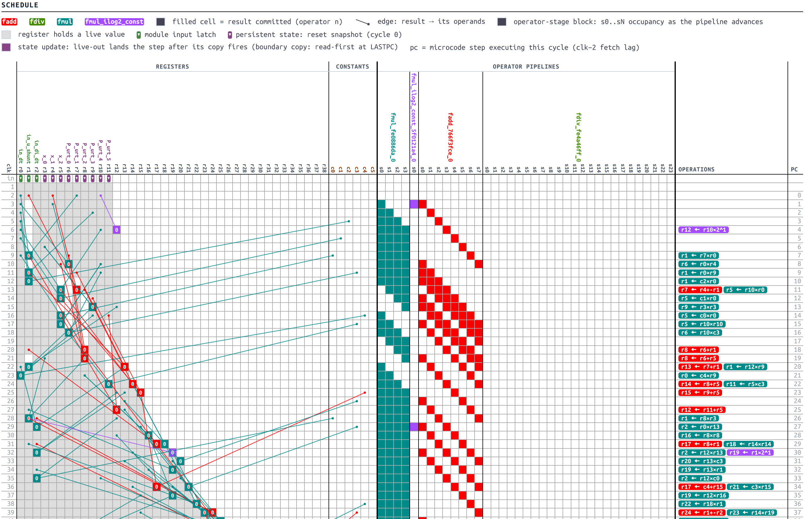

<div align="center">


<h1>Holoso</h1>

_Simple high-level synthesis of portable Verilog from idiomatic Python_

[](https://holoso.digital/)
[](https://pypi.org/project/holoso/)
[](https://forum.zubax.com)

</div>

-----

Holoso converts a subset of idiomatic Python into synthesizable and verifiable Verilog.
It is primarily designed for heavy numerical code which is abundant in control systems and DSP
where manual RTL coding is inefficient and error-prone.

Holoso focuses on Python because this is a popular language in modeling, system design, and verification domains;
ability to generate production HDL directly from the original model allows the designer to work with much simpler
harnesses and iterate faster.

See [PRIOR_ART.md](PRIOR_ART.md) for a detailed review of existing alternatives,
and why none are good enough for practical use.

Holoso is under active development and many of the features we aspire to deliver are currently missing.
Holoso is not yet stable; breaking changes will occur regularly without notice until v1.0 is out.
Contributions of any kind are emphatically welcome!



## 🎓 Crash course

### Install

```
pip install holoso
```

Also have your low-level synthesis/simulation tools available.

### Define your kernel

The *kernel* is a Python function or method that implements a given computation,
which is translated into a Verilog module.

Crucially, the kernel is just an *ordinary Python entity* that doesn't require (nontrivial) adaptation for hardware
synthesis; this is a key feature of Holoso -- just take your existing code that has been validated and
verified in simulation and use it as-is, no error-prone porting is required,
not necessary to maintain two parallel implementations.

The `examples/` directory contains a number of kernels that show the current capabilities of Holoso.
Here, we will define a very simple one to keep things compact; let's say it's going to be a classical PID controller:

```python
class PID:
    def __init__(self, *, kp: float, ki: float, kd: float, limit: float) -> None:
        self.kp = kp
        self.ki = ki
        self.kd = kd
        self.limit = limit
        self.integral = 0.0
        self.prev_error = 0.0
        self._started = False

    def update(self, setpoint: float, measurement: float, dt: float, /) -> float:
        error = setpoint - measurement
        candidate = self.integral + self.ki * error * dt
        derivative = (self.kd * (error - self.prev_error) / dt) if self._started else 0.0
        self.prev_error = error
        self._started = True
        u = self.kp * error + candidate + derivative
        if u > self.limit:
            u = self.limit
        elif u < -self.limit:
            u = -self.limit
        else:
            self.integral = candidate
        return u
```

Gee this looks exceptionally ordinary!
No sophisticated scaffolding is required to simulate and verify this!
The kernel can also be a standalone function (see examples).

### Configure the hardware

To construct the synthesizable RTL out of this, we need to pass our kernel to Holoso.
But Holoso does not know the limits of the target hardware, such as the longest combinational path.
Some tools provide fully automatic pipelining where the user specifies some target clock frequency and the synthesizer
attempts to automatically cut circuits into pipeline stages relying on combinational path delay heuristics
(e.g., see [Google XLS docs](https://google.github.io/xls/scheduling/)).
Holoso does not do that; instead, it provides explicit tuning knobs that enable insertion of predefined optional stages.
This makes pipeline tuning a somewhat more manual process but it also appears to deliver better results across various
target chips and flows.

Holoso constructs a specialized zero instruction set computer (ZISC) tightly optimized for the given kernel
with fully statically scheduled microcode. That ZISC machine has a simple static controller at its core
and a number of numerical and logical operators taking the place of ALU found in a conventional computer.
Most of the chip fabric is spent on the operators while the controller is typically comparatively simple;
most of the pipeline tuning is therefore also happening inside the operators.

The user specifies which optional operator stages to enable by specifying them before Holoso synthesis is invoked.
This is also where the *operand width* is selected: Holoso supports arbitrary-precision floating-point numbers
with configurable exponent and mantissa width; its floating point format is based on IEEE-754 with a number of
intentional deviations (no NaN, no subnormals).
Custom floating point is a very important feature for FPGA targets because their DSP tiles have specific operand
widths which are usually very different from the standard IEEE 754 binary16/32/64/etc,
meaning that those standard representations are rarely the optimal choice for an FPGA target.

The full configuration might look as follows:

```python
import holoso

# Select the floating-point format you wish to use.
# Ideally, wman (mantissa width) should be a multiple of DSP tile operand width.
fmt_f = holoso.FloatFormat(wexp=6, wman=18)

# Define the numerical operators. This is where you can configure additional stages to close timings.
operators = holoso.OpConfig(
    holoso.FAddOperator(fmt_f, stage_decode=1, stage_align=1, stage_normalize=1, stage_pack=1, stage_output=1),
    holoso.FMulOperator(fmt_f, stage_input=1, stage_product=1, stage_pack=1, stage_output=1),
    holoso.FDivOperator(fmt_f, stage_input=1, stage_pack=1, stage_output=1),
    holoso.FMulILog2OperatorFamily(fmt_f),
    holoso.FCmpOperator(fmt_f),
)
```

### Construct the RTL

Having set up the kernel and the hardware options, we can launch synthesis.

If the kernel is a function, it is simply passed to Holoso as-is.
Classes are different because they are stateful: to synthesize a class method,
we instantiate the class as we normally do, then we can optionally tweak the object's state as needed,
and then we pass its bound method to Holoso.
Holoso will inspect the current state of the class and use it as the module's reset state.
The passed bound method will be converted into the stateful RTL module.

```python
# Construct the stateful object with its initial state.
pid = PID(kp=0.5, ki=0.0625, kd=0.25, limit=4.0)

# Run Holoso -- construct the machine and schedule the microcode.
# The results are returned in-memory; you can write them to disk where you want.
# They include the generated Verilog module, the fixed holoso_support.v/.vh, testbench, and the reports.
result = holoso.synthesize(pid.update, operators)

# Write the files -- this is usually what you want.
out = result.write("outputs")

# Show what's been written.
for filename, path in out.items():
    print(f"{filename}: {path}")
```

### Inspect the results

The main backend is the one that emits Verilog RTL (unlike most other tools, this RTL is pretty human-readable), but
Holoso also generates human-friendly HTML reports that reveal the operation of the generated machine in great detail,
including the register liveness, operator pipeline occupancy, etc.

## ⚙️ Design

Holoso implements essentially a separate programming language whose syntax is a strict subset of Python,
and whose semantics is largely equivalent to Python with minor deviations that make sense in chip design context.
Save for the minor differences in semantics, Holoso ensures that one can execute the original Python code
and run the generated circuit (RTL) side by side, and obtain equivalent results (bit-exact unless floating points
are used, in which case small errors may creep up inherent to floats).

Holoso designs a narrowly specialized computing core (a zero-instruction-set computer, ZISC)
with custom statically scheduled microcode that implements the behavior of the original Python kernel.
Being in control of both the core synthesis and the program compilation, Holoso tends to generate
extremely efficient designs in terms of cycle latency and chip area utilization compared to the state of the art.
This ZISC-based approach has a greater initiation interval (II) compared to pure-pipeline approach
(at most one transaction in flight at any moment), but it results in significant chip area savings in complex cores.
From our experience, this choice is defensible in a large subset of practical control/DSP applications.

Holoso outputs portable and purely vendor-agnostic Verilog that can be fed into thid-party synthesis tools as-is,
along with its support library implementing various arithmetic operators. So far it has been tested at least with
Yosys (ECP5), Diamond (ECP5), and Vivado (Artix-7).

By default, Holoso is tuned for the minimum cycle latency and minimum $f_\max$.
If timing closure fails, one needs to locate the critical path and enable the staging knob that inserts a
register stage into the offending path; then re-synthesize and repeat until timings close.

Along with the synthesized Verilog, Holoso produces a Cocotb co-simulation testbench and a detailed and beautiful HTML
report that provides a human-friendly view of the processor and the microcode sequence constructed by the synthesizer.

>*You can SEE the pipeline — every cycle, every landing, every spill. It's gorgeous. People love it.*
>*They come up to me with tears in their eyes, they say sir, that schedule report, it's the most beautiful report we have ever seen.*

For a detailed technical review of the design and trade-offs, please refer to `DESIGN.md`.

### Semantics

Holoso follows Python with minimal deviations where it makes sense for hardware synthesis.

- Static typing only.
- No implicit type conversions.
- Boolean short-circuiting is not supported, all operands evaluated eagerly.
- Floating-point precision depends on the selected floating-point format. See below for more info about floats.
- No exceptions: division by zero, domain errors, etc. produce the closest meaningful result and assert the error flag.

### Floating point

The floating point engine is based on [Zubax Kulibin Float (ZKF)](https://github.com/Zubax/kulibin).

Differences from IEEE 754: no NaN, no subnormals (exponent 0 always encodes +0; finite magnitudes in `(0, min_normal/2)`
round to +0; magnitudes in `[min_normal/2, min_normal)` round to signed min_normal), no exceptions, overflow produces ±∞.
Canonical representations do not include negative zero (it is not an error to pass negative zero though).

Floating-point optimizations are fast-math style, assuming commutativity and associativity,
allowing non-bit-exact rewrites.

Infinity cases that would be NaN in IEEE 754:

| Expression          | Result                         |
|---------------------|--------------------------------|
| +∞ + −∞             | +0                             |
| 0⋅±∞                | +0                             |
| 0 ÷ 0               | +0                             |
| ±∞ ÷ ±∞             | +0                             |

Non-NaN infinity cases (same intent as IEEE 754):

| Expression          | Result                         |
|---------------------|--------------------------------|
| finite≠0 ÷ 0        | ±∞  (sign = sign of dividend)  |
| ±∞ ÷ 0              | ±∞  (sign = sign of dividend)  |
| finite ÷ ±∞         | +0                             |
| ±∞⋅±∞               | ±∞  (sign = signs XOR)         |
| finite≠0⋅±∞         | ±∞  (sign = signs XOR)         |

WEXP can be chosen freely depending on the required range, while WMAN is sensitive to the chip's DSP capabilities
and thus requires careful selection to achieve best resource utilization.

| WMAN | ≈ε (interval) | Description                                                                         |
|------|---------------|-------------------------------------------------------------------------------------|
| 16   | 3.052e-05     | DSP tiles in Lattice iCE40 and similar                                              |
| 18   | 7.629e-06     | Classic FPGA DSP width, very common: ECP5, PolarFire, Trion, many Intel modes, etc. |
| 24   | 1.192e-07     | IEEE 754 binary32; also fits Versal DSP58's 27x24 asymmetric multiplier side        |
| 27   | 1.490e-08     | Intel/Altera variable-precision DSPs                                                |
| 32   | 4.657e-10     | 2x16                                                                                |
| 36   | 2.910e-11     | 2x18 (very common) or native Intel/Altera 36x36-style variable-precision mode       |
| 48   | 7.105e-15     | 2x24 or 3x16; with an 8-bit exponent amounts to 7 bytes exactly                     |
| 53   | 2.220e-16     | IEEE 754 binary64                                                                   |

Narrower WMAN is rarely practical for computation due to low precision and fast error accumulation,
although they can still be useful for storage/exchange. One notable exception is neural networks though.

## 🛡️ Verification

Just say `nox`. Read the `noxfile.py` and `DESIGN.md` for details.

You may find the [zubax-fpga-toolchain](https://github.com/Zubax/fpga-toolchain-docker/pkgs/container/zubax-fpga-toolchain)
container useful as it comes with all of the required tools out of the box.

## ⚖️ License

Holoso is licensed under the [Apache License 2.0](LICENSE).
What you produce with it is yours: the Verilog this tool generates, together with the bundled support RTL it stitches
into every design, is unencumbered and carries no license obligations.
Use it in open-source or proprietary designs freely.
